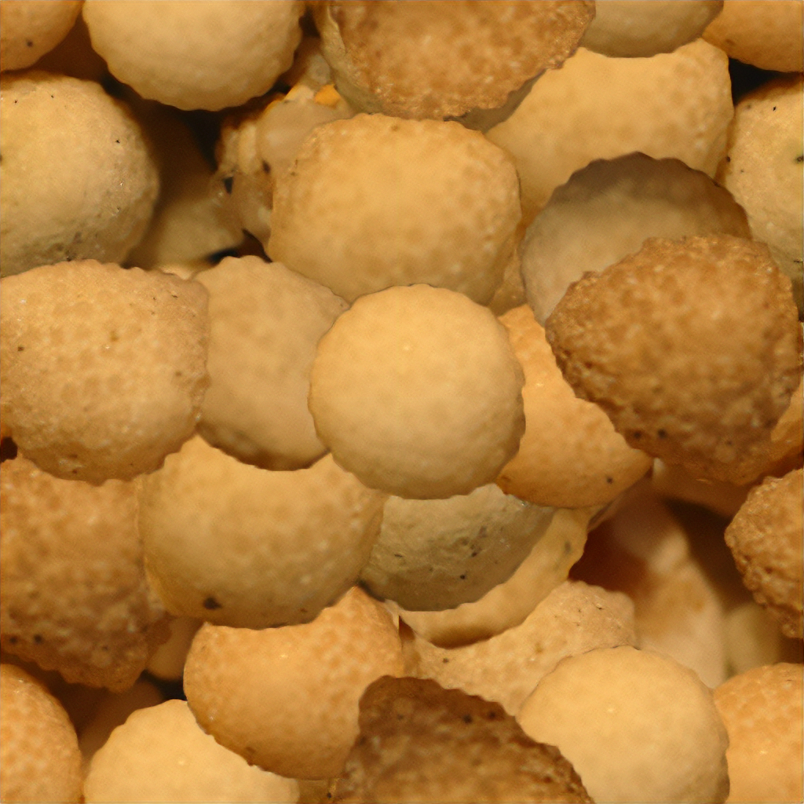

## Assignment Deliverables

1.  Render Image 1
    - Label file YYYY-MM-DD Lastname Firstname Render Image 1 (`.png`, `.jpg`)
2.  Render Image 2
    - Label file YYYY-MM-DD Lastname Firstname Render Image 2 (`.png`, `.jpg`)
3.  Blender `.blend` file with packed resources **or** Upload Maya scene archive `.zip`
    - Label file YYYY-MM-DD Lastname Firstname 3D Scene (`.blend`, `.zip`)

## Assignment Overview

3D models used in rendering are boring and nondescript without textures and colors. These can be enhanced with physical based materials.

### Requirements

- Minimum of 2 render images each of a a UV unwrapped and textured object in [Blender](../../../../3d-modeling/blender/blender.md) **or in** [Maya](../../../../3d-modeling/maya/maya.md)
- Minimum of 1 object mesh with more than 6 faces in scene
- Minimum of 1 use of each of the following (Texture Image, Bump)
- Minimum of 1 light source
- Render 2 different camera views of the scene at a minimum 1920x1080 or 3840x2160 (.png or .jpg)

### Process

1. Create a 3D polygon model with more than 6 faces. _(You can use meshes from [3D scans](../../../../3d-modeling/3d-scanning.md) or from [photogrammetry scans](../../../../3d-modeling/photogrammetry.md) or exported models from Autodesk Fusion._)
2. UV unwrap an object mesh.
   - [UV Mapping - Maya](../../../../3d-modeling/maya/uv-mapping-maya.md)
   - [UV Mapping - Blender](../../../../3d-modeling/blender/uv-mapping-blender.md)
3. Use the image textures provided below, images textures from online sources, or create your own image textures.
   - [Polyhaven.com](https://polyhaven.com/) is a great source for image textures, mesh objects, and HDRIs for rendering.
   - [BlenderKit](../../../../3d-modeling/blender/install-blenderkit-blender.md) has many textures and 3D mesh objects available.
   - [Substance]
4. Apply the a diffuse / color image texture.
5. Apply a bump map image texture or normal map image texture.
6. Ensure the textures wrap around the object without stretching.
7. Add additional mesh objects to the scene.
8. Add a light source.
9. Render 2 different camera views.

### Texture Images

<figure>

<figcaption>

Texture Image

</figcaption>
</figure>
<figure>

<figcaption>

Bump Map

</figcaption>
</figure>
<figure>

<figcaption>

Normal Map

</figcaption>
</figure>

## Assignment Resources

- [Maya How to Archive Scene](https://youtu.be/gic-kMWKjNI)
- [Blender pack all external assets](https://youtu.be/x6H6HFBLRlUl)

### Video Tutorials

- [Maya UV in Class Exercise](https://youtu.be/D3q2HleBJIs)
- [Blender UV in Class Exercise](https://youtu.be/OOmQNgawF8c)

#### Maya UV in Class Exercise

<iframe class="youTubeIframe" width="560" height="315" src="https://www.youtube.com/embed/D3q2HleBJIs" title="YouTube video player" frameborder="0" allow="accelerometer; autoplay; clipboard-write; encrypted-media; gyroscope; picture-in-picture; web-share" referrerpolicy="strict-origin-when-cross-origin" allowfullscreen></iframe>

#### Blender UV in Class Exercise

<iframe class="youTubeIframe" width="560" height="315" src="https://www.youtube.com/embed/OOmQNgawF8c?si=qkpRun0uEaGDfp2e" title="YouTube video player" frameborder="0" allow="accelerometer; autoplay; clipboard-write; encrypted-media; gyroscope; picture-in-picture; web-share" referrerpolicy="strict-origin-when-cross-origin" allowfullscreen></iframe>

#### Maya HDRI Image

<iframe class="youTubeIframe" width="560" height="315" src="https://www.youtube.com/embed/wiad9sjWAOI" title="YouTube video player" frameborder="0" allow="accelerometer; autoplay; clipboard-write; encrypted-media; gyroscope; picture-in-picture; web-share" referrerpolicy="strict-origin-when-cross-origin" allowfullscreen></iframe>

#### Blender HDRI Image

<iframe class="youTubeIframe" width="560" height="315" src="https://www.youtube.com/embed/VaGfn4i5dKQ" title="YouTube video player" frameborder="0" allow="accelerometer; autoplay; clipboard-write; encrypted-media; gyroscope; picture-in-picture; web-share" referrerpolicy="strict-origin-when-cross-origin" allowfullscreen></iframe>

## Grading Rubric

| Assessment                                                                             | Weight    |
| -------------------------------------------------------------------------------------- | --------- |
| More than 6 faces on object in 3D scene                                                | 20        |
| Use Texture Image + Bump Map on material                                               | 20        |
| Minimum of 1 light source                                                              | 20        |
| Render 2 different camera views                                                        | 20        |
| Upload Blender .blend file with packed resources **or** Upload Maya scene archive .zip | 10        |
| File Management and Labeling                                                           | 10 points |

