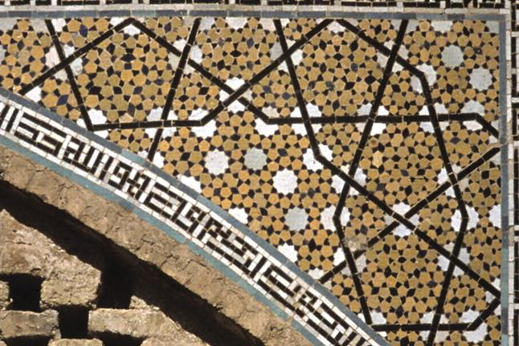

## Intro to Computer and Algorithmic Art

Algorithmic Art predates the invention of the computer and digital technology. The specific geometries and math used in Islamic tiling patterns such as such as [Girih tiles](https://en.wikipedia.org/wiki/Girih_tiles) are are described by Roman Verostko as pre-digital precursors to algorithmic art. [^2] Tilings in Islamic architecture have been shown to have had a patterning breakthrough around 1200 C.E. by reimagining the girih tile patterns as tessellations. Peter Lu and Paul Steinhardt show that examining the girih tiles as "equilateral polygons decorated with lines" allowed new patterns to become more complex. Their investigations show that the combination of "self-similar transformations" and the tile shapes allowed the artisans to make almost perfect Penrose patterns well before before being discovered by Western mathematics five centuries later. [^lu-steinhardt] Penrose patterns are non-repeating patterns know aperiodic patterns. [^penrose-wiki] This means that the patterns continue to infinity without repeating, similar to a generative algorithm creating an infinite landscape to explore in a video game.

<div class="gallery-grid">
<figure>

[](./2007-02-23-Girih-tile_Darb-i_Imam_shrine_Isfahan_Iran-Science.jpeg)

<figcaption>

Girih pattern on a spandrel from the Darb-i Imam shrine, Isfahan, Iran (1453 C.E.) - Public Domain, [Wikimedia Commons](https://commons.wikimedia.org/wiki/File:Darb-i_Imam_shrine_spandrel.JPG)

</figcaption>

</figure>
<figure>

[.png>)](<./2009-02-01-Penrose_Tiling_(P1_over_P3).png>)

<figcaption>

Penrose Tiling P1 over P3 by [Inductiveload](https://commons.wikimedia.org/wiki/User:Inductiveload) - Own work, Public Domain, [Wikimedia Commons](https://commons.wikimedia.org/w/index.php?curid=5839250)

</figcaption>
</figure>
</div>

Lillian Schwartz was a pioneer in using computers to create computer generated art. In the late 1960s she worked as a consultant at Bell Laboratories and developed tools and techniques for using computers in film and animation. She is also credited with creating the first digital drawing with a preasure sensitive tablet that was transmitted around the world in real-time. [^lillian]

Schwartz was featured in the documentary, _The Artist and the Computer 1976_.

<div class="video-grid">
<div class="iframe-16-9-container">
<iframe class="youTubeIframe" width="560" height="315" src="https://www.youtube.com/embed/GRFPV9smRyg" title="YouTube video player" frameborder="0" allow="accelerometer; autoplay; clipboard-write; encrypted-media; gyroscope; picture-in-picture; web-share" allowfullscreen></iframe>
</div>
<div class="iframe-16-9-container">
<iframe class="youTubeIframe" width="560" height="315" src="https://www.youtube.com/embed/QCthSns4U4s" title="YouTube video player" frameborder="0" allow="accelerometer; autoplay; clipboard-write; encrypted-media; gyroscope; picture-in-picture; web-share" allowfullscreen></iframe>
</div>
</div>

Sol LeWitt made a series of Wall Drawings with instructions Sol LeWitt talked about conceptual art being, "The idea is the machine that makes the art." [^1]

"Wall Drawing #4: A square divided horizontally and vertically into four equal parts, each with lines in different directions"
https://www.clevelandart.org/magazine/cleveland-art-may-june-2016/converging-lines

Bruce Nauman's [_Body Pressure_](http://projects.e-flux.com/do_it/manuals/artists/n/N001/N001A_text.html) is a series of instructions for the viewer that are completed in sequence to complete the artwork.

_Quad_, a play by Samuell Beckett, uses algorithmic instructions for the actors. The play begins, "The players (1, 2, 3, 4) pace the given area, each following his particular course. Area: square. Length of side: 6 paces." As we will see when setting up a "Canvas" in [p5.js](./01-04-p5js-introduction.md), this is very similar to the code `createCanvas(6, 6);` The play continues with listing the parameters for each of the four courses.

|           |                                |
| --------- | ------------------------------ |
| Course 1: | AC, CB, BA, AD, DB, BC, CD, DA |
| Course 3: | BA, AD, DB, BC, CD, DA, AC, CB |
| Course 3: | CD, DA, AC, CB, BA, AD, DB, BC |
| Course 4: | DB, BC, CD, DA, AC, CB, BA, AD |

This is similar to declaring a two dimensional array in [JavaScript](../../../../coding/javascript.md). An array is a series of values saved as data in a program and a 2D array is a series of multiple series of values.

```javascript
// Two dimensional array of Courses from Samuell Beckett's Quad Play
const courses = [
  [AC, CB, BA, AD, DB, BC, CD, DA], // course 1
  [BA, AD, DB, BC, CD, DA, AC, CB], // course 2
  [CD, DA, AC, CB, BA, AD, DB, BC], // course 3
  [DB, BC, CD, DA, AC, CB, BA, AD], // course 4
];
```

Since an algorithm is a set of instructions, much like a recipe, humans can follow the steps and perform the algorithm or program. Although it is possible to have analog or human algorithms, as demonstrated in Beckett's _Quad_, for longer, more complex, and repetitive algorithms, the use of a computer and programming is more ideal and allows results that are not possible by analog execution.

<div class="gallery-grid">
<figure>

[](./1984-page-291-quad-excerpt-samuell-beckett-collected-shorter-plays.png)

<figcaption>

Page from Samuell Beckett's _Quad_ Play showing "algorithmic" like instructions and diagrams for the actors [^beckett]

</figcaption>
</figure>

<div class="center-card">
<div class="iframe-16-9-container">
<iframe class="youTubeIframe"width="560" height="315" src="https://www.youtube.com/embed/4ZDRfnICq9M?si=1XR-hgqaTilTnSyL" title="YouTube video player" frameborder="0" allow="accelerometer; autoplay; clipboard-write; encrypted-media; gyroscope; picture-in-picture; web-share" allowfullscreen></iframe>
</div>
</div>

</div>

### Chance Operations and Randomness

Artists have used "chance" or random events to create art. Marchell Duchamp dropped strings of known lengths on the ground and then traced their resultant shape profiles to make "creative measuring devices". The composer John Cage used dice rolling and other chance operations to determine musical compositions. Swiss artist, Jean Tinguely, used mechanical chance operations to create unpredictable drawings with his _meta-matic_ drawing machines.

<div class="video-grid">
<div class="iframe-16-9-container">
<iframe class="youTubeIframe"width="560" height="315" src="https://www.youtube.com/embed/ZNGpjXZovgk?si=UnwiXtJ0CDFqQCRn" title="YouTube video player" frameborder="0" allow="accelerometer; autoplay; clipboard-write; encrypted-media; gyroscope; picture-in-picture; web-share" allowfullscreen></iframe>
</div>
<div class="iframe-16-9-container">
<iframe class="youTubeIframe"width="560" height="315" src="https://www.youtube.com/embed/gXOIkT1-QWY?si=0r-Z6eA6tJ-Mq8fC" title="YouTube video player" frameborder="0" allow="accelerometer; autoplay; clipboard-write; encrypted-media; gyroscope; picture-in-picture; web-share" allowfullscreen></iframe>
</div>
</div>

Casey Reas transformed Sol LeWitt drawing instructions into generative software in an exhibit, at the Whitney, [Casey Reas: Software Structures Launched 2004 Restored 2016](https://whitney.org/exhibitions/software-structures). The project started with Reas thinking about the relevance of Sol LeWitt's drawings to generative software art. Reas then recreated three of LeWitt's drawing structures, in software that served as a catalyst for creating new structures and software.

Below is a p5.js sketch by Reas of Sol LewWitt's "Wall Drawing #106. Arcs from the midpoints of two sides of the wall." [^whitney-106-comments] Software written by a human, follows the instructions and makes the drawing according to the instructions or recipe of Sol LeWitt.

<figure>
<div class="iframe-4-3-container">
<iframe class="responsiveIframe" width="800px" height="600px" src="https://artport.whitney.org/commissions/software-structures-2016/_106/sketch.html"></iframe>
</div>
<figcaption>

Wall Drawing #106. First implemented in [Processing](https://processing.org/) by Casey Reas in 2004, ported to [p5.js](https://p5js.org/) in 2016.

</figcaption>
</figure>
<figure>
<div class="iframe-4-3-container">
<iframe class="responsiveIframe" width="800px" height="600px" src="https://artport.whitney.org/commissions/software-structures-2016/s3_2/sketch.html"></iframe>
</div>
<figcaption>

Structure #003B. First implemented in [Processing](https://processing.org/) by Casey Reas in 2004, ported to [p5.js](https://p5js.org/) in 2016. [^whitney-3b]

</figcaption>
</figure>

- [HAROLD COHEN AND AARON—A 40-YEAR COLLABORATION By Chris Garcia | August 23, 2016](https://computerhistory.org/blog/harold-cohen-and-aaron-a-40-year-collaboration/)

- [Algorithmic Art - Wikipedia](https://en.wikipedia.org/wiki/Algorithmic_art)

## Computer Art Video Clips

<iframe width="560" height="315" src="https://www.youtube.com/embed/CIEYlUosKUY?si=dH7uJVXm-vO6oOLT" title="YouTube video player" frameborder="0" allow="accelerometer; autoplay; clipboard-write; encrypted-media; gyroscope; picture-in-picture; web-share" allowfullscreen></iframe>

<iframe width="560" height="315" src="https://www.youtube.com/embed/_8DMEHxOLQE?si=qgdIoKssGl1Ofodu" title="YouTube video player" frameborder="0" allow="accelerometer; autoplay; clipboard-write; encrypted-media; gyroscope; picture-in-picture; web-share" allowfullscreen></iframe>

<iframe width="560" height="315" src="https://www.youtube.com/embed/IPczQgCuOOc?si=RzVCIf5RNh9C2TGA" title="YouTube video player" frameborder="0" allow="accelerometer; autoplay; clipboard-write; encrypted-media; gyroscope; picture-in-picture; web-share" allowfullscreen></iframe>

<iframe width="560" height="315" src="https://www.youtube.com/embed/U1DbaUATNtY?si=N0bw12cyzhuMi-hz" title="YouTube video player" frameborder="0" allow="accelerometer; autoplay; clipboard-write; encrypted-media; gyroscope; picture-in-picture; web-share" allowfullscreen></iframe>

<iframe width="560" height="315" src="https://www.youtube.com/embed/Cn-U_Dj5UeE?si=dskYdyVuh_Manb9N" title="YouTube video player" frameborder="0" allow="accelerometer; autoplay; clipboard-write; encrypted-media; gyroscope; picture-in-picture; web-share" allowfullscreen></iframe>

<script>

  


  </script>

[^1]: [Paragraphs on Conceptual Art - Artforum Summer 1967 Vol. 5, No 10](https://www.artforum.com/features/paragraphs-on-conceptual-art-211354/)
[^2]: [Algorithmic Art by Roman Verostko](https://www.verostko.com/algorithm.html)
[^lillian]: [Lillian Schwartz Biography](http://lillian.com/biography/) [Web Archive](https://web.archive.org/web/20230604211831/http://lillian.com/biography/)
[^beckett]: Beckett, Samuel. “Quad.” Play. In Collected Shorter Plays, 289–94. New York: Grove Press, 1984.
[^lu-steinhardt]: Peter J. Lu, Paul J. Steinhardt, Decagonal and Quasi-Crystalline Tilings in Medieval Islamic Architecture. Science **315**,1106-1110(2007). DOI: [10.1126/science.1135491](https://doi.org/10.1126/science.1135491)
[^penrose-wiki]: [Penrose Tiling](https://en.wikipedia.org/wiki/Penrose_tiling) Wikipedia.
[^whitney-106-comments]: [Comments Page](https://artport.whitney.org/commissions/software-structures-2016/_106/comments.html) from [Software Structures 106 at the Whitney.
[^whitney-3b]: [Structure 3B](https://artport.whitney.org/commissions/software-structures-2016/s3_2/) by Casey Reas in [Software Structures](https://artport.whitney.org/commissions/software-structures-2016/map.html) at the Whitney.
