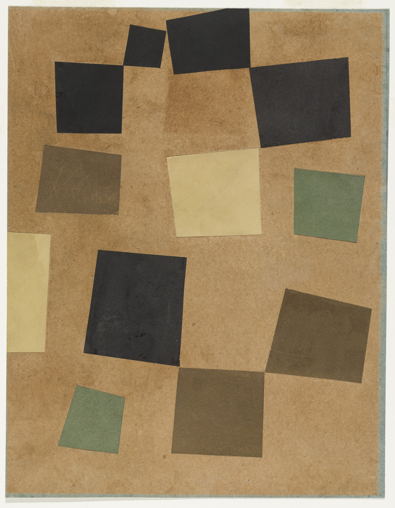

## Intro to Computer and Algorithmic Art

Algorithmic Art predates the invention of the computer and digital technology. The specific geometries and math used in Islamic tiling patterns such as such as [Girih tiles](https://en.wikipedia.org/wiki/Girih_tiles) are are described by Roman Verostko as pre-digital precursors to algorithmic art. [^2] Tilings in Islamic architecture have been shown to have had a patterning breakthrough around 1200 C.E. by reimagining the girih tile patterns as tessellations. Peter Lu and Paul Steinhardt show that examining the girih tiles as "equilateral polygons decorated with lines" allowed new patterns to become more complex. Their investigations show that the combination of "self-similar transformations" and the tile shapes allowed the artisans to make almost perfect Penrose patterns well before before being discovered by Western mathematics five centuries later. [^lu-steinhardt] Penrose patterns are non-repeating patterns know aperiodic patterns. [^penrose-wiki] This means that the patterns continue to infinity without repeating, similar to a generative algorithm creating an infinite landscape to explore in a video game.

<div class="gallery-grid">
<figure>

[](./2007-02-23-Girih-tile_Darb-i_Imam_shrine_Isfahan_Iran-Science.jpeg)

<figcaption>

Girih pattern on a spandrel from the Darb-i Imam shrine, Isfahan, Iran (1453 C.E.) - Public Domain, [Wikimedia Commons](https://commons.wikimedia.org/wiki/File:Darb-i_Imam_shrine_spandrel.JPG)

</figcaption>

</figure>
<figure>

[](./2009-02-01-Penrose_Tiling_P1_over_P3.png)

<figcaption>

Penrose Tiling P1 over P3 by [Inductiveload](https://commons.wikimedia.org/wiki/User:Inductiveload) - Own work, Public Domain, [Wikimedia Commons](https://commons.wikimedia.org/w/index.php?curid=5839250)

</figcaption>
</figure>
</div>

## Analog Algorithmic Art

Sol LeWitt made a series of Wall Drawings with instructions. He talked about conceptual art being, "The idea is the machine that makes the art." [^1] The wall drawings are separated from the artist, since once someone has the instructions, the algorithm, or the recipe, anyone can make them. Recipes, and instructions are not copyrightable in the United States, so anyone can make their own wall drawings, you just can't call them Sol LeWitt artworks.

The instructions for _Wall Drawing #797_ read, "The first drafter has a black marker and makes an irregular horizontal line near the top of the wall. Then the second drafter tries to copy it (without touching it) using a red marker. The third drafter does the same, using a yellow marker. The fourth drafter does the same using a blue marker. Then the second drafter followed by the third and fourth copies the last line drawn until the bottom of the wall is reached." [^massmoca-lewitt]

<figure>

[](./1995-sol-lewitt-wall-drawing-797-mass-moca.jpg)

<figcaption>

WALL DRAWING #797, Sol LeWitt, at [MASS MoCA](https://massmoca.org/event/walldrawing797/) - 1995

</figcaption>
</figure>

Bruce Nauman's [_Body Pressure_](http://projects.e-flux.com/do_it/manuals/artists/n/N001/N001A_text.html) is a series of instructions for the viewer that are completed in sequence to complete the artwork.

_Quad_, a play by Samuell Beckett, uses algorithmic instructions for the actors. The play begins, "The players (1, 2, 3, 4) pace the given area, each following his particular course. Area: square. Length of side: 6 paces." As we will see when setting up a "Canvas" in [p5.js](./01-04-p5js-introduction.md), this is very similar to the code `createCanvas(6, 6);` The play continues with listing the parameters for each of the four courses.

|           |                                |
| --------- | ------------------------------ |
| Course 1: | AC, CB, BA, AD, DB, BC, CD, DA |
| Course 3: | BA, AD, DB, BC, CD, DA, AC, CB |
| Course 3: | CD, DA, AC, CB, BA, AD, DB, BC |
| Course 4: | DB, BC, CD, DA, AC, CB, BA, AD |

This is similar to declaring a two dimensional array in [JavaScript](../../../../coding/javascript.md). An array is a series of values saved as data in a program and a 2D array is a series of multiple series of values.

```javascript
// Two dimensional array of Courses from Samuell Beckett's Quad Play
const courses = [
  [AC, CB, BA, AD, DB, BC, CD, DA], // course 1
  [BA, AD, DB, BC, CD, DA, AC, CB], // course 2
  [CD, DA, AC, CB, BA, AD, DB, BC], // course 3
  [DB, BC, CD, DA, AC, CB, BA, AD], // course 4
];
```

Since an algorithm is a set of instructions, much like a recipe, humans can follow the steps and perform the algorithm or program. Although it is possible to have analog or human algorithms, as demonstrated in Beckett's _Quad_, for longer, more complex, and repetitive algorithms, the use of a computer and programming is more ideal and allows results that are not possible by analog execution.

<div class="gallery-grid">
<figure>

[](./1984-page-291-quad-excerpt-samuell-beckett-collected-shorter-plays.png)

<figcaption>

Page from Samuell Beckett's _Quad_ Play showing "algorithmic" like instructions and diagrams for the actors [^beckett]

</figcaption>
</figure>

<div class="center-card">
<div class="iframe-16-9-container">
<iframe class="youTubeIframe"width="560" height="315" src="https://www.youtube.com/embed/4ZDRfnICq9M?si=1XR-hgqaTilTnSyL" title="YouTube video player" frameborder="0" allow="accelerometer; autoplay; clipboard-write; encrypted-media; gyroscope; picture-in-picture; web-share" referrerpolicy="strict-origin-when-cross-origin" allowfullscreen></iframe>
</div>
</div>

</div>

## Early Computer Art

Ivan Sutherland created Sketchpad in 1963 for his PhD thesis at MIT. It was one of the first Graphical User Interfaces (GUI) and one of the first Computer Aided Design (CAD) systems created. [^design-world]

Vera Molnár worked with algorithmic art before having access to a computer and developed a technique, "Machine Imaginare" that used algorithms to determine an image's composition by hand. Her initial experiments making art with computers required using punch cards and waiting days for a mechanical plotter to produce the image. [^Molnar]

<div class="gallery-grid">
<figure>

[](./1982-Vera-Molnár-From-the-Hommage-à-Dürer-cycle-plotter-red-ink.jpg)

<figcaption>

Vera Molnár, From the Hommage à Dürer cycle, plotter, red ink, 1982, 41 x 40 cm - [Galerie Berthet-Aittouarès](https://www.galerie-ba.com/en/vera-molnar?pgid=k8610me6-19e72a39-2edf-42d3-8be9-1342c546c0a5)

</figcaption>
</figure>

<figure>

[](./1989-2015-Vera-Molnár-Sainte-Victoire-in-16-lines.jpg)

<figcaption>

Vera Molnár, Sainte Victoire in 16 Lines - 1989-2015 [Galerie Berthet-Aittouarès](https://www.galerie-ba.com/en/vera-molnar?pgid=k8610me6-61876e92-b7fd-44c6-b4e9-fe95a97d9f0d)

</figcaption>
</figure>
</div>

Lillian Schwartz was a pioneer in using computers to create computer generated art. In the late 1960s she worked as a consultant at Bell Laboratories and developed tools and techniques for using computers in film and animation. She is also credited with creating the first digital drawing with a pressure sensitive tablet that was transmitted around the world in real-time. [^lillian] Schwartz was featured in the documentary, _The Artist and the Computer 1976_.

A. Michael Noll also worked at Bell Labs and created many early and iconic computer artworks. He is credited with making early depictions of 3D computer animation and 3D stereoscopic movies, which appear 3D when each side is viewed by one eye, similar to early 21st century Virtual Reality (VR). The tech was so new that in a 1965-66 animation of a 4D hypercube, the artist felt the need to write "Computer Generated on the screen." [^a-michael-noll]

<div class="video-grid">
<div class="iframe-16-9-container">
<iframe class="youTubeIframe" width="560" height="315" src="https://www.youtube.com/embed/GRFPV9smRyg" title="YouTube video player" frameborder="0" allow="accelerometer; autoplay; clipboard-write; encrypted-media; gyroscope; picture-in-picture; web-share" referrerpolicy="strict-origin-when-cross-origin" allowfullscreen></iframe>
</div>
<div class="iframe-16-9-container">
<iframe class="youTubeIframe" width="560" height="315" src="https://www.youtube.com/embed/QCthSns4U4s" title="YouTube video player" frameborder="0" allow="accelerometer; autoplay; clipboard-write; encrypted-media; gyroscope; picture-in-picture; web-share" referrerpolicy="strict-origin-when-cross-origin" allowfullscreen></iframe>
</div>
</div>

Frieder Nake made use of graphical plotters and mathematics to create computer art and made some of the first computer artworks and participated in some of the earliest exhibitions of computer art. [^wiki-nake] Nake was an algorithmic and generative art pioneer and one of the "Algorists", a self named group of early algorithmic art and generative art practitioners. [^amerika]

John Whitney worked with Saul Bass on the opening sequence of Alfred Hitchcock's _Vertigo_ to create what is considered the first computer animation in film. [^computeranimationhistory] The pioneering techniques of Whitney directly inspired the work of Douglas Trumbull, who created the cutting edge "Star Gate" scene in Stanley Kubrick's _2001: A Space Odyssey_. He built a time controllable exposure slit-scan machine. [^hollywood-reporter]

Charles Csuri was a artistic pioneer at the forefront of computer art and using computers for animation. Csuri is credited with one of the earliest computer animations titled, _Hummingbird_ in 1967. Unlike later computer animations where the entire creation and rendering process occurs within the memory of the computer, Csuri uses a microfilm plotter to draw over 30,000 frames of animation directly onto film. It is an interesting example of a hybrid type of digital art that requires advanced technology and lots of physical labor. [^csuri-moma]

### Chance Operations and Randomness

Artists have used "chance" or random events to create art. Well before the John Cage's chance operations music, there was the German _Musikalisches Würfelspiel_, or musical dice game, that used dice to randomly select which precomposed selections of music to play. Musical dice games were made by well known composers such as Bach and Mozart. [^musical-dice]

Jean Hans Arp used chance operations to create collage compositions. The uniform size with variation of the multiple compositions created by Arp with chance seem like early visions of later generative computer art.

<div class="gallery-grid">
<figure>

[](./1916-Jean-Hans-Arp-Untitled-Collage-with-Squares-Arranged-according-to-the-Law-of-Chance-1916–17.jpg)

<figcaption>

Jean (Hans) Arp - _Untitled_ (Collage with Squares Arranged According to the Law of Chance) 1916-1917 [MoMA](https://www.moma.org/collection/works/37013)

</figcaption>
</figure>
<figure>

[](./1917-Jean-Hans-Arp-Untitled-Squares-Arranged-According-to-the-Laws-of-Chance-1917.jpg)

<figcaption>

Jean (Hans) Arp - _Untitled_ (Squares Arranged According to the Laws of Chance) 1917 [MoMa](https://www.moma.org/collection/works/37166)

</figcaption>
</figure>
</div>

Tristan Tzara describes cut up poetry in his "Dada Manifesto" by giving instructions on how to use the technique to make a "Dada Poem."

> TO MAKE A DADAIST POEM
>
> Take a newspaper.
> Take some scissors.
> Choose from this paper an article of the length you want to make your poem.
> Cut out the article.
> Next carefully cut out each of the words that makes up this article and put them all in a bag.
> Shake gently.
> Next take out each cutting one after the other.
> Copy conscientiously in the order in which they left the bag.
> Them poem will resemble you.
> And there you are – an infinitely original author of charming sensibility, even though unappreciated by the vulgar herd
>
> From _Dada Manifesto On Feeble Love And Bitter Love_ by Tristan Tzara [^tzara]

Marchell Duchamp dropped strings of known lengths on the ground and then traced their resultant shape profiles to make "creative measuring devices". The composer John Cage used dice rolling and other chance operations to determine musical compositions. Swiss artist, Jean Tinguely, used mechanical chance operations to create unpredictable drawings with his _meta-matic_ drawing machines.

William Burroughs later used the cutup technique in writing _Naked Lunch_ and later experimented with Brion Gysin in film with _The Cut Ups_ that show seemingly random interspersed scenes and cutup conversation of lots of "Hello" and other greetings. [^burroughs-1] Burroughs thought cutups had "magical powers" and were able to predict the future. [^burroughs-2] David Bowie used cutup techniques to write sound lyrics. While he used the lyrics produced by the cut up words in a couple songs, Bowie says that the main use of the technique is "... igniting anything that might be in my imagination." Like Burroughs, Bowie also seems to have "magical thinking" about the predictive power of cut ups. [^bowie]

Randomness alone can be chaotic and less than pleasing. In nature action follow semi predictable paths and patterns. The ripples on a pond don't spontaneously appear 20 meters to the left and the 85 meters to the right, each ripple is formed based on its previous position and the positions of all the other ripples and objects in the pond. It is still "random" but follows rules and a pattern and therefore is more organic and often thought as more pleasing that true randomness.

This pleasing type of randomness became a large part of computer graphics with the creation of Perlin Noise. This is an algorithm developed by Kevin Perlin in 1983 for use in the original _Tron_ movie to create textures and other visual effects. [^perlin-wiki] Below there is an animation showing the difference between Perlin Noise, something that has rules and a pattern, and random noise, which is chaotic and seemingly without any reason.

<div class="video-grid">
<div class="iframe-16-9-container">
<iframe class="youTubeIframe"width="560" height="315" src="https://www.youtube.com/embed/ZNGpjXZovgk?si=UnwiXtJ0CDFqQCRn" title="YouTube video player" frameborder="0" allow="accelerometer; autoplay; clipboard-write; encrypted-media; gyroscope; picture-in-picture; web-share" referrerpolicy="strict-origin-when-cross-origin" allowfullscreen></iframe>
</div>
<div class="iframe-16-9-container">
<iframe class="youTubeIframe"width="560" height="315" src="https://www.youtube.com/embed/gXOIkT1-QWY?si=0r-Z6eA6tJ-Mq8fC" title="YouTube video player" frameborder="0" allow="accelerometer; autoplay; clipboard-write; encrypted-media; gyroscope; picture-in-picture; web-share" referrerpolicy="strict-origin-when-cross-origin" allowfullscreen></iframe>
</div>
<div class="iframe-16-9-container">
<iframe class="youTubeIframe" width="560" height="315" src="https://www.youtube.com/embed/CIEYlUosKUY?si=dH7uJVXm-vO6oOLT" title="YouTube video player" frameborder="0" allow="accelerometer; autoplay; clipboard-write; encrypted-media; gyroscope; picture-in-picture; web-share" referrerpolicy="strict-origin-when-cross-origin" allowfullscreen></iframe>
</div>

<div class="iframe-16-9-container">
<div  class="youTubeIframe" id="sketch-holder">
</div>
</div>
</div>

## Digital Algorithmic and Generative Art

Desmond Paul Henry used mechanical change operations similar to Jean Tinguely's drawing machines to make a computer drawing machine. [^ohanrahan]

<div class="gallery-grid">
<figure>

[](./1962-Desmond-Paul-Henry-picture_by_drawing_machine_1.jpg)

<figcaption>

Desmond Paul Henry Picture Made by Drawing Machine [^desmond-1]

</figcaption>
</figure>
<figure>

[](./Desmond-Paul-Henry_Drawing_Machine_1.jpg)

<figcaption>

Desmond Paul Henry Drawing Machine [^desmond-2]

</figcaption>
</figure>

</div>

Casey Reas transformed Sol LeWitt drawing instructions into generative software in an exhibit, at the Whitney, [Casey Reas: Software Structures Launched 2004 Restored 2016](https://whitney.org/exhibitions/software-structures). The project started with Reas thinking about the relevance of Sol LeWitt's drawings to generative software art. Reas then recreated three of LeWitt's drawing structures, in software that served as a catalyst for creating new structures and software.

Below is a p5.js sketch by Reas of Sol LewWitt's "Wall Drawing #106. Arcs from the midpoints of two sides of the wall." [^whitney-106-comments] Software written by a human, follows the instructions and makes the drawing according to the instructions or recipe of Sol LeWitt.

<figure>
<div class="iframe-4-3-container">
<iframe class="responsiveIframe" width="800px" height="600px" src="https://artport.whitney.org/commissions/software-structures-2016/_106/sketch.html"></iframe>
</div>
<figcaption>

Wall Drawing #106. First implemented in [Processing](https://processing.org/) by Casey Reas in 2004, ported to [p5.js](https://p5js.org/) in 2016.

</figcaption>
</figure>
<figure>
<div class="iframe-4-3-container">
<iframe class="responsiveIframe" width="800px" height="600px" src="https://artport.whitney.org/commissions/software-structures-2016/s3_2/sketch.html"></iframe>
</div>
<figcaption>

Structure #003B. First implemented in [Processing](https://processing.org/) by Casey Reas in 2004, ported to [p5.js](https://p5js.org/) in 2016. [^whitney-3b]

</figcaption>
</figure>

Harold Cohen was an early experimenter with artificial intelligence and machine created art. He created AI systems that would create art by following rules. He created a small drawing robot, called "TURTLE" that moved around a piece of paper and made marks according to rules. Rather than the random mechanical chance of Jean Tinguely's meta matics, this small machine has a system of rules on how to make the art. Cohen created the AARON system to make artworks based on rules. He continued to work on this AI system over many years, at first filling in marks with color himself, and eventually equipping the system with a robotic mark making arm. [^garcia-cohen]

<div class="video-grid">
<div class="iframe-16-9-container">
<iframe class="youTubeIframe" width="560" height="315" src="https://www.youtube.com/embed/IPczQgCuOOc?si=RzVCIf5RNh9C2TGA" title="YouTube video player" frameborder="0" allow="accelerometer; autoplay; clipboard-write; encrypted-media; gyroscope; picture-in-picture; web-share" referrerpolicy="strict-origin-when-cross-origin" allowfullscreen></iframe>
</div>
<div class="iframe-16-9-container">
<iframe class="youTubeIframe" width="560" height="315" src="https://www.youtube.com/embed/U1DbaUATNtY?si=N0bw12cyzhuMi-hz" title="YouTube video player" frameborder="0" allow="accelerometer; autoplay; clipboard-write; encrypted-media; gyroscope; picture-in-picture; web-share" referrerpolicy="strict-origin-when-cross-origin" allowfullscreen></iframe>
</div>
</div>

## Computer Art Video Clips

<div class="video-grid">

<div class="iframe-16-9-container">
<iframe class="youTubeIframe" width="560" height="315" src="https://www.youtube.com/embed/_8DMEHxOLQE?si=qgdIoKssGl1Ofodu" title="YouTube video player" frameborder="0" allow="accelerometer; autoplay; clipboard-write; encrypted-media; gyroscope; picture-in-picture; web-share" referrerpolicy="strict-origin-when-cross-origin" allowfullscreen></iframe>
</div>

<div class="iframe-16-9-container">
<iframe class="youTubeIframe" width="560" height="315" src="https://www.youtube.com/embed/Cn-U_Dj5UeE?si=dskYdyVuh_Manb9N" title="YouTube video player" frameborder="0" allow="accelerometer; autoplay; clipboard-write; encrypted-media; gyroscope; picture-in-picture; web-share" referrerpolicy="strict-origin-when-cross-origin" allowfullscreen></iframe>
</div>

</div>

<div class="video-grid">
<div class="video-card">

John Whitney _Catalog_

<div class="iframe-16-9-container">
<iframe class="youTubeIframe" width="560" height="315" src="https://www.youtube.com/embed/TbV7loKp69s?si=WZ8pGlH42yd1kRm5" title="YouTube video player" frameborder="0" allow="accelerometer; autoplay; clipboard-write; encrypted-media; gyroscope; picture-in-picture; web-share" referrerpolicy="strict-origin-when-cross-origin" allowfullscreen></iframe>
</div>
</div>
<div class="video-card">

SketchPad

<div class="iframe-16-9-container">
<iframe class="youTubeIframe" width="560" height="315" src="https://www.youtube.com/embed/6orsmFndx_o?si=VXec0Q3SA5cIGBNC" title="YouTube video player" frameborder="0" allow="accelerometer; autoplay; clipboard-write; encrypted-media; gyroscope; picture-in-picture; web-share" referrerpolicy="strict-origin-when-cross-origin" allowfullscreen></iframe>
</div>
</div>
<div class="video-card">

Vertigo

<div class="iframe-16-9-container">
<iframe class="youTubeIframe" width="560" height="315" src="https://www.youtube.com/embed/GQwp6M2q1NE?si=7KzSSWIiYpSjwsOX" title="YouTube video player" frameborder="0" allow="accelerometer; autoplay; clipboard-write; encrypted-media; gyroscope; picture-in-picture; web-share" referrerpolicy="strict-origin-when-cross-origin" allowfullscreen></iframe>
</div>
</div>
<div class="video-card">

A. Michael Noll

<div class="iframe-16-9-container">
<iframe class="youTubeIframe" width="560" height="315" src="https://www.youtube.com/embed/0j63uV6O5qE?si=UK4vdkd3CCU0iki_" title="YouTube video player" frameborder="0" allow="accelerometer; autoplay; clipboard-write; encrypted-media; gyroscope; picture-in-picture; web-share" referrerpolicy="strict-origin-when-cross-origin" allowfullscreen></iframe>
</div>
</div>
<div class="video-card">
10 Print

<div class="iframe-16-9-container">
<iframe class="youTubeIframe" width="560" height="315" src="https://www.youtube.com/embed/m9joBLOZVEo?si=57KoUk6AJh2YXDqb" title="YouTube video player" frameborder="0" allow="accelerometer; autoplay; clipboard-write; encrypted-media; gyroscope; picture-in-picture; web-share" referrerpolicy="strict-origin-when-cross-origin" allowfullscreen></iframe>
</div>
</div>
<div class="video-card">

DOUGLAS TRUMBULL | Master Class | Higher Learning

<div class="iframe-16-9-container">
<iframe class="youTubeIframe" width="560" height="315" src="https://www.youtube.com/embed/FBaZQojd1_s?si=cojZyVE_vG_Y-rh4" title="YouTube video player" frameborder="0" allow="accelerometer; autoplay; clipboard-write; encrypted-media; gyroscope; picture-in-picture; web-share" referrerpolicy="strict-origin-when-cross-origin" allowfullscreen></iframe>
</div>
</div>

</div>

## Further Reading

- [Algorithmic Art - Wikipedia](https://en.wikipedia.org/wiki/Algorithmic_art)

## References

<script src="/js/p5.min.js"></script>
<script src="../2024-perlin-noise-demo.js"></script>

[^1]: [Paragraphs on Conceptual Art - Artforum Summer 1967 Vol. 5, No 10](https://www.artforum.com/features/paragraphs-on-conceptual-art-211354/)
[^2]: [Algorithmic Art by Roman Verostko](https://www.verostko.com/algorithm.html)
[^lillian]: [Lillian Schwartz Biography](http://lillian.com/biography/) [Web Archive](https://web.archive.org/web/20230604211831/http://lillian.com/biography/)
[^beckett]: Beckett, Samuel. “Quad.” Play. In Collected Shorter Plays, 289–94. New York: Grove Press, 1984.
[^lu-steinhardt]: Peter J. Lu, Paul J. Steinhardt, Decagonal and Quasi-Crystalline Tilings in Medieval Islamic Architecture. Science **315**,1106-1110(2007). DOI: [10.1126/science.1135491](https://doi.org/10.1126/science.1135491)
[^penrose-wiki]: [Penrose Tiling](https://en.wikipedia.org/wiki/Penrose_tiling) Wikipedia.
[^whitney-106-comments]: [Comments Page](https://artport.whitney.org/commissions/software-structures-2016/_106/comments.html) from Software Structures 106 at the Whitney.
[^whitney-3b]: [Structure 3B](https://artport.whitney.org/commissions/software-structures-2016/s3_2/) by Casey Reas in [Software Structures](https://artport.whitney.org/commissions/software-structures-2016/map.html) at the Whitney.
[^garcia-cohen]: Garcia, Chris. [HAROLD COHEN AND AARON—A 40-YEAR COLLABORATION](https://computerhistory.org/blog/harold-cohen-and-aaron-a-40-year-collaboration/) computerhistory.org - August 23, 2016.
[^wiki-nake]: [Frieder Nake](https://en.wikipedia.org/wiki/Frieder_Nake) Wikipedia.
[^amerika]: [An Interview with Frieder Nake](https://www.rightclicksave.com/article/an-interview-with-frieder-nake)
[^massmoca-lewitt]: [Wall Drawing 797](https://massmoca.org/event/walldrawing797/) MASS MoCA
[^Molnar]: Willams, Alex. [Vera Molnar, Pioneer of Computer Art, Dies at 99](https://www.nytimes.com/2023/12/15/arts/vera-molnar-dead.html). New York Times. December 15, 2023.
[^perlin-wiki]: [Perlin Noise](https://en.wikipedia.org/wiki/Perlin_noise) Wikipedia.
[^musical-dice]: [Musikalisches Würfelspiel](https://en.wikipedia.org/wiki/Musikalisches_W%C3%BCrfelspiel) Wikipedia.
[^tzara]: [Dada Manifesto On Feeble Love And Bitter Love](https://391.org/manifestos/1920-dada-manifesto-feeble-love-bitter-love-tristan-tzara/) (1920) by Tristan Tzara 12th December 1920 [Web Archive](https://web.archive.org/web/20230323050533/https://391.org/manifestos/1920-dada-manifesto-feeble-love-bitter-love-tristan-tzara/)
[^bowie]: [David Bowie Cutups](https://youtu.be/m1InCrzGIPU?si=9wWfkvBRti3SaMYJ) YouTube.
[^burroughs-1]: [The Cut Ups](https://www.youtube.com/watch?v=Uq_hztHJCM4) William Burroughs and Brion Gysin - YouTube.
[^burroughs-2]: [Origin And Theory Of The Tape Cut-Ups](https://www.youtube.com/watch?v=40dA7PZyy3o) - YouTube.
[^design-world]: Yares, Evan. [50 Years of CAD](https://www.designworldonline.com/50-years-of-cad/). Design World. 2013 February 13.
[^computeranimationhistory]: [Vertigo 1958](https://computeranimationhistory-cgi.jimdofree.com/vertigo/) Computer Animation History.
[^hollywood-reporter]: Trumbull, Douglas. As told to Carolyn Giardina. [‘2001: A Space Odyssey’: Douglas Trumbull on Stanley Kubrick’s Search for “Ultimate Perfection”](https://www.hollywoodreporter.com/movies/movie-news/2001-a-space-odyssey-special-effects-pioneer-douglas-trumbull-remembers-stanley-kubrick-1114803/) The Holywood Reporter. May 25, 2018. [Web Archive](https://web.archive.org/web/20240115090816/https://www.hollywoodreporter.com/movies/movie-news/2001-a-space-odyssey-special-effects-pioneer-douglas-trumbull-remembers-stanley-kubrick-1114803/)
[^a-michael-noll]: [https://www.rightclicksave.com/article/the-interview-a-michael-noll](https://www.rightclicksave.com/article/the-interview-a-michael-noll)
[^desmond-1]: [Picture by Drawing Machine](https://commons.wikimedia.org/wiki/File:Wiki.picture_by_drawing_machine_1.jpg) Wikimeda Commons.
[^desmond-2]: [Drawing Machine](https://commons.wikimedia.org/wiki/File:Wiki.Henry_Drawing_Machine_1.jpg) Wikimeda Commons.
[^ohanrahan]: O'Hanrahan, Elaine and B. A. Oxon. [Artistic intuition meets technical ingenuity: the unique contribution to Digital ArtHistor of 1960's computer art pioneer, Desmond Paul Henry](https://doc.gold.ac.uk/aisb50/AISB50-S12/AISB50-S12-OHanrahan-paper.pdf) 2014. [Web Archive](https://web.archive.org/web/20230926070636/https://doc.gold.ac.uk/aisb50/AISB50-S12/AISB50-S12-OHanrahan-paper.pdf)
[^csuri-moma]: [Charles Csuri's _Hummingbird_](https://www.moma.org/calendar/exhibitions/3903) MoMA.
