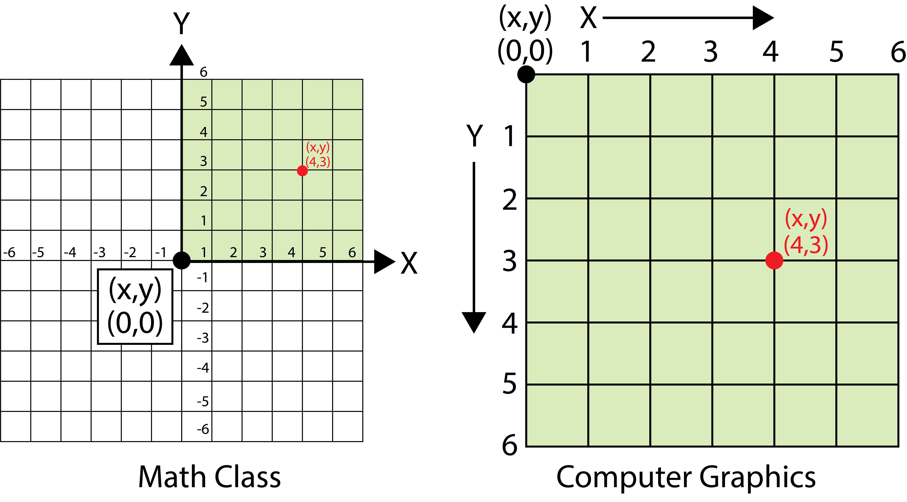

## What is p5.js?

> p5.js is a JavaScript library for creative coding, with a focus on making coding accessible and inclusive for artists, designers, educators, beginners, and anyone else! p5.js is free and open-source because we believe software, and the tools to learn it, should be accessible to everyone.
>
> Using the metaphor of a sketch, p5.js has a full set of drawing functionality. However, you’re not limited to your drawing canvas. You can think of your whole browser page as your sketch, including HTML5 objects for text, input, video, webcam, and sound.
>
> _Description from [p5js.org](https://p5js.org/)_

- installing the library
- [Setup Local Server](https://github.com/processing/p5.js/wiki/Local-server)

## Computer Graphics Coordinates

Unlike in elementary math class the coordinates (0,0) are not in the middle of the page. Coordinates start in the upper left side of the page or screen in computer graphics. Y gets bigger as you move down the screen and X gets bigger as you move right across the screen.

[](./20240103-computer-graphics-coordinates.png)

## Using the p5.js Online Editor

The creators of p5.js provide a convenient and easy to use [online editor]https://editor.p5js.org/ that works in an internet browser window. This allows for quick experimentation and testing. To access the [online editor](https://editor.p5js.org/) go to [https://editor.p5js.org/](https://editor.p5js.org/).

At the top of the editor is a menu with "File, Edit, Sketch, and Help". There is a play button, a stop button, and a check box for "Auto-refresh".

There is a sketch.js window that has the basic bones of a p5.js sketch. This sketch will draw a canvas 400px by 400px and color the background a 120 gray color. When the play button is clicked or the "Auto-refresh" button is toggled, this result will be seen in the Preview window.

```javascript
// Default sketch in the p5.js online editor
function setup() {
  createCanvas(400, 400);
}

function draw() {
  background(220);
}
```

## Parts of a p5.js Program or Sketch

### `setup()`

The `setup()` function runs once at the beginning of a p5.js program. This can "setup" parts of the program such as variables or other settings. The function will execute or run all of the commands inside the curly brackets or braces `{ }`. A common part in `setup()` in p5.js is setting up a canvas to draw on.

```javascript
function setup() {
  createCanvas(400, 500);
}
```

The `setup()` function above creates a canvas that is 400 pixels wide by 500 pixels tall.

### canvas

### `draw()`

The draw function is called after the completion of the setup function and runs continuously until the program stops or the function `noLoop()` is called. Functions are "called" in computer programming jargon. Its speed is controlled by the `frameRate()` function but defaults to 60 frames per second (fps) according to the docs. A sketch or program can only have one draw function. [^2]

### shapes

Different shapes can be drawn in p5.js such as triangles, circles (ellipses), lines, rectangles, and single points. Special functions can be used to create complex shapes such as those used in vector drawing programs like [Adobe Illustrator](../../../../software/adobe-illustrator/illustrator.md).

### color

The color of the canvas and the color of shapes can be set. To set the background color to completely red use the code `background(255,0,0);` The syntax is (Red, Green, Blue) with 0 representing no color and 255 representing 100% color. If a single number is used such as `background(45);` then it will be shaded with a monochrome grey shade corresponding to its position on the 0-255 color scale.

Before drawing a shape you can select a stroke and a fill color. The default is a white fill and a black stroke.
To set a green fill and a blue stroke, you could write the following code:

```javascript
fill(0, 255, 0);
stroke(0, 0, 255);
```

These are completely saturated colors. A more pleasing color palette can be selected by using all three color values. In addition different color modes can be called. Instead of using RGB color mode it may be better to use HSB or HSL for Hue / Saturation Brightness (or Lightness), similar to HSV Hue / Saturation / Value. These modes can be more intuitive for making color adjustments than RGB.

### Code Comments

Comments in code help you remember what different functions and variables represent. They are helpful for debugging and having others review your code. Comments should be used to increase understanding. A good practice is to write code comments for your future self that has amnesia. Think if you would understand the code by reading the comment in 10 years if you forgot everything about the program.

Comments can be single line or multi line in p5.js. Single line comments in Javascript start with two slashes `//`.

`// This is a single line comment`

Multiline comments in Javascript start with a slash and a star `/*` and end with a star and a slash `*/`.

```javascript
/* This is a multiline
comment that continues until
it reaches the ending star * and slash / 
*/
```

An additional use for comments is to "comment out" parts of your code. When you want to test different options without deleting everything from the code editor, "commenting out" some of the code, either a single line or multiple lines, is a recommended method.

[^2]: [p5.js frameRate() Documentation](https://p5js.org/reference/#/p5/frameRate)
