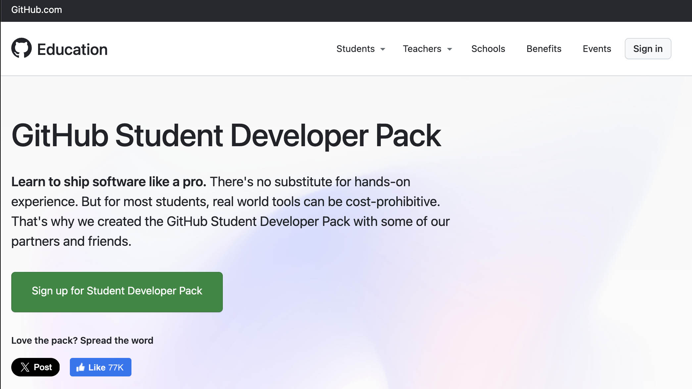

As students, you are eligible for the "GitHub Student Developer Pack." The Student Developer Pack gives students access to learning resources, free domain registration, cloud hosting credits, code training, GitHub Campus expert training, access to GitHub Codespaces, discounts on hardware, and many other [student benefits](https://education.github.com/pack).

## Git

Git is a version control system for files on computers for used with programming and code files. It is like a "super save and undo" button. Git works with "Commits" of changes to your files. Each commit can have a message attached to it explaining what the changes are. Each change is saved in sequence and you can co back to any previous version of the file. This generally works better than having a single file that gets saved over with each change or having a series of files "code-draft.js", "code-working.js", "code-working-2.js", code-working-3-final-final.js", code-problem-now-fixed-final-draft-send-final-3.js". There afe better ways to label files for a manual version control system. Humans are prone to mistakes, so why mess with that when Git has solved the problem already?

## GitHub

GitHub is an online website that works with Git. They are not the same thing. GitHub allows you to sync your files and commit changes to a repository online. A repository is like a project folder for code or a programming project. You can have multiple repositories and they can be private, viewable only by you, or publicly viewable. Using GitHub facilitates collaboration with other programmers and is a good place to keep a backup of your coding projects.

We will talk more about how to set up GitHub with your text editor and programming environment later in the course. For now, sign up for a GitHub account using your student email address.
