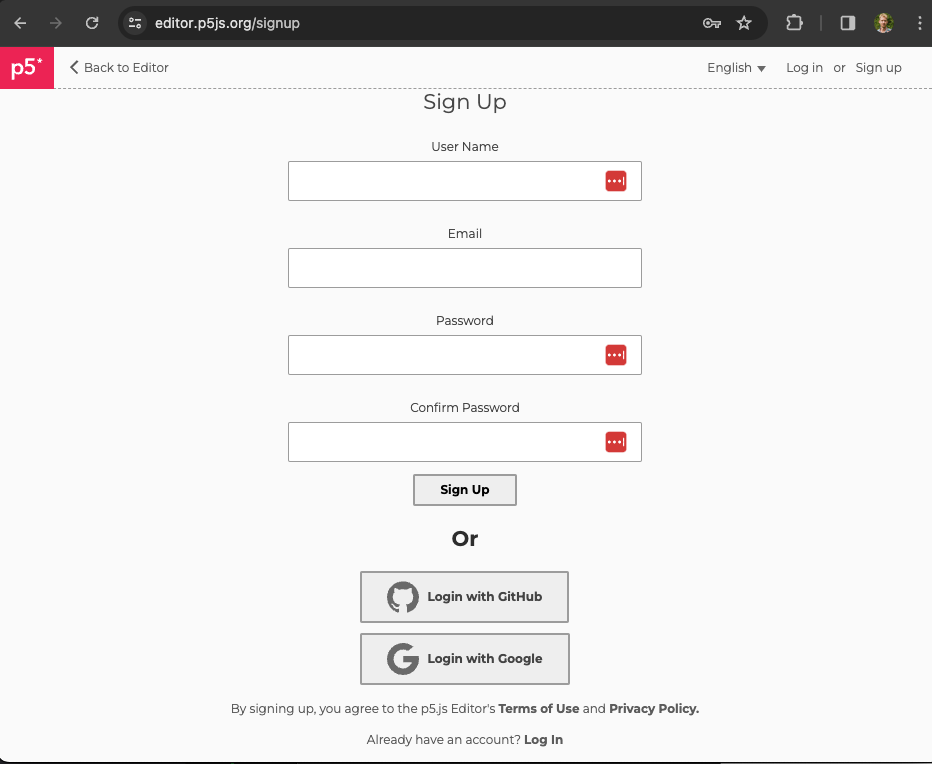
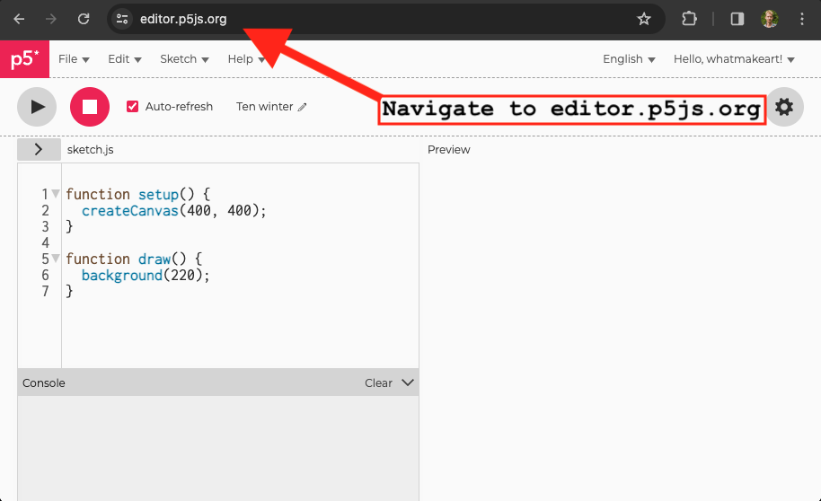
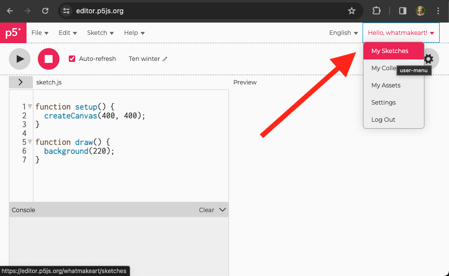
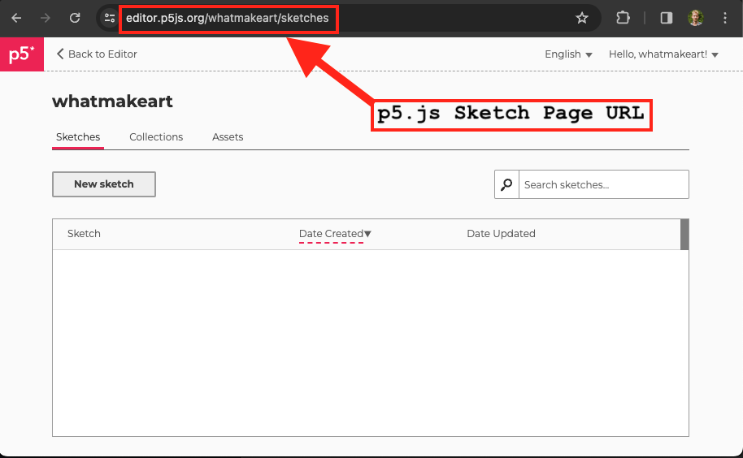
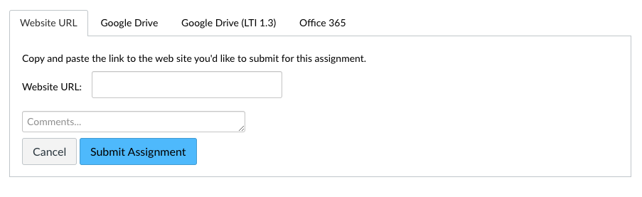

## Assignment Deliverables

1. Add URL for your p5.js Sketches page to the URL entry field in the [Canvas assignment](https://cia.instructure.com/courses/1059/assignments/6662).
   - p5.js Sketches page link example - `https://editor.p5js.org/whatmakeart/sketches`

## Assignment Instructions

After signing up, add your profile urls to the URL entry field in the [Canvas assignment page](https://cia.instructure.com/courses/1059/assignments/6662).

### p5.js Account

1. Sign up for a p5.js account. [https://editor.p5js.org/signup](https://editor.p5js.org/signup)

2. After signing up for the p5.js account, navigate to the [p5.js web editor](https://editor.p5js.org/).

3. Select the Sketch page from the drop down menu on the top right of the p5.js web editor.

4. Copy the URL of your p5.js Sketch page.

5. Paste it into the URL field of the Canvas Assignment.

