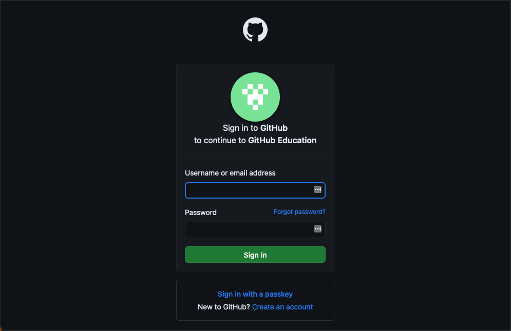

## Assignment Deliverables

1. Add URL for your GitHub Profile page to the URL entry field in the [Canvas assignment](https://cia.instructure.com/courses/1059/assignments/6663).
   - GitHub Profile Page link example - `https://github.com/whatmakeart`

## Assignment Instructions

After signing up for these accounts, add your profile urls to the URL entry field in the [Canvas assignment page](https://cia.instructure.com/courses/1059/assignments/6662).

## Sign Up for GitHub Account

1. Sign up for a [GitHub Education Account](https://education.github.com/sign_in) with your Student email address.

2. Confirm your email.

3. Set up two factor authentication

4. Upload your GitHub Profile URL to the Canvas assignment.
