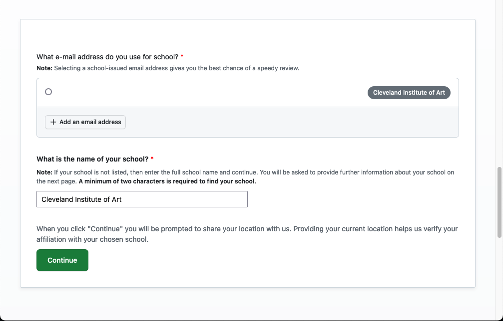

## Assignment Deliverables

1. Upload a Screenshot of your Student Developer Confirmation email to Canvas

   - Label the file YYYYMMDD Lastname Firstname Student Developer Pack.jpg or png

   **OR**

2. Upload a Screenshot of any error message or eligibility confirmation delay messages from GitHub to Canvas
   - Label the file YYYYMMDD Lastname Firstname Sign Up Error.jpg or png

## Assignment Overview

### GiHub Student Developer Pack

After signing up for a GitHub account with your student email address, then make sure you complete the following checklist from [GitHub](https://education.github.com/discount_requests/application) to make sure that you qualify for the Student Developer Pack and have your account approved right away.

### Student Developer Pack Eligibility Checklist

> To qualify for student benefits, you must:
>
> - Have a GitHub account.
> - Be at least 13 years old.
> - Be currently enrolled in a degree or diploma granting course of study from a recognized educational institution.
> - Be able to provide documentation from your school which demonstrates your current student status.
>
> Before you begin:
>
> - Check that you are using a [supported browser](https://docs.github.com/en/get-started/using-github/supported-browsers), and that location services are not blocked by your browser or platform.
> - Complete your GitHub account [billing information](https://github.com/settings/billing/payment_information) with your full legal name as it appears on your academic affiliation documentation. (You do not have to add a payment method.)
> - [Verify](https://docs.github.com/en/account-and-profile/setting-up-and-managing-your-personal-account-on-github/managing-email-preferences/adding-an-email-address-to-your-github-account) your academic email address on your GitHub account, if your school provides one.
> - Secure your GitHub account with [two-factor authentication](https://docs.github.com/en/authentication/securing-your-account-with-two-factor-authentication-2fa). (We recommend using the [GitHub Mobile](https://docs.github.com/en/authentication/securing-your-account-with-two-factor-authentication-2fa/configuring-two-factor-authentication#configuring-two-factor-authentication-using-github-mobile) app.)
> - [Personalize](https://docs.github.com/en/account-and-profile/setting-up-and-managing-your-github-profile/customizing-your-profile/personalizing-your-profile) your public GitHub Profile with your photo, your name, your pronouns, and more.
> - Generate a README for your public GitHub Profile, [customize it with your interests](https://docs.github.com/en/account-and-profile/setting-up-and-managing-your-github-profile/customizing-your-profile/managing-your-profile-readme), and publish it for the world to see.
>
> GitHub Student Developer Pack instructions from [GitHub](https://education.github.com/discount_requests/application)

## Assignment Instructions

1. Complete the Eligibility Checklist above.
2. Register for a [GitHub Student Developer Pack](https://education.github.com/pack).
3. Confirm you are a student.

4. Confirm your School.

5. Follow any additional sign up prompts and email confirmation requests.
6. Screenshot your confirmation email from GitHub or screenshot any errors or problems that arise. [How to take a screenshot](../../../../software/how-to-take-a-screenshot.md)
7. Upload your labeled screenshot to the Canvas assignment.
