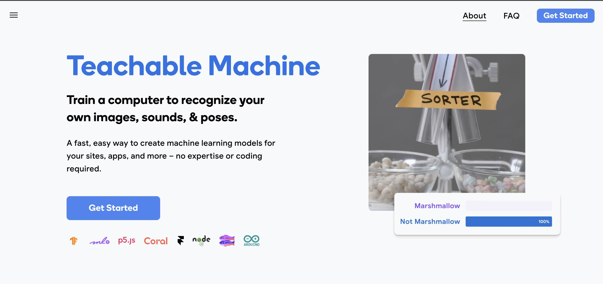

## Image Classification with Teachable Machine

[Teachable Machine](https://teachablemachine.withgoogle.com/) is a project created by Google Labs that allows users to train machine learning models with nearly no code. I say nearly because while the training is just clicking buttons, some manipulation of example code is needed in order to use the newly trained model in an interesting way.
