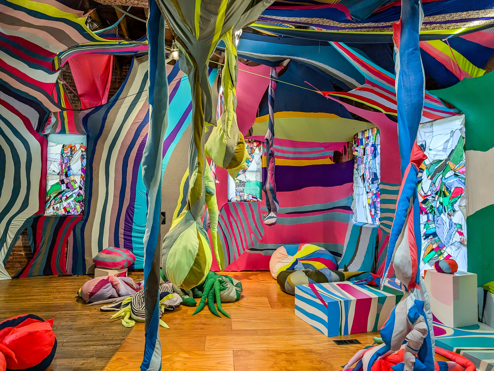
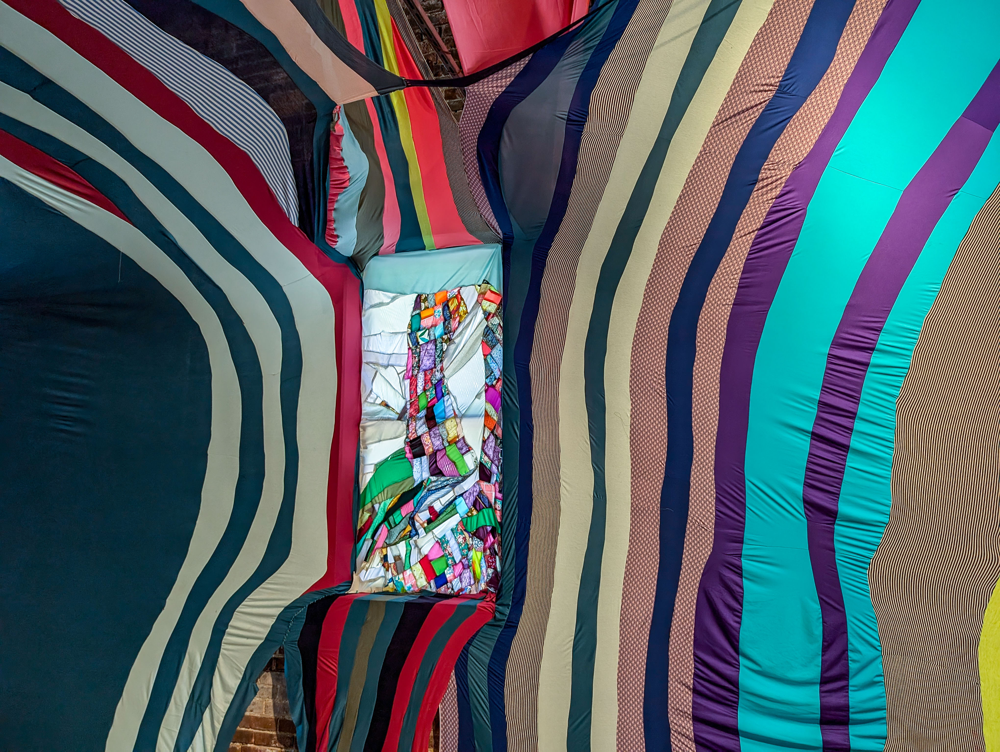
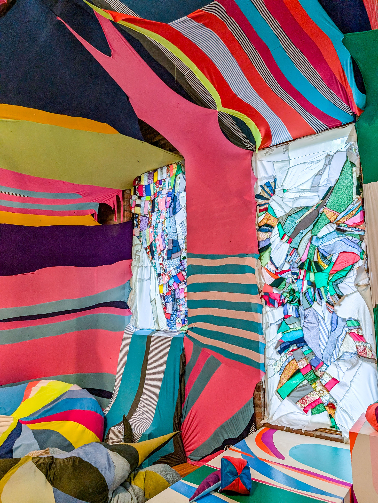
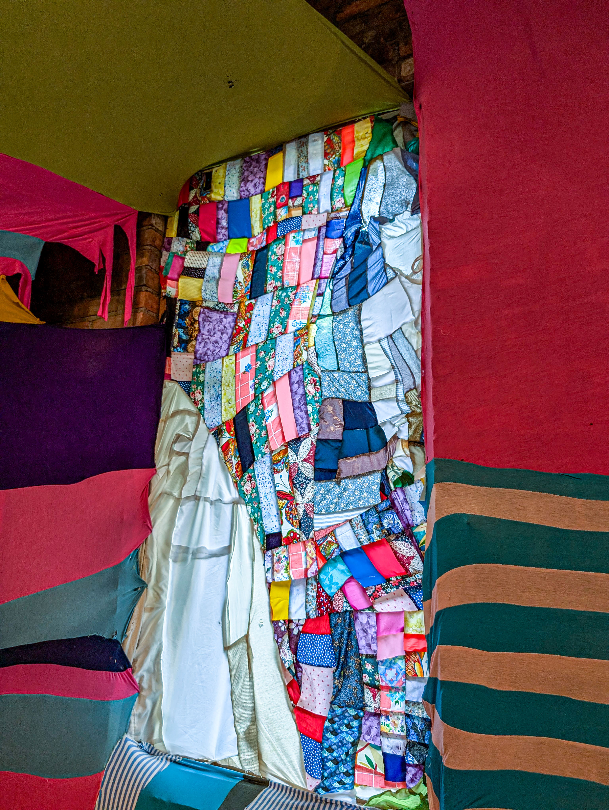

## Assignment Deliverables

1. 17.25" x 28.5" Assembled Scrap Fabric Sewn Collage

## Requirements

1. Use minimum of 1 each of basic sewing seams
   - [Plain Seam](../../../../sewing/how-to-sew-a-plain-seam.md)
   - [French Seam](../../../../sewing/how-to-sew-a-french-seam.md)
   - [Mock Flat Felled Seam](../../../../sewing/how-to-sew-a-mock-flat-felled-seam.md)
   - [Serged Seam](../../../../sewing/how-to-sew-a-serged-seam-with-home-serger.md)
   - [Serged Seam with Top Stitching](../../../../sewing/how-to-sew-serged-seam-with-topstiching-home-serger.md)
   - [Busted Seam](../../../../sewing/how-to-sew-a-busted-seam.md)
2. Use minimum of 6 different fabric selections
3. Assemble rectilinear scrap fabric sewn collage ~17.25" x ~28.5"
4. Reference the work of Tommy Nguyen who recent exhibit, [Tommy Nguyen: _may the PLUSH be with you_](https://sculpturecenter.org/tommy-nguyen/), featuring soft sculptural works at the [Sculpture Center](https://sculpturecenter.org/) in Cleveland, Ohio.

## Artist Reference

### Tommy Nguyen: _may the PLUSH be with you_

<figure>

<figcaption>

[Tommy Nguyen: _may the PLUSH be with you_](https://sculpturecenter.org/tommy-nguyen/) installation at the [Sculpture Center](https://sculpturecenter.org/) in Cleveland, Ohio.

 </figcaption></figure>
<figure>

<figcaption>

[Tommy Nguyen: _may the PLUSH be with you_](https://sculpturecenter.org/tommy-nguyen/) installation at the [Sculpture Center](https://sculpturecenter.org/) in Cleveland, Ohio.

 </figcaption></figure>
 <figure>

<figcaption>

[Tommy Nguyen: _may the PLUSH be with you_](https://sculpturecenter.org/tommy-nguyen/) installation at the [Sculpture Center](https://sculpturecenter.org/) in Cleveland, Ohio.

 </figcaption></figure>

 <figure>

<figcaption>

[Tommy Nguyen: _may the PLUSH be with you_](https://sculpturecenter.org/tommy-nguyen/) installation at the [Sculpture Center](https://sculpturecenter.org/) in Cleveland, Ohio.

 </figcaption></figure>

- [Tommy Nguyen: _may the PLUSH be with you_](https://sculpturecenter.org/tommy-nguyen/)
- [Tommy Nguyen Website](https://tommynguyen.info/)

## Grading Rubric

| Assessment                          | Weight    |
| ----------------------------------- | --------- |
| Plain Seam Used                     | 10 points |
| French Seam Used                    | 10 points |
| Mock Flat Felled Seam Used          | 10 points |
| Serged Seam Used                    | 10 points |
| Serged Seam with Top Stitching Used | 10 points |
| Busted Seam Used                    | 10 points |
| Size ~17.25" x ~28.5"               | 10 points |
| Sewn Collage Composition and Design | 30 points |

