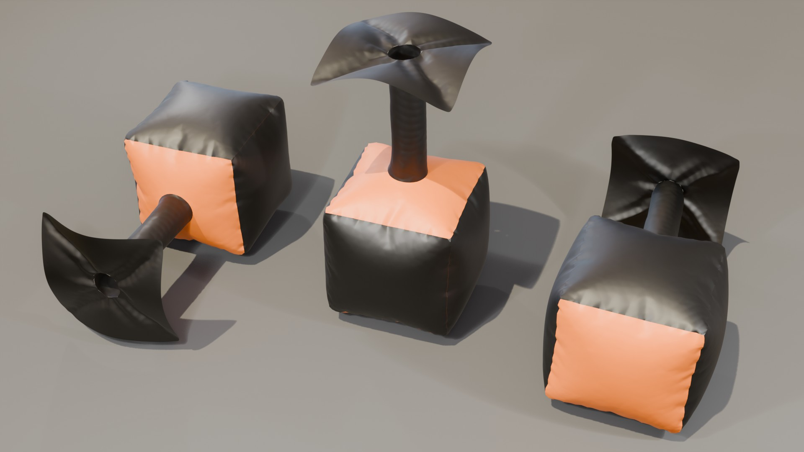

## Assignment Deliverables

1. Sewn Inflatable Section

## Assignment Overview

Learn about module forms and batch processing of inflatable components by sewing urethane coated nylon fabric into a form. These forms will later be joined to make a larger cold air inflatable.

<figure>

<figcaption>

Render of modular inflatable form

</figcaption>
</figure>

## Process

The roll of fabric is ~59 inches wide. Divided by 3 the width becomes ~19 5/8 inches.

### Fabric Pieces Needed

- 7 19 5/8 inch squares
- 1 27 inch x 29.5 inch tube piece

1. Cut out fabric 7 square pieces and 1 tube piece
2. Join 5 sides of cube together
3. Cut hole for tube in two remaining square pieces. This hole has a 4.25" radius.
4. Attach tube to one square piece at hole
5. Attach square piece to cube
6. Attach final square to tube
