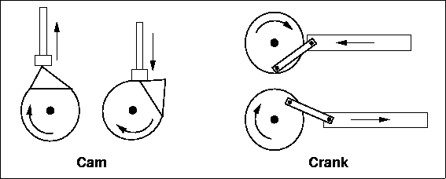

This page includes resources and links from [Bob Drake's](./11-02-bob-drake.md) Sonic Arts Workshop [^1] in the fall 2023 [Time Based Strategies course](../00-getting-started/00-02-time-based-strategies-syllabus.md) in the [Sculpture + Expanded Media Department](https://www.cia.edu/academics/sculpture-expanded-media) at the [Cleveland Institute of Art](https://www.cia.edu/).

## Listening

### John Cage

<iframe class="youTubeIframe" width="560" height="315" src="https://www.youtube.com/embed/H-Xy-gAaOzw" title="YouTube video player" frameborder="0" allow="accelerometer; autoplay; clipboard-write; encrypted-media; gyroscope; picture-in-picture; web-share" allowfullscreen></iframe>

### [Christine Sun Kim](http://christinesunkim.com/)

<iframe class="vimeoIframe" src="https://player.vimeo.com/video/31083172?h=c477c18286#t=2m12s" width="640" height="360" frameborder="0" allow="autoplay; fullscreen; picture-in-picture" allowfullscreen></iframe>

### Pauline Oliveros

<iframe class="youTubeIframe" width="560" height="315" src="https://www.youtube.com/embed/WvP4MxvFpP0" title="YouTube video player" frameborder="0" allow="accelerometer; autoplay; clipboard-write; encrypted-media; gyroscope; picture-in-picture; web-share" allowfullscreen></iframe>

<iframe class="youTubeIframe" width="560" height="315" src="https://www.youtube.com/embed/u355U29bOt0" title="YouTube video player" frameborder="0" allow="accelerometer; autoplay; clipboard-write; encrypted-media; gyroscope; picture-in-picture; web-share" allowfullscreen></iframe>

## Example Videos - autonomous / indeterminate sculptures

### [Anne-f Jacques’s](http://anne-fff.tumblr.com/) sound constructions/performances

- Matières en suspension: https://vimeo.com/295939586 (installation)
- quelques lentes patentes: https://vimeo.com/294635305 (sculpture sketches)
- Audiograft 2016: https://vimeo.com/175714054 (performance)
- Les Transformables v.103 - https://vimeo.com/178374566 (installation/performance)
- Mechanical Music – VNM Festival 2016: https://vimeo.com/200082976 (performance)

<iframe class="vimeoIframe" src="https://player.vimeo.com/video/295939586?h=70fe027487" width="640" height="360" frameborder="0" allow="autoplay; fullscreen; picture-in-picture" allowfullscreen></iframe>

<iframe class="vimeoIframe" src="https://player.vimeo.com/video/294635305?h=0a0a571751" width="640" height="360" frameborder="0" allow="autoplay; fullscreen; picture-in-picture" allowfullscreen></iframe>

<iframe class="vimeoIframe" src="https://player.vimeo.com/video/175714054?h=c75440ad39" width="640" height="360" frameborder="0" allow="autoplay; fullscreen; picture-in-picture" allowfullscreen></iframe>

<iframe class="vimeoIframe" src="https://player.vimeo.com/video/178374566?h=8f6a65f612" width="640" height="427" frameborder="0" allow="autoplay; fullscreen; picture-in-picture" allowfullscreen></iframe>

<iframe class="vimeoIframe" src="https://player.vimeo.com/video/200082976?h=0bcf1df297&color=C5113E" width="640" height="360" frameborder="0" allow="autoplay; fullscreen; picture-in-picture" allowfullscreen></iframe>

### [Petr Válek’s](https://vasulkakitchen.org/en/petr-valek-figments-and-other-stuff) extreme noise

- https://www.youtube.com/watch?v=6-D9ofCURUk (wall sculpture)
- https://www.youtube.com/watch?v=GLZcWX-0nAM (sculpture)
- https://www.youtube.com/watch?v=-wLpRpuKVVc (sculpture w/ zither)
- https://www.youtube.com/watch?v=1wgmlZH3UPU (sculpture/instrument)
- https://www.youtube.com/watch?v=UGrJBnpq830 (sculpture)
- https://www.youtube.com/watch?v=EDH4D6ombV0 (sculpture)

<iframe class="youTubeIframe" width="560" height="315" src="https://www.youtube.com/embed/6-D9ofCURUk" title="YouTube video player" frameborder="0" allow="accelerometer; autoplay; clipboard-write; encrypted-media; gyroscope; picture-in-picture; web-share" allowfullscreen></iframe>

<iframe class="youTubeIframe" width="560" height="315" src="https://www.youtube.com/embed/GLZcWX-0nAM " title="YouTube video player" frameborder="0" allow="accelerometer; autoplay; clipboard-write; encrypted-media; gyroscope; picture-in-picture; web-share" allowfullscreen></iframe>

<iframe class="youTubeIframe" width="560" height="315" src="https://www.youtube.com/embed/-wLpRpuKVVc" title="YouTube video player" frameborder="0" allow="accelerometer; autoplay; clipboard-write; encrypted-media; gyroscope; picture-in-picture; web-share" allowfullscreen></iframe>

<iframe class="youTubeIframe" width="560" height="315" src="https://www.youtube.com/embed/1wgmlZH3UPU " title="YouTube video player" frameborder="0" allow="accelerometer; autoplay; clipboard-write; encrypted-media; gyroscope; picture-in-picture; web-share" allowfullscreen></iframe>

<iframe class="youTubeIframe" width="560" height="315" src="https://www.youtube.com/embed/UGrJBnpq830" title="YouTube video player" frameborder="0" allow="accelerometer; autoplay; clipboard-write; encrypted-media; gyroscope; picture-in-picture; web-share" allowfullscreen></iframe>

<iframe class="youTubeIframe" width="560" height="315" src="https://www.youtube.com/embed/EDH4D6ombV0 " title="YouTube video player" frameborder="0" allow="accelerometer; autoplay; clipboard-write; encrypted-media; gyroscope; picture-in-picture; web-share" allowfullscreen></iframe>

## Techniques

### Tones vs. Noises

- Abrasive “noisy” sound
  - Friction/resistance
  - Scraping
  - Softer (cardboard) or irregular (sandpaper, rough rock) surfaces on object
- Tonal
  - Striking, percussive, or vibration activation
  - Harder materials – metal, ceramic, hardwood
  - Suspend objects to allow for freer vibration (foam, rubber, string).

### Resonant Objects/Chambers

- Increase volume of small sounds by mounting on a larger plate
- Increase resonance by suspending objects, so they are freer to vibrate
- Increase & modify the sound by mounting on container with an opening

### Simple Machines

- Change rotary motion to linear using cams, cranks, levers [^2]

### Loose Coupling

Introduce irregularity / indeterminacy to motion

- Non-rigid parts like string, rubber bands
- Loose-fitting or “sloppy” connections
- Eccentric weighted motor-driven parts
- Freely moving objects reacting to motor-driven movement (stirring marbles in a bowl)

## Further Reading

- [Deep Listening Institute](http://www.deeplistening.org/site/content/about)
- [Ruben Museum intro to Sonic Meditations](http://rubinmuseum.org/blog/pauline-oliveros-deep-listening-sound-meditations)

[^1]: Text and resources on this page from Sonic Arts Workshop handout written by [Bob Drake](https://fluxmonkey.com/)
[^2]: _**Figure 3.9:** Cams and Cranks_ from [Basic Mechanics](https://www.clear.rice.edu/elec201/Book/basic_mech.html) chapter of [ELEC 201 Notes](https://www.clear.rice.edu/elec201/index.html) by Dr. James F. Young
