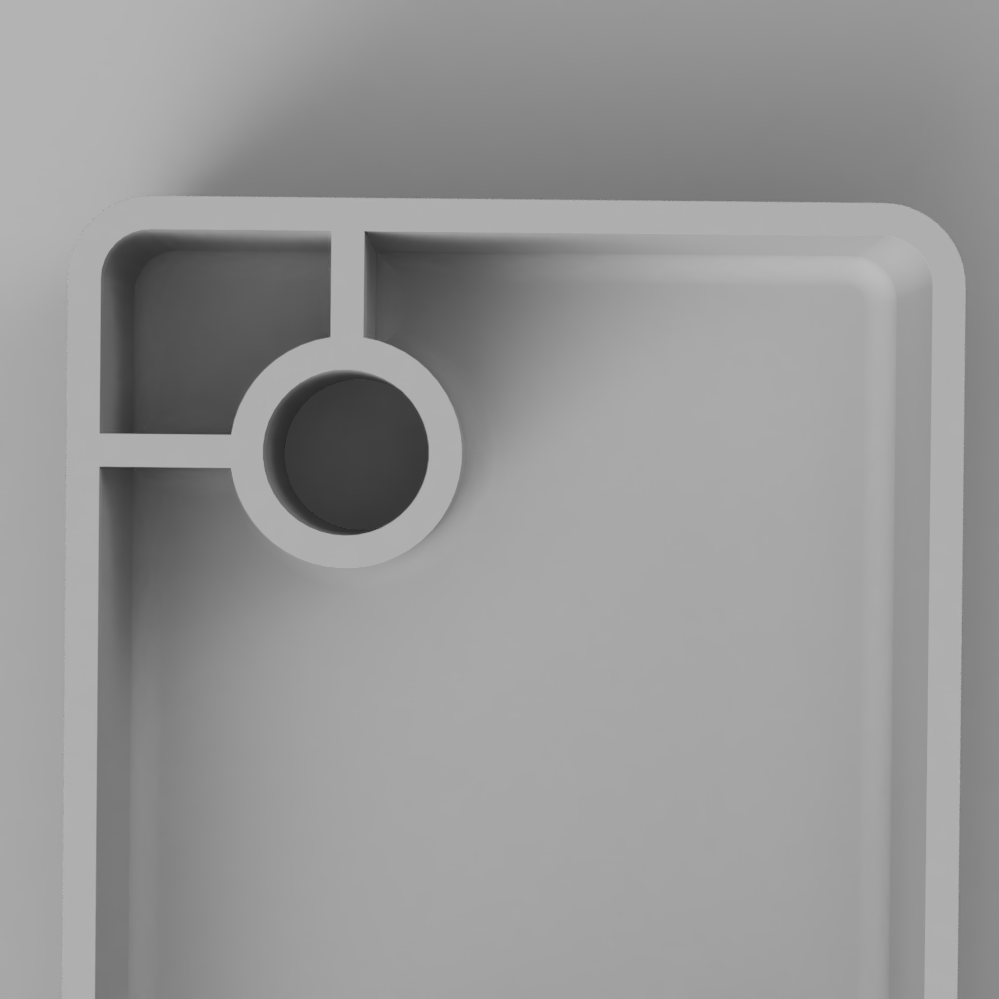

3D Printing is an [additive-processes](../sculpture/additive-processes.md) of [Fabrication](../making/fabrication.md).

## Types of 3D Printers

### FDM Printers

### Resin Printers

### Dual Print Head Printers

### Laser Sintering Printers

### General 3D Print Rules for FFD Printing without Dissolvable Supports

- Keep thin and small parts multiples of the nozzle size. The nozzle at the think[box] is .4mm absolute minimum size of fine objects is 1.2mm. A better size for thin walls and supports is 1.6mm. 1.5mm or 1.7 mm are not good. 2.0mm or 2.4mm are even better.
- Keep overhanging parts extending out less than 45 degrees. This allows layers to overlap a bit and slowly extend out wider. 45 degrees is the max otherwise the printer tries to print in mid air and all the filament falls to the ground.
- Objects must be fully connected and "manifold" or "watertight" You can't have pieces floating in the air or close but not touching. Don't have small voids. Make the pieces solid and uniform. You can have a hollow vase or container but all its parts and walls should be connected and solid.

 Red models will not print without supports but green models will because they rise up at 45 degrees

 Red models will not print without supports but green models will because they rise up at 45 degrees

### General Structural 3D Printing Guidelines

The following guidelines help achieve successful 3d Prints especially when designing containers, structural parts and pieces that need to be the correct size to match real world objects. These concepts still hold true for more organic creative work but may not be as necessary.

 Example of model showing Mechanical 3D Print Guidelines

Gussets or supporting pieces like wings give more structure to elements.|# 3D Printing This tutorial will

## Prerequisites

To complete this tutorial you should be familiar with

## Instructions

The first step

 Uniform Walls help with deformation and warping.

 Fillets or rounded interior corners add strength and help with warping. Ribs also shown, connect vertical pieces to other vertical pieces or walls. 

 Chamfers or angled interior corners add strength and help with warping like fillets do.

Rounded Corners put less stress on the corners and are smoother to print.

### 3D Printing Terms

These are some common words and terminology used in 3D Printing

- Vertex - the base unit of a polygon model. It is a point in space defined by an x, y and z coordinate. Can be moved around and "welded" to other vertexes or connected to another vertex with an edge.
- Edge - the line connecting two vertexes in a polygon model. Edges make closed shaped that are called faces
- Face - the enclosed shape made by connected vertexes and edges. Can be a triangle, a quad (four-sides) or an N-Gon
- Triangle - simplest planar shape. STLs are made of triangle but triangles should be avoided if possible when modeling since they cannot be subdivided easily and do not make smooth forms.
- Quad - A four sided polygon. This is generally the best shape to make your model from.
- N-Gon - A polygon with (n) sides. These should be avoided. With T-Splines you may have some n-gons but it is best to make them into quads if you can.
- Mesh - The structure of a 3D model. It is made of of points (vertexes), edges and polygon faces.
- Bounding Box - the smallest box that your model can fit in. IT is a rectangular prism defined by a height, width and length.
- Raft - bottom support for a 3D print to help it adhere to the print bed when the print starts and to keep the print from falling over when the print gets taller.
- Infill - Support material in the middle of a 3D print. Can be made of different patterns and is usually not solid. Sometimes described in percentage terms, less infill will make a faster print and use less material while a higher percentage infill will take longer to print and use more material.
- Support Material - extra printed material used to support parts of the print that overhang more than 45 degrees in the horizontal direction. Sometime a model can be orientated on the printer at a different angle to avoid support material. Can be removed but often messes up the surface where it attached to the print.
- Parametric - A 3D model driven by defined dimensions and parameters
- Solid - A 3D model that is not a plane or open shape. It is a full solid object.
- Polygon - A 3 or more sided shape. The surfaces of 3D models are made of polygons
- STL (STereoLithography) - the most common file format used for 3D printing. It is made of a fine triangle mesh. This file format works for 3D printing but is not good for modeling. Always save the original model file so you can make changes. It is possible to edit an STL file but it is much easier to edit the original 3D model.
- Print in Place (PIP) - Method of printing moving parts such as hinges and joints in a 3D print in one operation. This produces forms that would not be possible with traditional manufacturing techniques.
- Fused Filament Fabrication (FFF) - Most common method of affordable 3D printing. This method uses a thermoplastic filament, or wire, on a spool that is fed through a nozzle. Heat melts the thermoplastic and new layers are fused to previous layers in order to make the print.
-

## Further Reading

### External Links

https://hackaday.com/2018/01/14/aluminum-no-match-for-3d-printed-press-brake-dies/

https://www.3dhubs.com/knowledge-base/how-design-snap-fit-joints-3d-printing

https://3dprint.com/169757/103dp-nintendo-switch/

Understanding & Designing for FDM Tolerances | All3DP Pro

https://m.all3dp.com/2/engineering-tolerance-definition-drawing/

Researchers 3D-printed a cell-sized tugboat

https://www.engadget.com/researchers-3-dprinted-a-microscopic-boat-to-see-how-bacteria-swim-105633277.html

Are 3D printed watermarks a “grave and growing” threat to people’s privacy? - 3D Printing Industry

https://3dprintingindustry.com/news/are-3d-printed-watermarks-a-grave-and-growing-threat-to-peoples-privacy-176309/

Printed Sewing Machine Parts Extend Singer’s Range | Hackaday

https://hackaday.com/2021/12/03/print-sewing-machine-parts-extend-singers-range/

I developed a design method to print trim parts larger than the build volume

https://www.reddit.com/r/3Dprinting/comments/s2aj5r/i_developed_a_design_method_to_print_trim_parts/?utm_medium=android_app&utm_source=share
