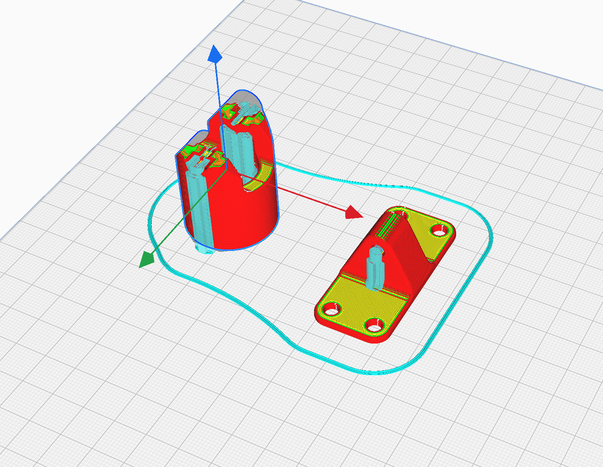

Cura is a 3D printing slicing program.

1. Choose the correct 3D printer

2. Place STL files on the print bed.

3. Start with the recommended settings and choose if you need supports or not.

4. Preview the slicing of the print.

5. When everything is set, save the gcode file to disk.

