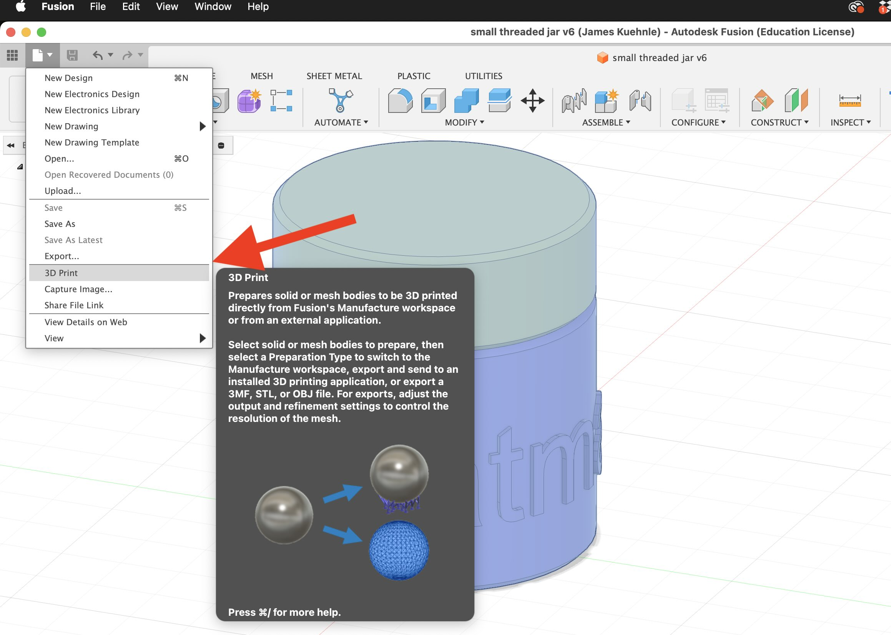
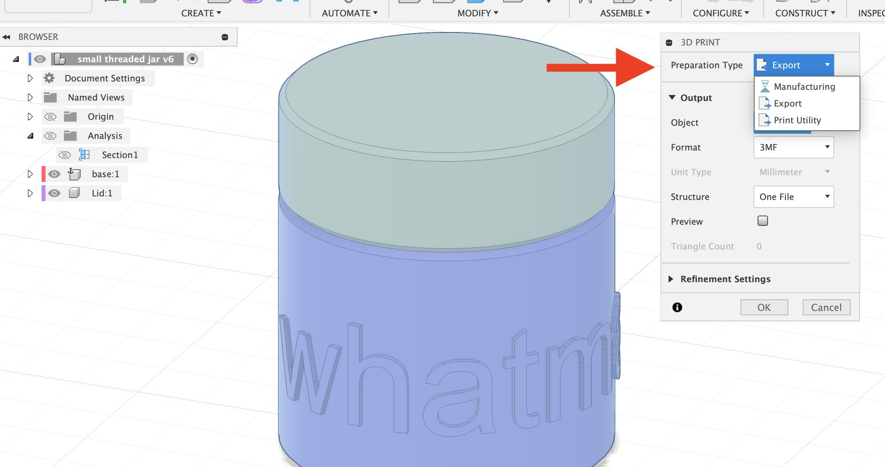
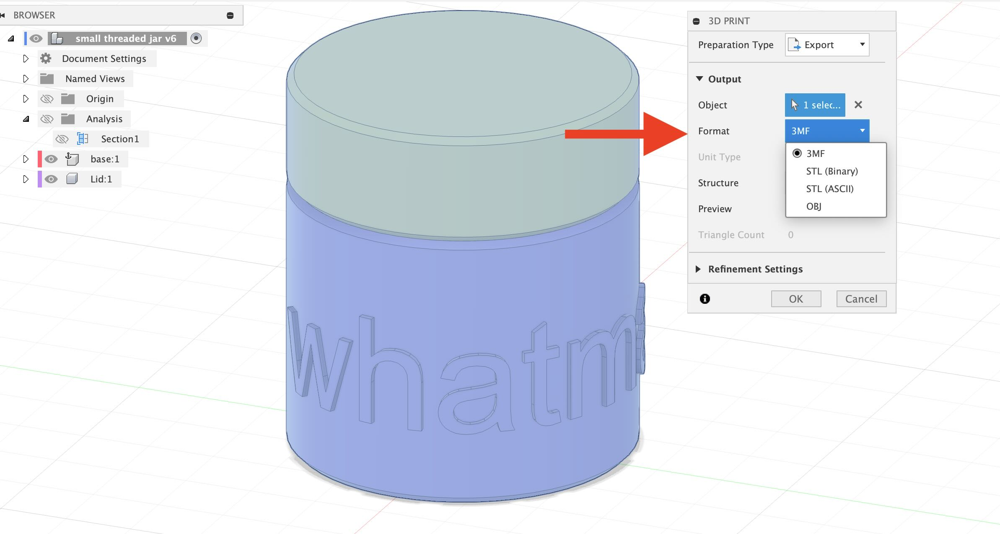

<iframe class="youTubeIframe" width="560" height="315" src="https://www.youtube.com/embed/NyXJhfod6_8?rel=0" title="YouTube video player" frameborder="0" allow="accelerometer; autoplay; clipboard-write; encrypted-media; gyroscope; picture-in-picture; web-share" referrerpolicy="strict-origin-when-cross-origin" allowfullscreen></iframe>

- [Export 3mf File Fusion 360](https://youtu.be/NyXJhfod6_8)

<figure>

<figcaption>

Select File > 3D Print ...

</figcaption>
</figure>

<figure>

<figcaption>

Choose the export option to save the file on your local computer

</figcaption>
</figure>

<figure>

<figcaption>

Choose the .3mf file format

</figcaption>
</figure>
