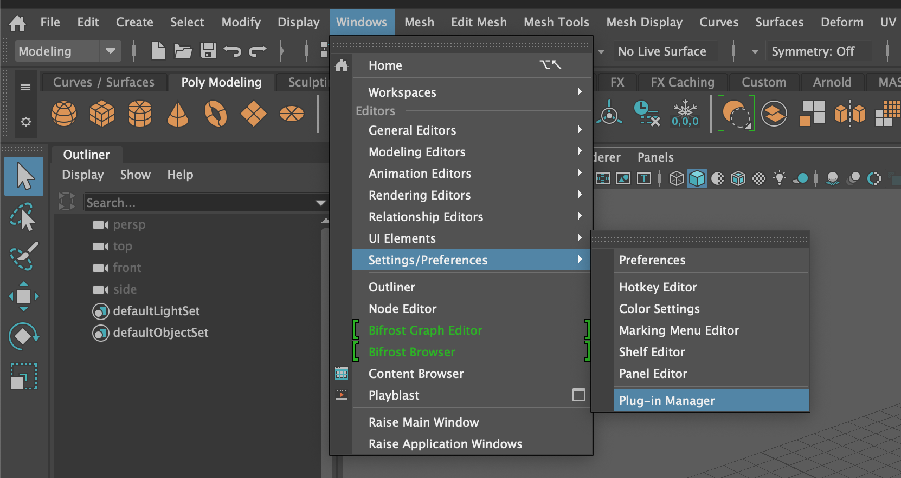
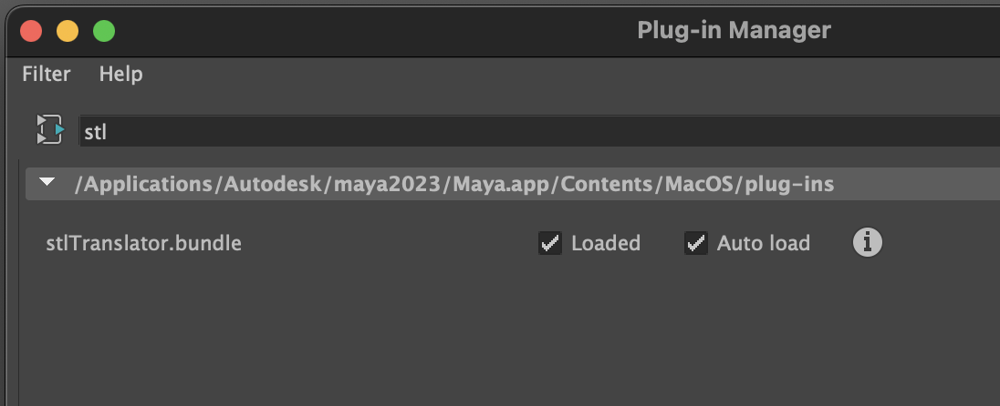

Before exporting a mesh as an STL for 3D printing, it is important to make sure that the mesh is manifold or watertight. Otherwise the file will not be able to be 3D printed.

## Enable STL Translator Bundle Plugin

By default [Maya](../../3d-modeling/maya/maya.md) does not have an STL export option. The STL plugin needs to be enabled.

Go to Windows > Settings / Preferences > Plug In Manager ...

In the search box, type "STL"

Click the checkbox for enable and auto load.

Now if you export a selection, STL is one of the file format options.

