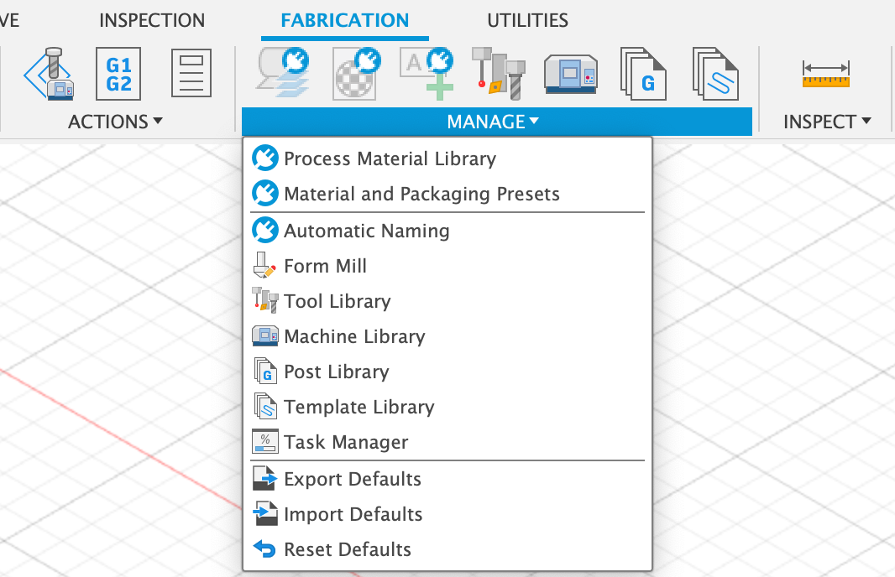

In order to create toolpaths in Fusion 360 we need to tell Fusion what tool we will use to cut out our pieces so the computer can do the proper calculations. The main dimension needed for a laser cutting tool is the width of the laser so Fusion can calculate the kerf offset. All cutting tools leave a gap where they pass through the material. If this gap is not accounted for then pieces will not be the expected size.

In the Manufacure Workspace there is a tool library. Here you can create and import tools to use in Fusion 360. These tools can be reused in later projects.

Follow the instructions in the video below to create a laser cut tool in Fusion 360. Make sure you enter a kerf of .127 mm since that is the kerf of the laser cutters at the think[box]. If your pieces do not fit correctly you can then adjust this tool in Fusion 360 to correct the kerf for your desired fit.

## Create Laser Cutter Tool with Specific Kerf

<iframe class="youTubeIframe" style="position: absolute; top: 0; bottom: 0; left: 0; width: 100%; height: 100%; border: 0; z-index: 1;" src="https://www.youtube.com/embed/-B6DXF9aE5s?rel=0" width="560" height="315" frameborder="0" allowfullscreen="allowfullscreen"></iframe>

