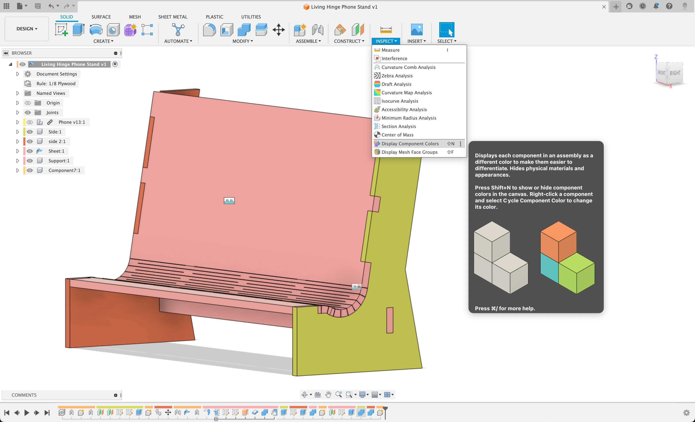

## Assess your Digital Model

Look at your digital model in Fusion 360 and decide if there are design issues or changes that you want to make. Think about how your pieces connect. Think about the overall aesthetics of the stand.

- Do the finger joints only sit on the outside of a piece or are the fully enclosed?
- Is there clearance for bolts?
- Do you have enough support pieces?
- Are there additional places to add decorative etchings or photo engravings?
- Are there any sharp corners? Are there places that decorative cutouts or negative space could be added to the design?
- Could more organic forms be added to improve the design?

Design is a process of iteration and improvement. There are likely places where you design could be altered and changed before cutting. Make these changes to your model in Fusion 360. Some changes will be as simple as changing the value of user parameters. Others will require modification of sketches or extrude features. More involved changes may require creating new components or even deleting existing components.

- △ Triangles are strong
- ┗ L's are Lame
- ▢ Squares are ok but need some help
- ○ Circles are amazing but can be hard to attach to

## Check your Plywood Thickness

Measure your plywood with digital calipers. You can use a piece from your laser cut test. It might be close but the thickness is likely different than what you used for your user parameter in Fusion 360. Update your user parameter to match so you have joints that fit and are even. This is especially important for thicker pieces of plywood.

It is a good idea to temporarily make the "ply" parameter much larger to double check that you used the user parameter throughout your model everyplace "ply" was needed. It is easy to accidentally type the actual dimension rather that using the user parameter. You want to check this before cutting. If you put in a larger number and you notice one piece doesn't change, then that is an indication that you did not use the parameter on that dimension. Go back and change it. [Changing Plywood Thickness in Fusion 360 video demo.](https://www.youtu.be/a7HOiBC_81s)

## Fix Errors

Then check your Fusion 360 file for errors in the timeline. Fix these errors in the timeline by moving the playhead to the first error and fixing it before the others. Right click on the feature in the timeline to review any errors. Continue until all errors are complete. [Fixing Fusion 360 Errors video demo.](https://www.youtu.be/F3673fmEymo)

## Make Sure Each Piece is a Component

Turn on the Inspection Tool > Display Component Colors in Fusion 360. It is located under the Inspect button in the Design Workspace. This makes each individual component have a different display color. This does not change any appearances they you applied. If you turn off Display Component Colors, then the previous appearances will show.

Showing the components as different colors can help make sense of a complicated model. It can also show places that may have not been cut through. It helps check if everything is a separate component since pieces that are the same color could be the same component. As an added benefit, the colors of the components are also shown in the browser on the left and the design timeline on the bottom. This can be extremely helpful when modifying and troubleshooting a model.

Note: Sometimes Fusion 360 picks colors that look similar.

