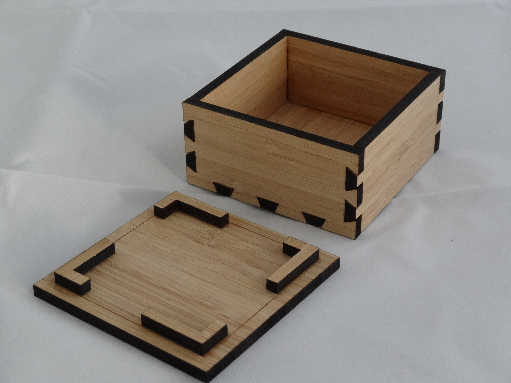
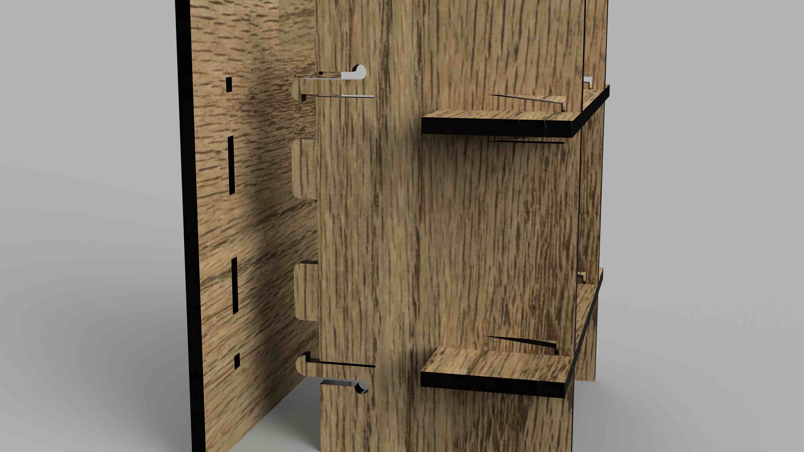

There are many ways to join a laser cut project together ranging from gravity to glue to bolts to snap pieces. You can use a variety of ways to connect. Here are some example images of different methods of joining pieces together. There are many more ways. Search the internet for other methods of making laser cut joints.

## Box Finger Joints

Finger joints are a common way to join laser cut projects together. They have an advantage over simple butt joints since the fingers help align the pieces but can make it more difficulty to glue and clamp during assembly. Finger joints can be on the edge as shown in the image ore then can be inset so they are contained by the panel that they insert into. Box with finger joints on all sides [Demo video making a finger jointed box.](https://youtu.be/ZrcqauNvt0M)

<iframe class="youTubeIframe" width="560" height="315" src="https://www.youtube.com/embed/ZrcqauNvt0M?rel=0" title="YouTube video player" frameborder="0" allow="accelerometer; autoplay; clipboard-write; encrypted-media; gyroscope; picture-in-picture; web-share" allowfullscreen></iframe>

## Slot Hook Joints

The slots for the hooks must be large enough for the entire hook to pass through. A bit of clearance in the hook space can help the pieces slide together. Care must be taken to model the parts to align when the hooks are engaged. Usually this means having more space at the top to accommodate the open slot.

## Pinned Finger Joints

Pinned finger joints send a tab all the way through a hole in a panel. The tab extends far enough to allow for at least the thickness of a "pin" to slide into its opening. This pin keeps the finger joint tab from pulling out. Pinned joints can be aligned so they use the same pin. This can create enough friction that the pin won't slip out.

<iframe class="youTubeIframe" width="560" height="315" src="https://www.youtube.com/embed/2r7NKS-3Wao?rel=0" title="YouTube video player" frameborder="0" allow="accelerometer; autoplay; clipboard-write; encrypted-media; gyroscope; picture-in-picture; web-share" allowfullscreen></iframe>

## Dovetail Joints

[Article](https://hackaday.io/project/170065-laser-cut-dovetail-enclosures) from hackaday.io showing [laser cut dovetail joints](https://hackaday.io/project/170065-laser-cut-dovetail-enclosures) originally designed by [Mark Wilson](https://www.flickr.com/photos/funnypolynomial/). [^1] Detailed photos of the joints and the chiseling process are on Mark's [Flickr album "Dovebox"](https://www.flickr.com/photos/funnypolynomial/albums/72157657942214811). These require a bit of chiseling after the laser cutting but the woodworking is minimal and goes quickly. This technique uses etched laser lines as guides for the chisel. Because of the chiseling, aligning the wood grain with the dovetails is important. This can add a unique look to your laser cut project. It could potentially be adapted for use with acrylic with a sanding jig to make the angle cuts.

<figure>

<figcaption>

[Laser-cut Dovetail Joint](https://www.flickr.com/photos/funnypolynomial/20806382969/) by [Mark Wilson](https://www.flickr.com/photos/funnypolynomial/) is licensed under [CC BY 2.0](https://creativecommons.org/licenses/by/2.0/) [^2]

</figcaption>
</figure>

<figure>

<figcaption>

[Top off](https://www.flickr.com/photos/funnypolynomial/20805356968/in/album-72157657942214811/) by [Mark Wilson](https://www.flickr.com/photos/funnypolynomial/) is licensed under [CC BY 2.0](https://creativecommons.org/licenses/by/2.0/) [^3]

</figcaption>
</figure>

## Captive Nut Joints

With properly sized slots and holes, bolts and nuts can be used to securely attach laser cut panels with a captive nut technique. It holds a hex nut so it cannot spin, acting like a wrench as the bolt is tightened. This is similar to the cam lock fasteners used in assemble at home flat pack furniture.

<iframe class="youTubeIframe" width="560" height="315" src="https://www.youtube.com/embed/57OT_SIW96U?rel=0" title="YouTube video player" frameborder="0" allow="accelerometer; autoplay; clipboard-write; encrypted-media; gyroscope; picture-in-picture; web-share" allowfullscreen></iframe>

<iframe class="youTubeIframe" width="560" height="315" src="https://www.youtube.com/embed/UK8bsVQy4s8?rel=0" title="YouTube video player" frameborder="0" allow="accelerometer; autoplay; clipboard-write; encrypted-media; gyroscope; picture-in-picture; web-share" allowfullscreen></iframe>

## Spring Clip Key Joint

Key joints are basically pinned joints. A tap with a hole passes through another board, then a key slide into the tab hole that prevents the board from pulling out. Keys can be made of many shapes. A usefull key shape is a simple wedge. Keys can also be made into shapes that need to be compressed a bit to fit into the slot and then bounce back after insertion. This acts as a positive machanical lock for the key or pin. Materials need to be tested to see how far they will compress for a particulare spring clip key joint.

## Snap Joints

Snap joints positively lock into place when assembled. They are much more complex than other joining methods and usually require a bit of trial and error to make work in a specific design. This joint uses the flexibility of a material to have a tab move out of the way when the piece is inserted that snaps back into position with a hook that does not allow it to pull back through. Many manufactured plastic objects use a version of this joint. It is also seen on plastic backpack buckles and straps.

[^1]: https://hackaday.io/project/170065-laser-cut-dovetail-enclosures
[^2]: https://www.flickr.com/photos/funnypolynomial/20806382969/
[^3]: https://www.flickr.com/photos/funnypolynomial/20805356968/in/album-72157657942214811/
