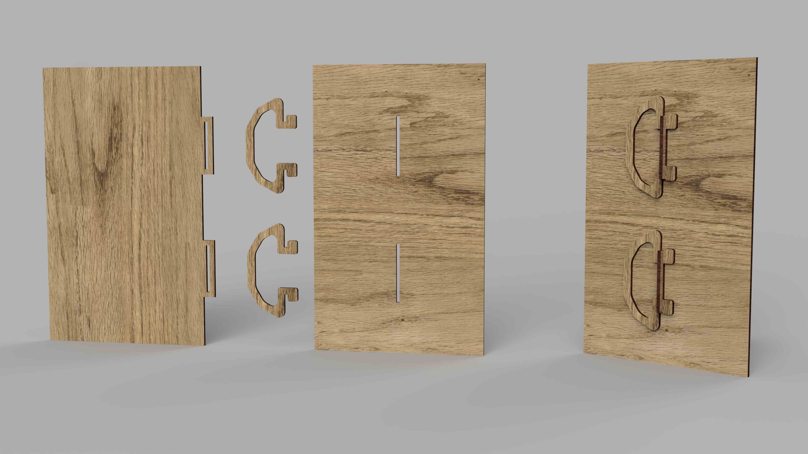
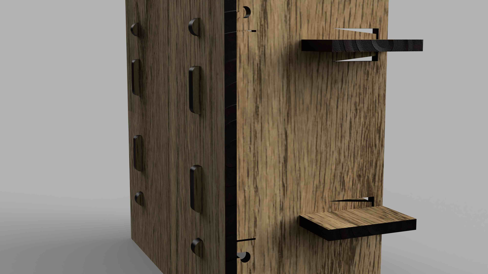
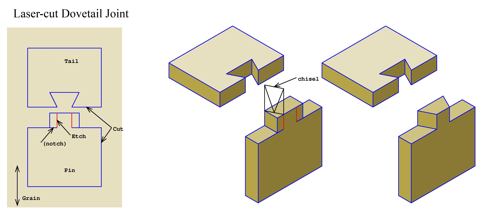

There are many ways to join a laser cut project together ranging from gravity to glue to bolts to snap pieces. You can use a variety of ways to connect. Here are some example images of different methods of joining pieces together. There are many more ways. Search the internet for other methods of making laser cut joints.

## Basic Joints

### Butt Joint Perpendicular

### Planar Butt Joint

<iframe class="youTubeIframe" width="560" height="315" src="https://www.youtube.com/embed/id2I8982n_g?si=Lq7cuOC8s78Ly2S9" title="YouTube video player" frameborder="0" allow="accelerometer; autoplay; clipboard-write; encrypted-media; gyroscope; picture-in-picture; web-share" allowfullscreen></iframe>

### Box or Finger Joints

Finger joints are a common way to join laser cut projects together. They have an advantage over simple butt joints since the fingers help align the pieces but can make it more difficulty to glue and clamp during assembly. Finger joints can be on the edge as shown in the image ore then can be inset so they are contained by the panel that they insert into. Box with finger joints on all sides [Demo video making a finger jointed box.](https://youtu.be/ZrcqauNvt0M)

<iframe class="youTubeIframe" width="560" height="315" src="https://www.youtube.com/embed/ZrcqauNvt0M?rel=0" title="YouTube video player" frameborder="0" allow="accelerometer; autoplay; clipboard-write; encrypted-media; gyroscope; picture-in-picture; web-share" allowfullscreen></iframe>

### Edge Half Lap Joint

Although a laser cutter has a small kerf, it is almost imperceptible compared to the kerf of a [CNC](../cnc/cnc-basics.md) machine. For soft materials like wood, the rounded interior corners left by the laser's kerf can be ignored. For hard materials like acrylic or metal, dogbone fillets may be necessary on inside corners. Since the laser cutter can almost cut a square inside corner, we can make edge half lap joints.

<iframe class="youTubeIframe"  width="560" height="315" src="https://www.youtube.com/embed/L-I4FLnRj4c?si=EwcVcCdO4slye5ue" title="YouTube video player" frameborder="0" allow="accelerometer; autoplay; clipboard-write; encrypted-media; gyroscope; picture-in-picture; web-share" allowfullscreen></iframe>

## Mechanical Joints Without Fasteners

### Slot Hook Joints

The slots for the hooks must be large enough for the entire hook to pass through. A bit of clearance in the hook space can help the pieces slide together. Care must be taken to model the parts to align when the hooks are engaged. Usually this means having more space at the top to accommodate the open slot.

### Pinned Finger Joints

Pinned finger joints send a tab all the way through a hole in a panel. The tab extends far enough to allow for at least the thickness of a "pin" to slide into its opening. This pin keeps the finger joint tab from pulling out. Pinned joints can be aligned so they use the same pin. This can create enough friction that the pin won't slip out.

<iframe class="youTubeIframe" width="560" height="315" src="https://www.youtube.com/embed/2r7NKS-3Wao?rel=0" title="YouTube video player" frameborder="0" allow="accelerometer; autoplay; clipboard-write; encrypted-media; gyroscope; picture-in-picture; web-share" allowfullscreen></iframe>

### Spring Clip Key Joint

Key joints are basically pinned joints. A tap with a hole passes through another board, then a key slide into the tab hole that prevents the board from pulling out. Keys can be made of many shapes. A useful key shape is a simple wedge. Keys can also be made into shapes that need to be compressed a bit to fit into the slot and then bounce back after insertion. This acts as a positive mechanical lock for the key or pin. Materials need to be tested to see how far they will compress for a particular spring clip key joint.

### Snap Joints

Snap joints positively lock into place when assembled. They are much more complex than other joining methods and usually require a bit of trial and error to make work in a specific design. This joint uses the flexibility of a material to have a tab move out of the way when the piece is inserted that snaps back into position with a hook that does not allow it to pull back through. Many manufactured plastic objects use a version of this joint. It is also seen on plastic backpack buckles and straps.

## Joints with Fasteners

### Captive Nut Joints

With properly sized slots and holes, bolts and nuts can be used to securely attach laser cut panels with a captive nut technique. It holds a hex nut so it cannot spin, acting like a wrench as the bolt is tightened. This is similar to the cam lock fasteners used in assemble at home flat pack furniture.

<iframe class="youTubeIframe" width="560" height="315" src="https://www.youtube.com/embed/57OT_SIW96U?rel=0" title="YouTube video player" frameborder="0" allow="accelerometer; autoplay; clipboard-write; encrypted-media; gyroscope; picture-in-picture; web-share" allowfullscreen></iframe>

<iframe class="youTubeIframe" width="560" height="315" src="https://www.youtube.com/embed/UK8bsVQy4s8?rel=0" title="YouTube video player" frameborder="0" allow="accelerometer; autoplay; clipboard-write; encrypted-media; gyroscope; picture-in-picture; web-share" allowfullscreen></iframe>

### Screw Joint

If the thickness of the material allows for enough "bite" of a screw, then screws can be a quick and reliable method of joining laser cut pieces. The downside is that after a few assembly and disassemblies, the the screw hold can be stripped out and no long hold the screw in place tightly.

### Tapped Bolt Joint

To avoid the problem of stripped threads, the hole can be tapped for a bolt instead. These threads will eventually wear out as well.

### Threaded Inserts

Threaded inserts are more involved to install but make a durable attachment point that can be used multiple times.

## Compliant Joints and Mechanisms

Compliant joints take advantage of the natural flexibility of materials. Joints that snap into place after bending out of the way are an example of compliant joints. A [living hinge](./laser-cut-living-hinge.md) is an example of a compliant mechanism.

## Designing Joints for Clear Assembly by User

If a pin or a slot for a joint is directly in the middle of two parts, then there is the possibility that one of the parts may be flipped the wrong way. On a generic finger jointed box, this may not be a problem. But what if there is an engraving on one side of the box and you definitely want the engraving on the outside? What if there is a peg support that should be at the rear of the box?

You can take a cue from car manufactures and flat pack furniture designers. Often, but unfortunately not always, car parts are designed to fit one way so the user can not install the part backwards. Flat pack furniture often only has one way that all the assembly holes line up. This prevents putting the back of the chair on the front.

The same principles can be applied to your projects. If you need a part to fit a certain way, offset the joints so that it only can be assembled the correct way.

## Laser Cut Joint Demos

Below is a collection of interesting laser cut joint demonstration videos from the web. This is only a selection. There are so many creatives and makers that all are not included. These are included to jump start your own investigative research and browsing. Look for more examples and create your own.

### Dovetail Joints

[Article](https://hackaday.io/project/170065-laser-cut-dovetail-enclosures) from hackaday.io showing [laser cut dovetail joints](https://hackaday.io/project/170065-laser-cut-dovetail-enclosures) originally designed by [Mark Wilson](https://www.flickr.com/photos/funnypolynomial/). [^1] Detailed photos of the joints and the chiseling process are on Mark's [Flickr album "Dovebox"](https://www.flickr.com/photos/funnypolynomial/albums/72157657942214811). These require a bit of chiseling after the laser cutting but the woodworking is minimal and goes quickly. This technique uses etched laser lines as guides for the chisel. Because of the chiseling, aligning the wood grain with the dovetails is important. This can add a unique look to your laser cut project. It could potentially be adapted for use with acrylic with a sanding jig to make the angle cuts.

<figure>

<figcaption>

[Laser-cut Dovetail Joint](https://www.flickr.com/photos/funnypolynomial/20806382969/) by [Mark Wilson](https://www.flickr.com/photos/funnypolynomial/) is licensed under [CC BY 2.0](https://creativecommons.org/licenses/by/2.0/) [^2]

</figcaption>
</figure>

<figure>

<figcaption>

[Top off](https://www.flickr.com/photos/funnypolynomial/20805356968/in/album-72157657942214811/) by [Mark Wilson](https://www.flickr.com/photos/funnypolynomial/) is licensed under [CC BY 2.0](https://creativecommons.org/licenses/by/2.0/) [^3]

</figcaption>
</figure>

### "Hammer" Joint

On the [Lasersheets.eu blog](https://lasersheets.eu/blogs/news/hammer-joint), Jiskar Schmitz describes a "hammer" joint that uses a wedge to joint laser cut pieces together. The wedge must me put in place with a hammer, hence the name. The blog says the joint does not require glue but a bit of wood glue would likely make it stronger depending on the overall design. [^hammer-joint]

<iframe class="youTubeIframe" width="560" height="315" src="https://www.youtube.com/embed/AAGuJ9D3QkQ?si=5Vf33ClRlzIntUOE" title="YouTube video player" frameborder="0" allow="accelerometer; autoplay; clipboard-write; encrypted-media; gyroscope; picture-in-picture; web-share" allowfullscreen></iframe>

### Snap Fit Laser Cut Plastic

<figure>

<iframe class="youTubeIframe" width="560" height="315" src="https://www.youtube.com/embed/vDdfib7CqlI?si=0kTZOQJd2GRIxVpT" title="YouTube video player" frameborder="0" allow="accelerometer; autoplay; clipboard-write; encrypted-media; gyroscope; picture-in-picture; web-share" allowfullscreen></iframe>

<figcaption>

_laser-cut snap-lock assembly_ by Amy Makes Stuff [^amy]

</figcaption>
</figure>

### Flaticulation Joints

[Flaticulation: Laser Cutting Joints with Articulated Angles](https://www.chiaofang.tw/research/flaticulation/Flaticulation.pdf) is a research paper by Chiao Fang, Vivian Hsinyueh Chan, and Lung-Pan Cheng that demonstrates how to make laser cut joints that snap into specific angles other than the typical 90 degree joint for laser cut assemblies. [^flaticulation]

<iframe class="youTubeIframe" width="560" height="315" src="https://www.youtube.com/embed/j1Yg0lZpJf0?si=Sm_Arwp60IaVsi3_" title="YouTube video player" frameborder="0" allow="accelerometer; autoplay; clipboard-write; encrypted-media; gyroscope; picture-in-picture; web-share" allowfullscreen></iframe>

## Further Reading

- [Fusion 360 Finger Joint Add-in](https://github.com/FlorianPommerening/FingerJoints) is an add-in for Fusion 360 that creates finger joints on a model in Fusion 360 written by Florian Pommerening.
- [Laser Cut Like a Boss: Compliant Joints](https://lasercutlikeaboss.weebly.com/uploads/2/7/8/8/27883957/advancedjoinery_master_web.pdf) is a undergraduate research paper by Mary Morse, Ingrid Hagen-Keith, and Annie Zeng documenting their design and prototyping process to create a variety of compliant joints including snap fit joints and an interesting rotation snap fit joint. [^like-a-boss]

## References

[^1]: [Hackaday.io Laser Cut Dovetail Enclosures](https://hackaday.io/project/170065-laser-cut-dovetail-enclosures)
[^2]: [Funny Polynomial Flicker Photo](https://www.flickr.com/photos/funnypolynomial/20806382969/)
[^3]: [Funny Polynomial Flicker Album](https://www.flickr.com/photos/funnypolynomial/20805356968/in/album-72157657942214811/)
[^like-a-boss]: Mary Morse, Ingrid Hagen-Keith, & Annie Zeng. [Laser Cut Like a Boss: Compliant Joints](https://lasercutlikeaboss.weebly.com/uploads/2/7/8/8/27883957/advancedjoinery_master_web.pdf) [Web Archive](https://web.archive.org/web/20210510131620/https://lasercutlikeaboss.weebly.com/uploads/2/7/8/8/27883957/advancedjoinery_master_web.pdf)
[^hammer-joint]: Schmitz, Jiskar. [The Hammer Joint. A new laserable no-screw-no-glue wood joint](https://lasersheets.eu/blogs/news/hammer-joint) lasersheets.edu blog. December 01, 2023. [Web Archive](https://web.archive.org/web/20231215234230/https://lasersheets.eu/blogs/news/hammer-joint)
[^flaticulation]: Chiao Fang, Vivian Hsinyueh Chan, and Lung-Pan Cheng. 2022. Flaticulation: Laser Cutting Joints with Articulated Angles. In The 35th Annual ACM Symposium on User Interface Software and Technology (UIST ’22), October 29-November 2, 2022, Bend, OR, USA. ACM, New York, NY, USA, 16 pages. [https://doi.org/10.1145/3526113.](https://doi.org/10.1145/3526113)
[^amy]: [laser-cut snap-lock assembly](https://www.youtube.com/watch?v=vDdfib7CqlI) YouTube video by Amy Makes Stuff. May 27, 2019.
