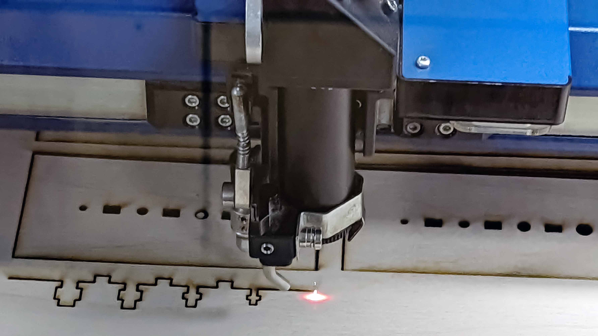

Laser cutting is a precise method of cutting a design from a material using a digital file as a guide. It uses a high-powered laser to slice materials such as wood, plastic, glass, metal, and paper into custom shapes and designs.

<figure>

<figcaption>

Epilog Laser Cutter cutting through plywood

</figcaption>
</figure>

### Laser Cutting Concepts and Terminology

Understanding the language of laser cutting is the first step to getting great results.

- **Kerf** is the width of the gap or space in the material that is removed by the laser beam as it cuts. It's important to account for kerf in designs that require precise fits, like press-fit boxes. The kerf varies with material type and thickness.
- **Speed** is how fast the laser head moves. Higher speeds with the same power result in a lighter cut or etch.
- **Power** the output energy of the laser, usually expressed as a percentage. Higher power is needed for cutting thicker, denser materials.
- **Focus** is set by the distace of the laser to the top of the material. The laser must be correctly focused on the material's surface to produce a clean cut. An out-of-focus beam will result in a wider kerf and sloppy edges.

#### Vector Cutting

The laser follows a continuous path defined by a vector line (like from a DXF or SVG file) to cut completely through the material. This is used for outlines and shapes.

#### Raster Engraving

The laser moves back and forth line by line, like an inkjet printer, firing at different power levels to etch an image onto the surface of the material. This is used for photos or filled-in areas.

#### Vector Engraving (or Scoring)

Similar to vector cutting, but with lower power so the laser only scores the surface instead of cutting through. It's perfect for creating clean, sharp lines.

### Laser Cutting Process

A laser cutter cuts all the way through the material or it etches on the top surface of a material. Laser cutting is [different than CNC milling](../cnc/cnc-vs-laser-cutting.md). It does not create pocket cuts that are possible with a [CNC](../cnc/cnc-basics.md) but a laser cutter can create very thin kerfs that are not possible with physical router bits on a CNC.

A laser cutter uses vector lines to cut through the substrate or to etch lines on the top surface of the material. Vectors can be manually drawn in a vector program like [Adobe Illustrator](../../software/adobe-illustrator/illustrator.md), Corel Draw, or Inkscape. Vector lines are more commonly exported from CAD programs is readable formats such as `DXF`.

Laser cutters can also photo etch onto the surface of a material using a raster image or a vector image. Etching works with grayscale images that are inverted since the burnt or etched parts are usually darker on materials like plywood.

### Laser Cutting Materials

The type of laser determines which materials you can cut, but some materials are generally universally safe or unsafe.

#### Common Materials

- Wood is excellent for both cutting and engraving. Results can vary based on the wood's glue and density.
- Acrylic, know by the brand name Plexiglass, cuts cleanly with a flame-polished edge and engraves beautifully.
- Cardboard and paper cut very easily at high speed and low power. Great for quick prototyping and stencils.
- Leather can be cut and engraved, but requires good ventilation.
- Delrin (Acetal) is an engineering plastic that cuts very cleanly and is great for mechanical parts.

#### Materials to Avoid Due to Safety

**Never** cut these materials in a standard CO2 laser cutter as they release hazardous gases or pose a significant fire risk.

- Polyvinyl Chloride (PVC) plastic releases chlorine gas when cut, which is toxic and deadly to humans and will corrode the inside of your machine.
- Polycarbonate, know by the brand name Lexan, is softer than acrylic. It absorbs infrared radiation, like the red light from the laser, and tends to melt and catch fire.
- Acrylonitrile butadiene styrene (ABS) plastic melts and releases cyanide gas.
- Many composites such as fiberglass or carbon fiber release harmful fumes and the composite resins do not cut well.
- High Density Polyethylene (HDPE) melts when cut with a laser.

## Laser Cutting Guides

- [Prepare DXF File for Laser Cutting](./prepare-dxf-file-for-laser-cutting.md)
- [Laser Cut Joints](./laser-cut-joints.md)
- [Living Hinge Minimum Bend Radius](./living-hinges-minimum-bend-radius-for-laser-cutting.md)
- [Laser Cut File Generators](./laser-cut-file-generators.md)

## Laser Cutting Fusion 360

[Fusion 360](../../3d-modeling/fusion-360/fusion-360.md) is a parametric modeling program well suited for createing complex 3D models for output to a laser cutter.

- [3D Modeling for Laser Cutting in Fusion 360](./3d-modeling-for-laser-cutting-fusion-360.md)
- [Lay Parts Flat for Laser Cutting in Fusion 360](./lay-parts-flat-for-laser-cutting-fusion-360.md)
- [Install DXF Post Processor Fusion 360](../../3d-modeling/fusion-360/install-dxf-post-processor-fusion-360.md)
- [Export Laser Cut Toolpaths to DXF Fusion 360](./export-laser-cut-toolpaths-to-dxf-fusion-360.md)
- [Make Laser Cutting Tool in Fusion 360](./fusion-360-create-laser-cutting-tool.md)
- [Revise 3D Models for Laser Cutting in Fusion 360](./fusion-360-laser-cut-3d-model-revisions.md)
- [Laser Cut Acrylic House in Fusion 360](./laser-cut-acrylic-house-in-fusion-360.md)
- [Laser Cut Box Added to 3D Printed Clamp in Fusion 360](./laser-cut-box-added-to-3d-printed-clamp-fusion-360.md)
- [Create Laminated 3D Forms from Flat Sheets](./create-laminated-3d-forms-from-flat-sheets-fusion-360.md)
- [Finger Joint Box with Laser Cutting](./laser-cut-finger-joint-box-fusion-360.md)
- [Laser Cut Cell Phone Stand](./laser-cut-cell-phone-stand.md)
- [Lay Parts Flat without Arrange Tool](./lay-parts-flat-without-arrange-tool-fusion-360.md)
- [Laser Cut Captive Nut Joints](./laser-cut-captive-nut-joints.md)
- [Laser Cut Half Lap Joint](./laser-cut-half-lap-joint.md)

## Laser Cutting Links

- [SVG Box Generator](https://www.festi.info/boxes.py/)
- [Making a laser-cut box/case with elastic clips | Climbers.net](https://climbers.net/sbc/make-laser-cut-case-elastic-clips/)
- [So What's a Practical Laser-Cut Clip Size? | Deferred Procrastination](http://marksabino.com/defproc/blog/2013/so-whats-a-practical-laser-cut-clip-size/)
- [Workshop basics: laser-cut enclosures - Captive nut and screw T-slot joints | Raspberry Pi Projects](https://projects.raspberrypi.org/en/projects/lasercutjoints)
- [An OpenSCAD Library For All Your CNC Cutting Needs | Hackaday](https://hackaday.com/2022/01/02/an-openscad-library-for-all-your-cnc-cutting-needs/)
- [CNC Joinery MAKE](https://makezine.com/2012/04/13/cnc-panel-joinery-notebook/)
- [Laser Cut Press Fit](https://makearchitecture.wordpress.com/people-2/jd-sassaman/asn2-laser-cutterpress-fit/)
