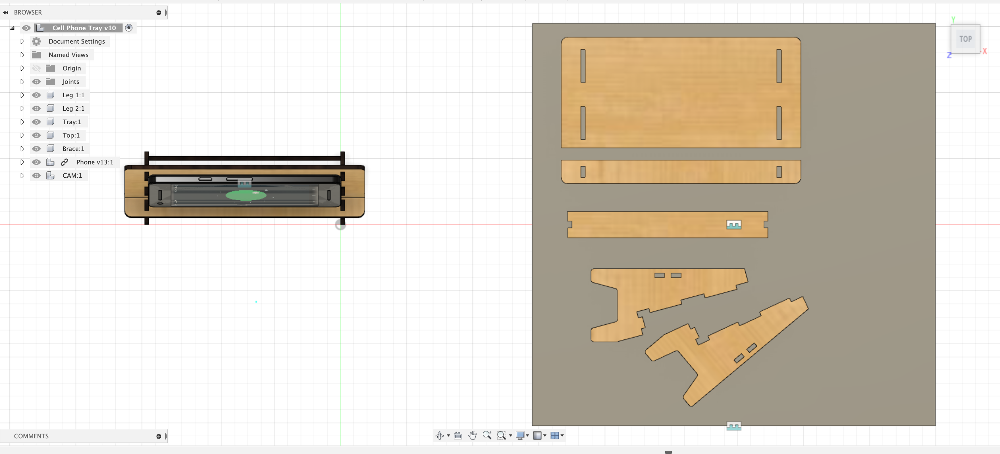

Once your model is complete and each piece is a separate and labeled component, you are ready to lay your pieces flat to create a DXF toolpath file for the laser cutter.

1. Draw a sketch to represent your plywood or acrylic sheet. Make the dimensions of the sketch the size of your material. If you are using larger plywood or acrylic then draw a larger sketch. If you are using a "remnant" or cutoff piece then draw your sketch to that size.
2. Then use the Arrange command to lay your parts flat.
3. Follow the instructions to arrange your parts flat.
   - [Lay Parts Flat with Arrange for Laser Cutting Multiple Thickness](lay-parts-flat-for-laser-cutting-multiple-thickness-fusion.md)
   - [Lay Parts Flat with Arrange for Laser Cutting](https://youtu.be/jeQPJHHwVN4)
   - [Lay Parts Flat without Arrange Tool for Laser Cutting](lay-parts-flat-without-arrange-tool-fusion-360.md)

<figure>

<figcaption>

Top view of components of laser cut stand flat on plywood.

</figcaption>
<figure>

### Lay Parts Flat with Arrange for Laser Cutting Multiple Thickness

<iframe class="youTubeIframe" title="YouTube video player" src="https://www.youtube.com/embed/6rVW04byXi4?rel=0" width="560" height="315" frameborder="0" allow="accelerometer; autoplay; clipboard-write; encrypted-media; gyroscope; picture-in-picture; web-share" referrerpolicy="strict-origin-when-cross-origin" allowfullscreen></iframe>

### Lay Parts Flat with Arrange for Laser Cutting

<iframe class="youTubeIframe" title="YouTube video player" src="https://www.youtube.com/embed/jeQPJHHwVN4?rel=0" width="560" height="315" frameborder="0" allow="accelerometer; autoplay; clipboard-write; encrypted-media; gyroscope; picture-in-picture; web-share" referrerpolicy="strict-origin-when-cross-origin" allowfullscreen></iframe>

## Alternative Method without the Arrange Tool

[Lay Parts Flat without Arrange Tool for Laser Cutting](lay-parts-flat-without-arrange-tool-fusion-360.md)
