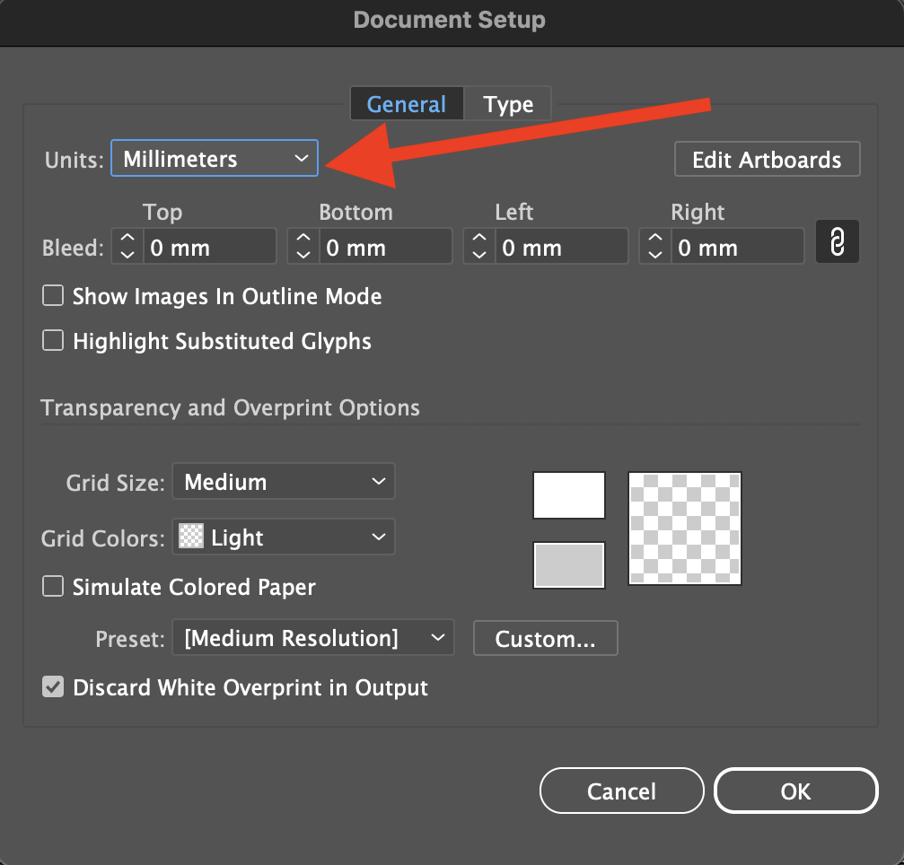
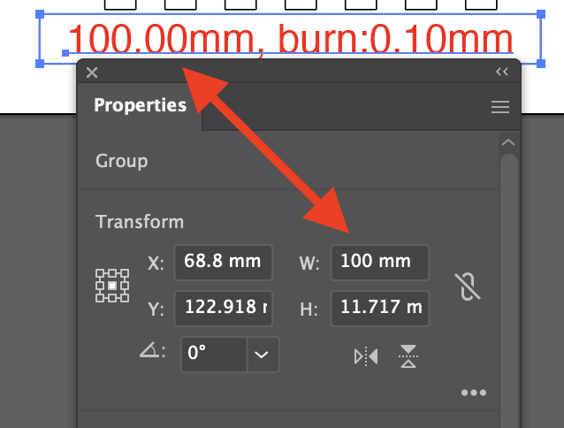
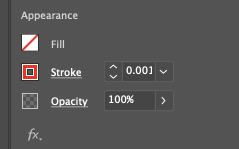

The think\[box\] at Case Western Reserve University uses Epilog Laser cutters that can "print" from an [Adobe Illustrator](../../software/adobe-illustrator/illustrator.md) file. Before cutting a complex project on is is a good idea to make a small test cut file to confirm settings and not waste material. After successfully cutting a test then you can begin a more intentional project. This file should be made before going to the think[box]. There are specific instructions to prepare the file in Adobe Illustrator. If you do not follow the directions then your file will not work properly on the laser cutters.

The test cut will demonstrate the ability of a through cut and an etching cut on the laser cutters.

## Laser Cut File Prep Instructions

Open Adobe Illustrator

&nbsp;

- Open your test file in Adobe Illustrator
- Adjust the scale in Illustrator or reimport at the correct scale

&nbsp;

- Change the document settings so the units are millimeters and not points or pixels

- Confirm the scale of the drawing by measuring a known distance
- If you used [boxes.py](https://www.festi.info/boxes.py/) to make your cut file, it has an option to include a 100 mm rectangle for dimension confirmation. An SVG export from [boxes.py](https://www.festi.info/boxes.py/) should show the rectangle as having a 100 mm with if Illustrator's document units are set to millimeters
- If you made the cut file from Fusion 360 or other 3D modeling software, then confirm a known dimension from your design. If you added a kerf adjustment, make sure to take that into account when measuring in Illustrator.

- Adjust the Artboard to the correct size to contain your drawing
- Think of the Artboard as your raw material, it should not be larger than the material you will cut on the laser cutter
- If the Artboard is real world size, and your drawing does not fit on the Artboard then something is wrong and you should double check your measurements

- Make sure all paths that will be cut through are individually "closed"
- To close a path, select all of the segments and "join" them by pressing Command J or Control J
- Then select all paths that will be cut through
- Set the Fill to transparent
- Change the stroke color to Red
- Change stroke width to .001 points
- Any red stroke with a width of .001 will be cut all the way through.

- Select the Path
- Set the Fill to transparent
- Change the stroke color to Blue
- Change stroke width to .5 points
- Any blue stroke with a width of .5 will be etched.

- Save your file
- Upload to Google Drive for later access
- Save your file on a USB Drive if available for redundancy

&nbsp;

Bring USB drive and / or Adobe Creative Cloud Password to think[box]. You need access to the test file from the USB drive or cloud storage.

&nbsp;

