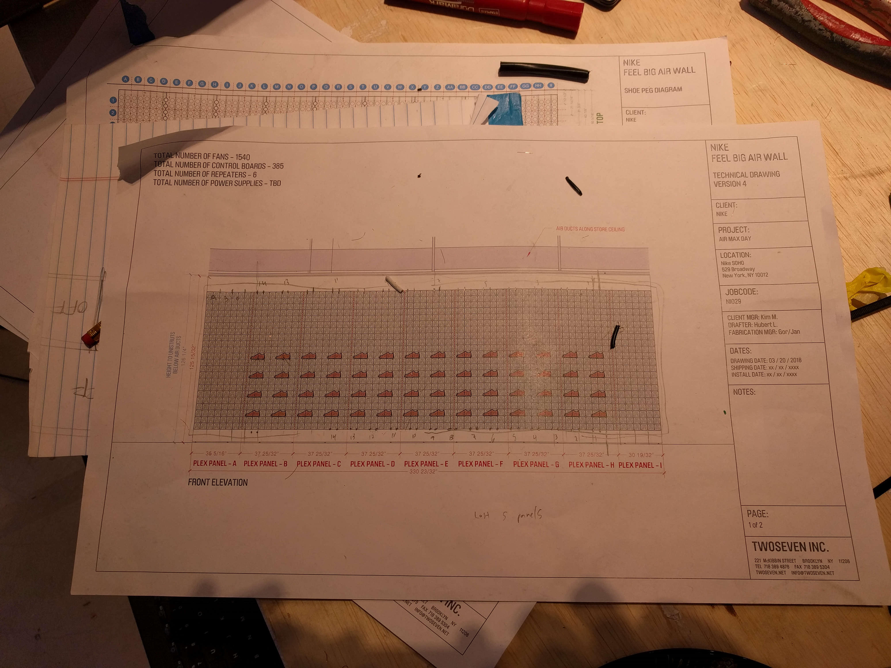
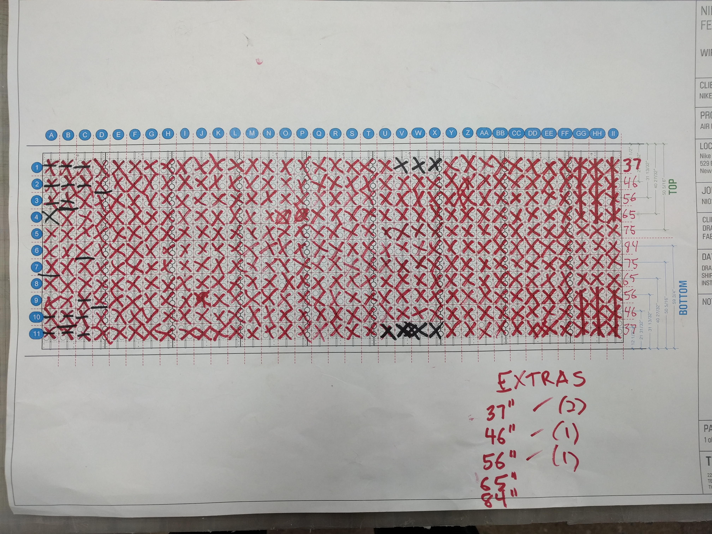
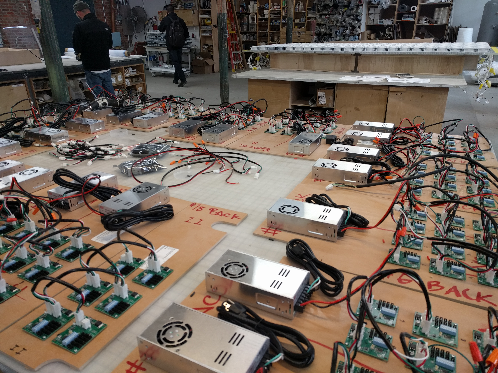
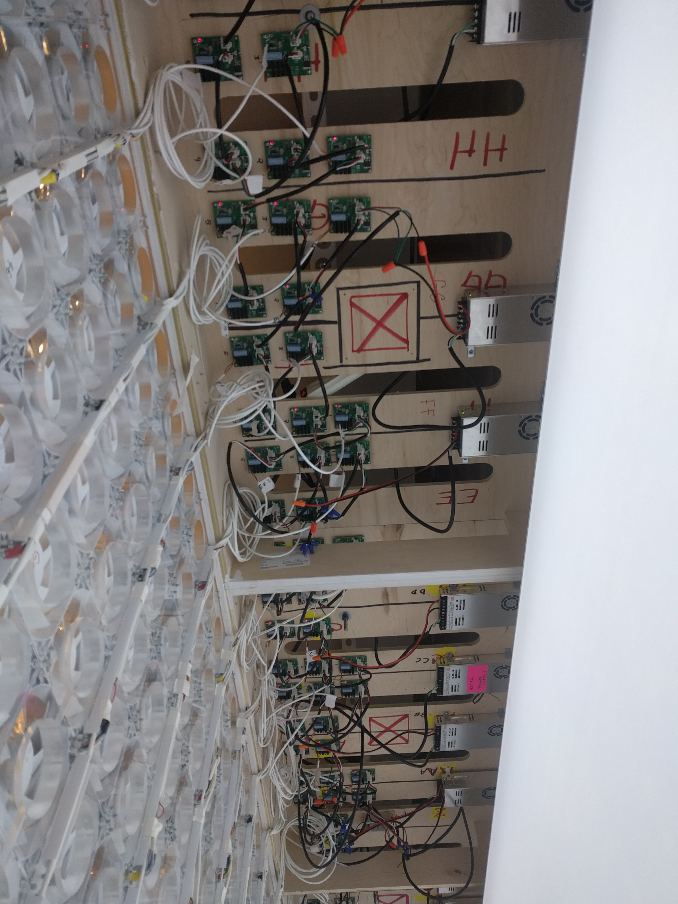

## What is Ideation Sketching?

Ideation [sketching](./sketching.md) is an important part of the creative process. There are many ways to make and generate ideas. The simplest way is with small thumbnail sketches with a pencil on paper.

Draw sketches that convey your idea and excite the viewer. Also draw sketches that explore how your concept could possibly be assembled and made.

Sketches can be made with analog techniques, digital techniques, or a combination of both. You can use pencils, markers, paper photo collage, digital photo collage, 3D modeling, vector graphics, digital painting and any other means of ideation and iteration.

It is important that you generate many different ideas and concepts that are unique designs. It is also important that you iterate on these different concepts to develop them past their initial idea phase. Variety, lots of different ideas, and iteration, variations of an idea, are important skills for the ideation process. Avoid the trap of instantly settling on a single idea. Push yourself to make new and unknown ideas. This is how you will grow as a creative.

## Ideation Sketching Guides

Sculpture commissions go through an initial planning phase and design phase. Once those approvals are complete, detailed drawings, contracts, and timelines are agreed upon. Then fabrication of the work begins. The drawings you make should be communicative of all aspects of your project and show how things will go together.

Will you use a screw? Glue? Welding? What sizes? What materials? This will take multiple [technical sketches](./technical-sketching.md) and multiple views. [Third angle projections](./third-angle-projection.md) are an established convention for drawings that communication the form of an object from multiple angles.

Some sections of a larger drawing may require larger scaled detail drawings. If there are 4 identical corners, you can draw a detail of 1 corner and make a note that the other corners are the same.

### Ideation Sketch Size

How large should ideation sketches be? If done digitally separate your sketches into multiple digital "pages" so that if one page is full screen on a laptop then we would see the same amount of detail if a scanned page of a sketchbook was full-screen on the laptop.

## Ideation Sketch Examples

### Hepp Maccoy Air Max Day

Example of [Hepp Maccoy](../artists/hepp-maccoy.md) working out interactive fan programming for a large installation for Nike's Air Max Day. Images courtesy of the artist.

<iframe class="vimeoIframe" title="vimeo-player" src="https://player.vimeo.com/video/285928549?h=4cb888d89f" width="640" height="360" frameborder="0"    allowfullscreen></iframe>

### Raul Romero

## Using Artificial Intelligence

Generative AI can assist in the ideation process. Image generators can modify sketches as well as create visualizations quickly from text prompts. Large language (LLMs) analyze large bodies of text. LLMs can be used for text and concept ideation.
