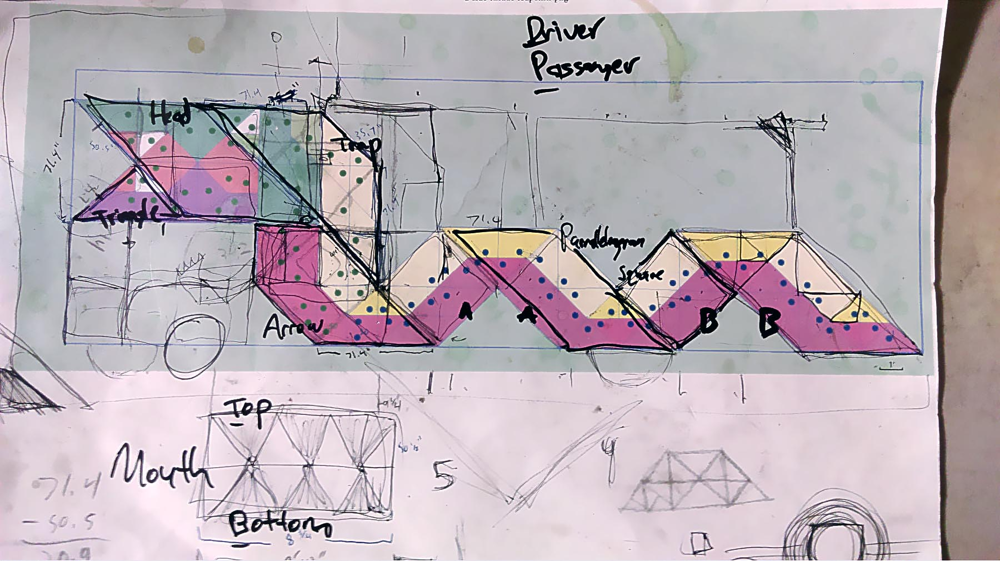

## What is Ideation Sketching?

Ideation [sketching](sketching.md) is an important part of the creative process. There are many ways to make and generate ideas. The simplest way is with small thumbnail sketches with a pencil on paper. One of the most important skills you can develop is idea generation. Even more important is the ability to develop and refine initial ideas.

Draw sketches that convey your idea and excite the viewer. Also draw sketches that explore how your concept could possibly be assembled and made.

Sketches can be made with analog techniques, digital techniques, or a combination of both. You can use pencils, markers, paper photo collage, digital photo collage, 3D modeling, vector graphics, digital painting and any other means of ideation and iteration.

It is important that you generate many different ideas and concepts that are unique designs. It is also important that you iterate on these different concepts to develop them past their initial idea phase. Variety, lots of different ideas, and iteration, variations of an idea, are important skills for the ideation process. Avoid the trap of instantly settling on a single idea. Push yourself to make new and unknown ideas. This is how you will grow as a creative.

### Idea Generation vs Idea Iteration

Idea generation is creating as many different ideas as possible. The ideas and concept should vary widely and have diverse approaches. Many of these ideas will be terrible but it is not a time to censor thought. Just get everything down on the proverbial page.

Idea iteration is selection a potentially promising idea from the idea generation phase and making many different versions of that particular idea. The version can be big changes or slight tweaks. After a few versions or "iterations" then you should examine the results and make further changes and iterations based on the results so far.

## Ideation Sketching Guides

### Idea Refinement Through Sketching

After an initial bout of ideation go back through your sketches and see which ones seem promising. Choose five of these ideas and refine them and redraw them larger. Pay attention to showing how the pieces of the stand would go together. Try to draw them as solid things in three-dimensional space on your page. Try to draw a minimum of 3 refined sketch ideas.

Sculpture commissions go through an initial planning phase and design phase. Once those approvals are complete, detailed drawings, contracts, and timelines are agreed upon. Then fabrication of the work begins. The drawings you make should be communicative of all aspects of your project and show how things will go together.

Will you use a screw? Glue? Welding? What sizes? What materials? This will take multiple [technical sketches](technical-sketching.md) and multiple views. [Third angle projections](third-angle-projection.md) are an established convention for drawings that communication the form of an object from multiple angles.

Some sections of a larger drawing may require larger scaled detail drawings. If there are 4 identical corners, you can draw a detail of 1 corner and make a note that the other corners are the same.

### Ideation Sketch Size

How large should ideation sketches be? If done digitally separate your sketches into multiple digital "pages" so that if one page is full screen on a laptop then we would see the same amount of detail if a scanned page of a sketchbook was full-screen on the laptop.

Make sure to draw your refined sketches large enough. The maximum number of refined sketches on a single page (~8.5"x11" sheet) is 2-3 sketches. Any more and they are too small. If you use digital techniques, the maximum number of refined sketches on a single screen size document is 2-3 sketches. Any more and they are too small.

### Using Artificial Intelligence

Generative [Artificial Intelligence](../coding/ai-artificial-intelligence.md) software can assist in the ideation process. Image generators can modify sketches as well as create visualizations quickly from text prompts. Large language (LLMs) analyze large bodies of text. LLMs can be used for text and concept ideation.

## Ideation Sketch to Final Magic

Finish works of art, installations, and products often seem like magic how things come into existence. How does the video game work? How can the chair be so well made with a smooth wood finish? What is the method that designers use to make a functional shovel? Where do I even start with how to design, fabricate, and program and electronic interactive installation?

Focusing on the final product ignores all of the work required to get to that point. Before a video game ships, or a chair is sat in, or a shovel moves snow off a driveway, or children smile in an interactive installation, there were sketches. Lots, and lots of sketches. Then prototype models were made, tested, and remade. Designs were iterated on and numerous problems encountered and solved.

Below are images from the life cycle of various creative projects. This is just a snapshot of each project as much more work and effort was required to create it, but all of these projects have the creative process in common. This can be called the design process, the making process, or just the only way to make cool stuff. Look at how sketches are used to communicate, to solve problems, explore ideas.

Sometimes sketches are beautiful on their own, others are barely legible but highly useful and functional. By looking at the entire creative process, we can peel back the magic cape from finished creative projects. This is a great way to learn from the work of others and to be inspired by all the work that went into a creative project.

Thank you to the creators who generously shared their creative practice with everyone.

### Hepp Maccoy Air Max Day

Example of [Hepp Maccoy](../artists/hepp-maccoy.md) working out interactive fan programming for a large installation for Nike's Air Max Day. Images courtesy of the artist.

<iframe class="vimeoIframe" title="vimeo-player" src="https://player.vimeo.com/video/285928549?h=4cb888d89f" width="640" height="360" frameborder="0" allow="accelerometer; autoplay; clipboard-write; encrypted-media; gyroscope; picture-in-picture; web-share" referrerpolicy="strict-origin-when-cross-origin" allowfullscreen></iframe>

### Raul Romero

[Raúl Romero](../artists/raúl-romero.md) shares the process to create objects for a sound art installation, _Undercurrents_ install ath the Delaware Contemporary in Wilmington, DE.

### Dragomi Art Car

The [Dragomi Art Car](https://dragomi.org/about/) did not spontaneously come into existence as an extravagant Burning Man electronic experience vehicle. IT started with ideas, sketches, prototyping and a big does of hard work. Even after the first iteration of the "final" art car, each year iterative improvements continued. This project, like so many, is only possible through the collaboration of a team. Thank you to Hepp Maccoy, Peter Trench, Malkohm Horn, Dan Holden, and Benigno Lopez for making Dragomi and sharing it with the world.

<iframe class="youTubeIframe" title="vimeo-player" src="https://player.vimeo.com/video/326638229?h=21a4eefcbf" width="640" height="360" frameborder="0" allow="accelerometer; autoplay; clipboard-write; encrypted-media; gyroscope; picture-in-picture; web-share" referrerpolicy="strict-origin-when-cross-origin" allowfullscreen></iframe>

