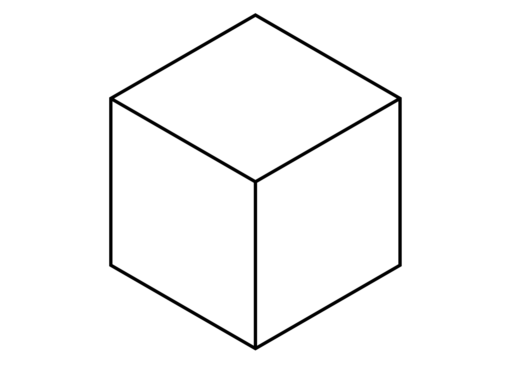
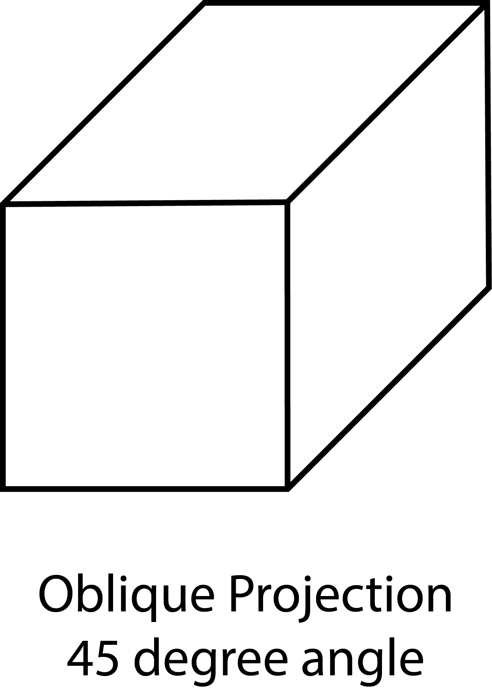

Technical sketching is a form of drawing used to visually communicate how and object is made, put together, or how something functions. Often dimensions of the object are written on the sketch as well as the precise scale of the drawing. A scaled drawing allows for small and large objects to be drawn at a reasonable size rather than their respective real world scale. Even if a drawing is not to scale it can still describe the form of the object.

Technical sketching differs from more creative types of drawing, rendering, representational drawing, and concept sketching. Technical sketching aims to remove any doubt or confusion about the shape and form of an object. This clear and communicative precision is in contrast to creative drawings that can look quite realistic, but do not contain all the needed information to fabricate or manufacture an object. A visually stunning rendering of a sports car, or a beautiful rendering of a new house may be necessary to communicate the feeling of a design for sales and advertising but technical drawings are needed to communicate how to make the car or house.

There are many types of technical drawings including architectural plans, mechanical drawings, electrical drawings, electronic circuit diagrams, machine processes, site plans, construction drawings.

Different fields and disciplines use symbols and conventions to make technical sketching more efficient. For example in construction drawings for buildings, all of the details of a light fixture or a window trim do not need to be drawn on the floor plan. A symbol for a light and an indication of a window are sufficient. Separate detail drawings can be included to show the specific details of the referenced parts.

## Projections and Perspective

Technical sketching uses a variety of visual projections and perspective techniques depending on what information is most important to convey. Common types include isometric perspective drawing, Oblique Projections, and third angle projections.

Isometric Perspective shows the sides of the object angled ad 30 degrees. The measurements on the vertical, horizontal, and 30 degree angles are to scale and real measurements.

Oblique Projection shows the front of the object like a parallel projection and then the sides of the object are drawn at a 45 degree angle. This adds distortion but gives a good view of the front.

## Third Angle Projection

Third Angle Projection shows the front, top, and side views of an object.

## Technical Sketching Practice

While it is possible to make extremely accurate and detailed technical drawings by hand, it is often impractical and can be done better and faster with digital tools. It is still important to be able to make quick, legible and communicative technical sketches. Even though the sketches do not need to be perfect they should still be as neat as possible without sacrificing too much speed. There are some simple techniques that help making technical drawings by hand.

## Basic Materials for Technical Sketching

Nothing more than a pencil, paper, and often an eraser is needed to make technical sketches. With practice, relatively accurate to scale sketches can be made freehand without the use of straight edges or triangles. The use of a few additional drawing supplies permit the creation of accurate and detailed technical drawings.

- pencil
- paper
- eraser
- t-square
- drawing board or surface with flat edge
- compass
- 30 / 60 triangle
- 45 triangle
- straight edge
- scaled rulers
- measuring device such as [digital calipers](../making/how-to-use-digital-calipers.md) or rulers

### 1. Technical Sketching Tools

<iframe class="youTubeIframe" src="https://www.youtube.com/embed/QaTlzXEHu4g?rel=0" width="300" height="150" allowfullscreen="allowfullscreen"></iframe>

