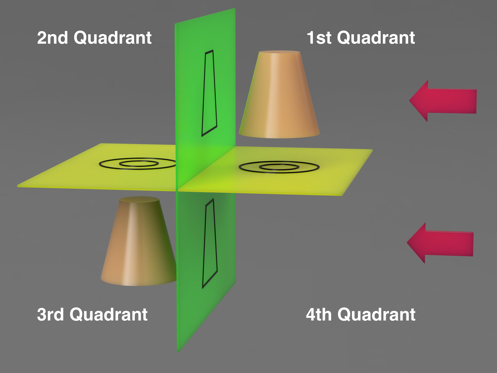
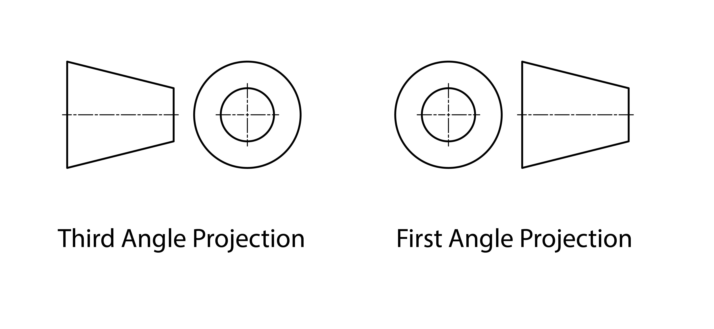

Third angle projection is a method of drawing a three dimensional object on a two dimensional plane or piece of paper. It is a type of orthographic projection that shows how an object looks from different directions on the same drawing. The different views line up and can be used to project dimensions from one view to another view using orthogonal (perpendicular) lines. The three views are front, side and top. The other common multi angle projection method is first angle projection but we will focus on third angle projections.

## Third Angle vs First Angle?

The main difference between third and first angle projection is the conceptual placement of the object with respect to the projection planes. In first angle projection the object is in the first quadrant and is imagined to be transparent while the projection planes are opaque. In third angle projection the object is in the third quadrant and is imagined to be opaque while the projection planes are transparent. The quadrants are the four "boxes" made with a typical x / y cartesian plane but with three dimensions. The first quadrant is the upper right or where the positive x and y are. The third quadrant is the lower left where the -x and -y are. In first angle projection the object is in between the viewer and the projection plane and in third angle projection the plane is in between the object and the viewer.

The diagram below shows the point of view of the viewer indicated by the red arrows. The quadrants are labeled and the 3rd angle projection is in the lower left. The projections of the objects are on the horizontal and vertical planes. Pay attention to the orientation of the projection top or bottom of the cone in relation to the side projection.

The symbols indicating the type of projection indicate type of projection by depicting a cone as seen above. For a third angle projection the symbol shows the top/front of the cone with the side of the cone to the side. This is the only way these views can be unfolded flat from the three dimensional image above. In first angle projection the side of the cone is shown and then the bottom/back is shown to the side. This diagram indicates the location of the projection plane in reference to the object and the viewer.

Third angle projections are more common in the United States while first angle projections are more common in Europe but both can be used to show multi view orthographic projections of 3D objects on 2D planes. Up to six views can be included but usually only three views are enough to have enough information to fabricate or make an object. Remember that the goal of an orthographic projection is to efficiently give all of the information needed to precisely model or fabricate an object.

Often dimensions are added to projection drawings to indicate the diameter of holes and other features of the object. The images below show a simple third angle projection with dimensions and a rendering of the object that it depicts. These three orthographic views of the object are all that is necessary to reproduce it as a 3D model or a physical object.

The video below demonstrates how to draw a simple third angle projection of a wooden block in third angle projection freehand.

### 1. Third Angle Projection Freehand

<iframe class="youTubeIframe" src="https://www.youtube.com/embed/0SdWqEYKYrI" width="300" height="150" allowfullscreen="allowfullscreen"></iframe>

