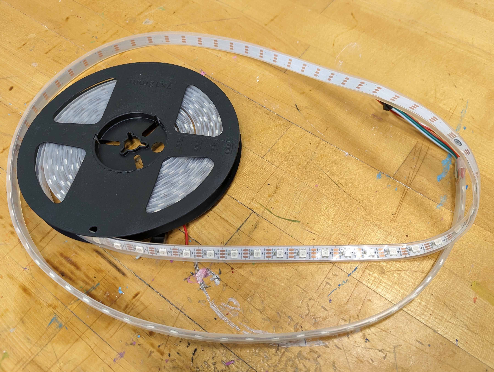
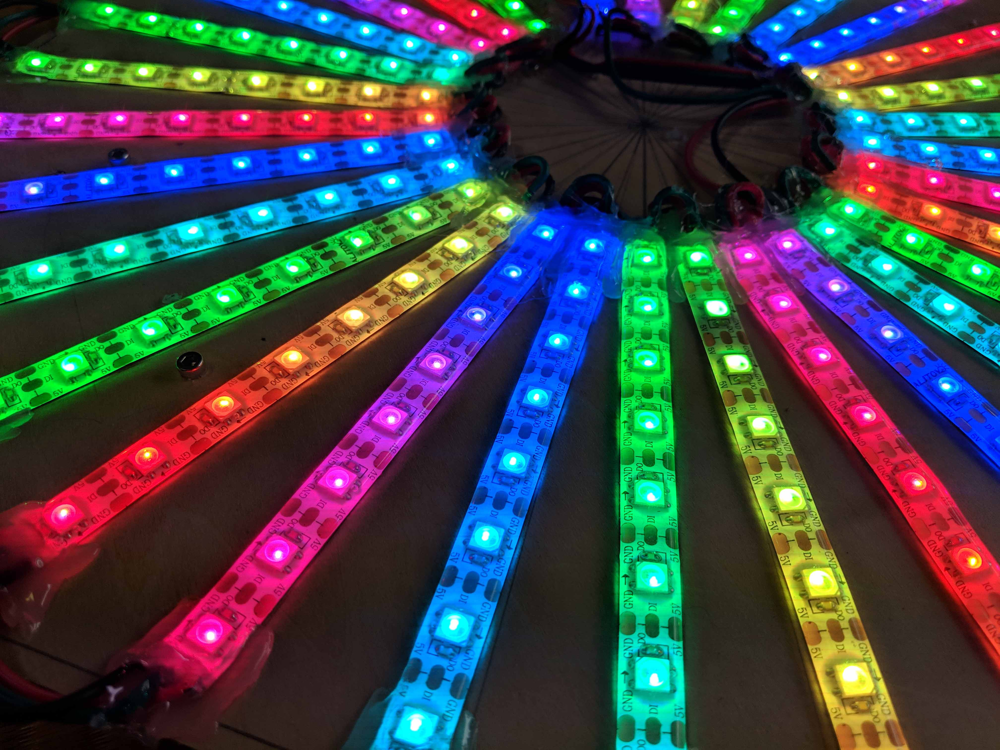
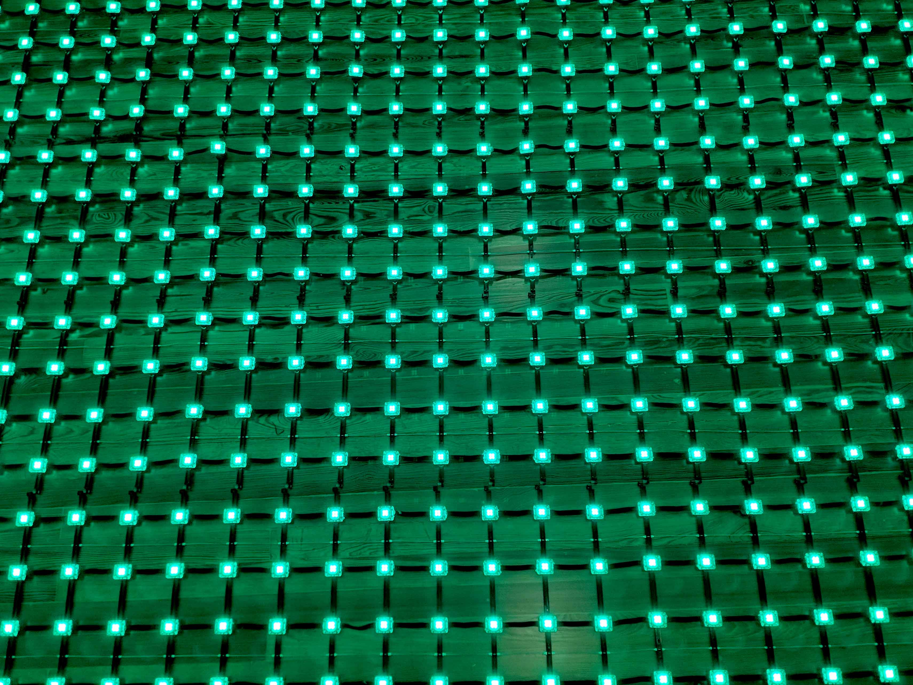
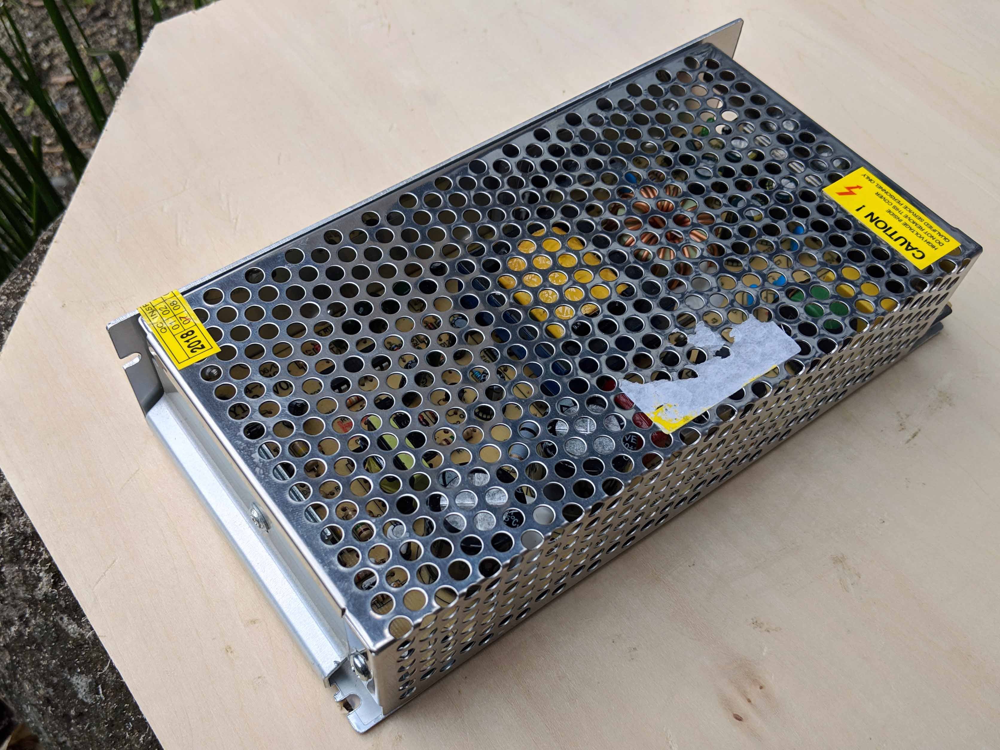

Addressable LEDs have an integrated chip that allows their color and brightness to be individually controlled. Addressable LEDs often come on long strips that can be cut to length at pre-determined points. Some addressable LEDs are packaged as large LED pixels used on buildings and large interactive media and sculptures.

Addressable LEDs come in RGB variety that only have 3 color LEDs and RGBW variety that have a fourth, white LED for better color range and brightness.

## RGB LED Protocols

Addressable LEDs require extremely precise timing to work. A signal is sent along the entire series of LEDs and tells each one what to do. This happens faster than human perception, so it appears instantaneous, but only one thing can happen at a time. It is important to use the correct protocol for each type of LED so colors and timing is correct.

Some addressable LEDs have a clock and a data line, others only have a data line. Some chips have a data passthrough so if one chip breaks the whole series does not stop working. Others do not have redundant data signals.

Common addressable RGB LED protocols include:

- APA102
- WS2801
- WS2811
- WS2812B
- NeoPixel (Brand name of an Adafruit project that are typically WS2811, WS2812, or WS2812B) [^1]
- UCS1903

## Examples of Addressable LEDs

<div class="gallery-grid">

<figure>

[](attachments/2023-addressable-strip-rgb-leds.jpg)

<figcaption>

Addressable Strip RGBW LEDs

</figcaption>
</figure>

<figure>

[](attachments/2018-rgb-strip-leds-illuminated-prototype.jpg)

<figcaption>

RGB Strip LED Prototype

</figcaption>
</figure>

<figure>

[](attachments/2018-led-pixel-matrix.jpg)

<figcaption>

Switching Power Supply

</figcaption>
</figure>

</div>

## Power Supplies

Large numbers of LEDs, addressable or not, require more power than an Arduino or Raspberry Pi can provide. External switching power supplies are needed. For long runs of LEDs in series, additional power must be "injected" along the line to over come voltage drop.

It is important that the ground of the power supply and the ground of the microcontroller are connected. If not then the data signal will not transmit well and erratic behavior will ensue. NOTE: Do not connect the positive current of the power supply and the power of the microcontroller unless you want to have a smoking and melting microcontroller.

<figure>

[](attachments/2018-switching-power-supply.jpg)

<figcaption>

Switching Power Supply

</figcaption>
</figure>

## Controlling Addressable LEDs with Arduino

The [Arduino](../arduino/arduino-introduction.md)Arduino and other microcontroller can control addressable LEDs with the help of libraries.

[Night Driver Strip](https://github.com/PlummersSoftwareLLC/NightDriverStrip) allows the controll of 8 channels of LEDs with the ESP32 chip.

### FastLED Library

A widely used library [FastLED](https://fastled.io/) is compatible with most addressable LED chips and protocols. According to the documentation, "FastLED supports popular LEDs including NeoPixel, WS2801, WS2811, WS2812B, LPD8806, TM1809, and more. The library runs on a wide range of Arduino and compatible boards, including both AVR- and ARM- based microcontrollers." [^2] The library can be installed directly in the Arduino IDE.

FastLED does not control RGBW LEDs without modification. There are multiple forks of the code online that add RGBW functionality to the original library. The website [Parts Not Included](https://www.partsnotincluded.com/fastled-rgbw-neopixels-sk6812/) has example sketches for using RGBW LEDs with FastLED.

### FastLED First Light Sketch

This sketch is helpful for determining what chipset your addressable LEDs have. Simply comment out one line at atime until it works.

```C
// Use if you want to force the software SPI subsystem to be used for some reason (generally, you don't)
// #define FASTLED_FORCE_SOFTWARE_SPI
// Use if you want to force non-accelerated pin access (hint: you really don't, it breaks lots of things)
// #define FASTLED_FORCE_SOFTWARE_SPI
// #define FASTLED_FORCE_SOFTWARE_PINS
#include <FastLED.h>

///////////////////////////////////////////////////////////////////////////////////////////
//
// Move a white dot along the strip of leds.  This program simply shows how to configure the leds,
// and then how to turn a single pixel white and then off, moving down the line of pixels.
//

// How many leds are in the strip?
#define NUM_LEDS 60

// For led chips like WS2812, which have a data line, ground, and power, you just
// need to define DATA_PIN.  For led chipsets that are SPI based (four wires - data, clock,
// ground, and power), like the LPD8806 define both DATA_PIN and CLOCK_PIN
// Clock pin only needed for SPI based chipsets when not using hardware SPI
#define DATA_PIN 3
#define CLOCK_PIN 13

// This is an array of leds.  One item for each led in your strip.
CRGB leds[NUM_LEDS];

// This function sets up the ledsand tells the controller about them
void setup() {
	// sanity check delay - allows reprogramming if accidently blowing power w/leds
   	delay(2000);

    // Uncomment/edit one of the following lines for your leds arrangement.
    // ## Clockless types ##
    // FastLED.addLeds<NEOPIXEL, DATA_PIN>(leds, NUM_LEDS);  // GRB ordering is assumed
    // FastLED.addLeds<SM16703, DATA_PIN, RGB>(leds, NUM_LEDS);
    // FastLED.addLeds<TM1829, DATA_PIN, RGB>(leds, NUM_LEDS);
    // FastLED.addLeds<TM1812, DATA_PIN, RGB>(leds, NUM_LEDS);
    // FastLED.addLeds<TM1809, DATA_PIN, RGB>(leds, NUM_LEDS);
    // FastLED.addLeds<TM1804, DATA_PIN, RGB>(leds, NUM_LEDS);
    // FastLED.addLeds<TM1803, DATA_PIN, RGB>(leds, NUM_LEDS);
    // FastLED.addLeds<UCS1903, DATA_PIN, RGB>(leds, NUM_LEDS);
    // FastLED.addLeds<UCS1903B, DATA_PIN, RGB>(leds, NUM_LEDS);
    // FastLED.addLeds<UCS1904, DATA_PIN, RGB>(leds, NUM_LEDS);
    // FastLED.addLeds<UCS2903, DATA_PIN, RGB>(leds, NUM_LEDS);
    // FastLED.addLeds<WS2812, DATA_PIN, RGB>(leds, NUM_LEDS);  // GRB ordering is typical
    // FastLED.addLeds<WS2852, DATA_PIN, RGB>(leds, NUM_LEDS);  // GRB ordering is typical
    // FastLED.addLeds<WS2812B, DATA_PIN, RGB>(leds, NUM_LEDS);  // GRB ordering is typical
    // FastLED.addLeds<GS1903, DATA_PIN, RGB>(leds, NUM_LEDS);
    // FastLED.addLeds<SK6812, DATA_PIN, RGB>(leds, NUM_LEDS);  // GRB ordering is typical
    // FastLED.addLeds<SK6822, DATA_PIN, RGB>(leds, NUM_LEDS);
    // FastLED.addLeds<APA106, DATA_PIN, RGB>(leds, NUM_LEDS);
    // FastLED.addLeds<PL9823, DATA_PIN, RGB>(leds, NUM_LEDS);
    // FastLED.addLeds<SK6822, DATA_PIN, RGB>(leds, NUM_LEDS);
    FastLED.addLeds<WS2811, DATA_PIN, RGB>(leds, NUM_LEDS);
    // FastLED.addLeds<WS2813, DATA_PIN, RGB>(leds, NUM_LEDS);
    // FastLED.addLeds<APA104, DATA_PIN, RGB>(leds, NUM_LEDS);
    // FastLED.addLeds<WS2811_400, DATA_PIN, RGB>(leds, NUM_LEDS);
    // FastLED.addLeds<GE8822, DATA_PIN, RGB>(leds, NUM_LEDS);
    // FastLED.addLeds<GW6205, DATA_PIN, RGB>(leds, NUM_LEDS);
    // FastLED.addLeds<GW6205_400, DATA_PIN, RGB>(leds, NUM_LEDS);
    // FastLED.addLeds<LPD1886, DATA_PIN, RGB>(leds, NUM_LEDS);
    // FastLED.addLeds<LPD1886_8BIT, DATA_PIN, RGB>(leds, NUM_LEDS);
    // ## Clocked (SPI) types ##
    // FastLED.addLeds<LPD6803, DATA_PIN, CLOCK_PIN, RGB>(leds, NUM_LEDS);  // GRB ordering is typical
    // FastLED.addLeds<LPD8806, DATA_PIN, CLOCK_PIN, RGB>(leds, NUM_LEDS);  // GRB ordering is typical
    // FastLED.addLeds<WS2801, DATA_PIN, CLOCK_PIN, RGB>(leds, NUM_LEDS);
    // FastLED.addLeds<WS2803, DATA_PIN, CLOCK_PIN, RGB>(leds, NUM_LEDS);
    // FastLED.addLeds<SM16716, DATA_PIN, CLOCK_PIN, RGB>(leds, NUM_LEDS);
    // FastLED.addLeds<P9813, DATA_PIN, CLOCK_PIN, RGB>(leds, NUM_LEDS);  // BGR ordering is typical
    // FastLED.addLeds<DOTSTAR, DATA_PIN, CLOCK_PIN, RGB>(leds, NUM_LEDS);  // BGR ordering is typical
    // FastLED.addLeds<APA102, DATA_PIN, CLOCK_PIN, RGB>(leds, NUM_LEDS);  // BGR ordering is typical
    // FastLED.addLeds<SK9822, DATA_PIN, CLOCK_PIN, RGB>(leds, NUM_LEDS);  // BGR ordering is typical
}

// This function runs over and over, and is where you do the magic to light
// your leds.
void loop() {
   // Move a single white led
   for(int whiteLed = 0; whiteLed < NUM_LEDS; whiteLed = whiteLed + 1) {
      // Turn our current led on to white, then show the leds
      leds[whiteLed] = CRGB::White;

      // Show the leds (only one of which is set to white, from above)
      FastLED.show();

      // Wait a little bit
      delay(100);

      // Turn our current led back to black for the next loop around
      leds[whiteLed] = CRGB::Black;
   }
}


```

### Adafruit NeoPixel Library

Adafruit has a [library](https://github.com/adafruit/Adafruit_NeoPixel) for controlling their branded NeoPixels. It is also available in the Arduino IDE.

### Addressable LEDs Random Colors using the Adafruit Library on TinkerCad

<div class="iframe-tinkercad-container">
<iframe class="responsiveIframe" width="725" height="453" src="https://www.tinkercad.com/embed/hRsU8xdhLpn?editbtn=1" frameborder="0" marginwidth="0" marginheight="0" scrolling="no"></iframe>
</div>

[^1]: [Adafruit NeoPixels](https://www.adafruit.com/category/168) ([Web Archive](https://web.archive.org/web/20230315044545/https://www.adafruit.com/category/168))
[^2]: [FastLED Website](https://fastled.io/) ([Web Archive](https://web.archive.org/web/20230102003425/https://fastled.io/))
