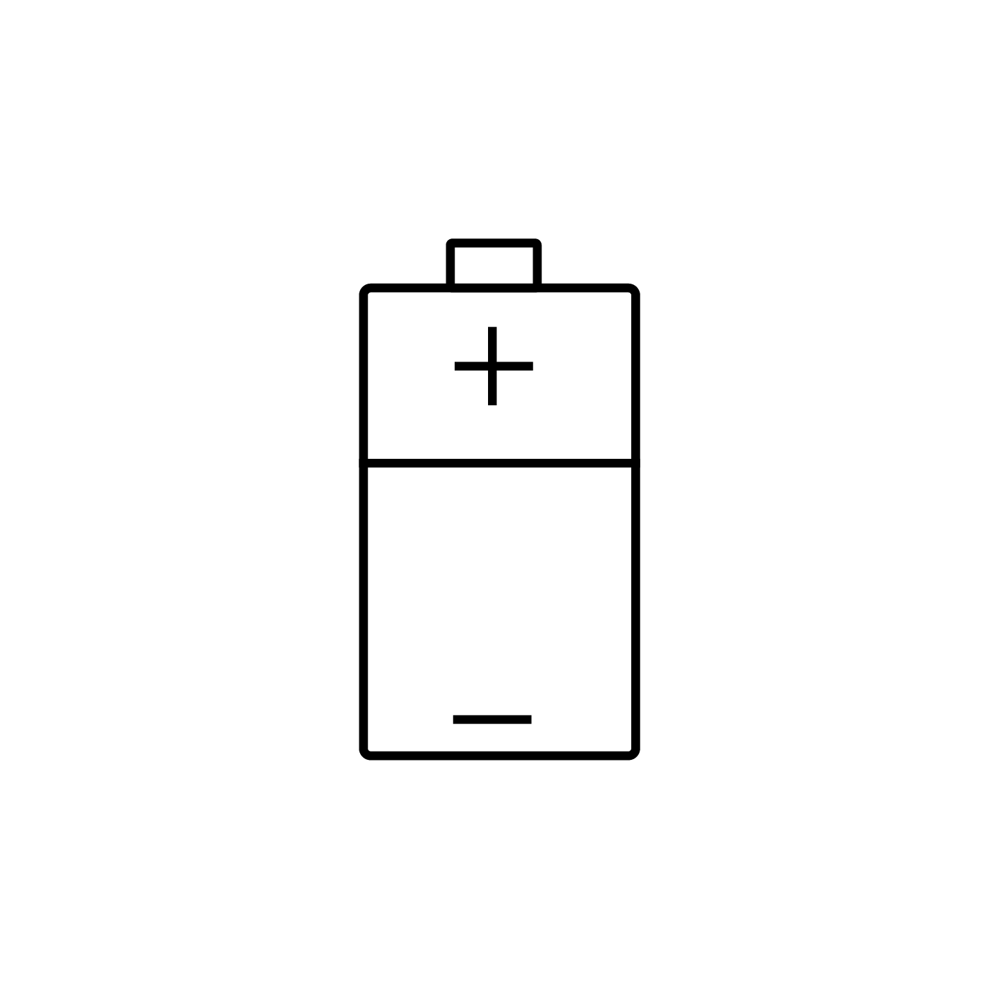

## What is Electricity?

Charged elections flow from one state to another usually from a negative charge to a positive charge while the current flows from the positive side to the negative side. Lighting and static electricity are examples of electricity in the natural environment. While light is cool to look at and it is fun to make your hair stand up with static electricity, neither are very useful in everyday scenarios. If this electron flow is directed through a conductor or wire in an electrical circuit it becomes much more practical. This current flow in a circuit can be used to do work such as turn on lights, make sounds, move motors, or run a heater.

Two common types of electrical circuits are AC, alternating current, and DC, direct current. The mains voltage in the wall is alternating current. The electricity in cars and electronics is usually direct current.

## Measuring Electricity

Voltage can be thought of as the potential for electrical flow. The higher the voltage, the higher the energy in the electrons. In order for electricity to flow there needs to be a voltage difference, often referred to as a gradient. The same is true for water. If water is spread out on a flat surface it has no gradient or difference so it stays put. If you collect the same water in a cup and then tip the cup there is a difference in water pressure and the water flows out of the cup until all the differences in water pressure even out and a flat puddle is left on the floor.

Electricity voltage potentials or gradients work in a similar way. For example if you rub you hands on a carpet a voltage potential in relation to a metal door knob not touching the carpet is created. When you touch the door knob and feel a static electricity shock the voltage potential or difference between your hand and the door knob is equalled out. The spark can be thought of as the light in a light bulb or the work of motor. One there is no remaining voltage potential then current can't flow. If you're hand was a cell phone battery it would now be out of juice and no current would flow to the phone to use that sweet, sweet internet.

The phone needs to be charged to keep working and the power plant needs to be "charged" to keep sending electricity to the wall receptacle to charge the phone. Fuel or an energy source is converted to a voltage potential at the power plant to keep everything going. If a higher voltage potential isn't created then there won't be any current flow and we will just have electricity "puddles" on the ground and now more cat videos.

Current can flow through solids or liquids. Liquids need something to transfer the electron for current to flow. Your body uses electric current flow to stay alive and you need salts and electrolytes to function properly. This is also why you shouldn't dry your hair I'm the shower, for multiple reasons.

Electricity doesn't just flow freely, it is slowed down by resistance. Your hand and the door knob has resistance. Metal wires generally have low resistance so current flows well through wires. As a general rule, a thinner wire has more resistance than a thick wire, and a longer wire has more resistance than a shorter wire

### Ohm's Law

The following famous equation known as Ohm's Law calculates electricity current flow. The Current is the voltage, potential for flow, divided by the resistance in the circuit. The resistance measures how well or not well the current flows through the object. For example copper has low resistance while rubber has a high resistance.

| Unknown Value  | Equation   | Equation Description            |
| -------------- | ---------- | ------------------------------- |
| Current (I)    | I = V / R  | Current = Voltage / Resistance  |
| Voltage (V)    | V = I \* R | Voltage = Current \* Resistance |
| Resistance (R) | R = V / I  | Resistance = Voltage / Current  |

What does this mean in practice? Consider a couple extreme examples.

<figure>

<figcaption>

Battery with the near infinite resistance of the surrounding air

</figcaption>
</figure>
<figure>

<figcaption>

Battery with near infinite current due to a wired short circuit condition

</figcaption>
</figure>

If you have a charged battery that is not connected to anything, then it has the voltage potential written on its label, often 1.5 volts. What about the resistance? The resistance is nearly infinite since electrical current does not efficiently travel through the air. That means we can now calculate the Current (I) as I = 1.5v / ∞ and therefore the current (I) is zero. You already intuitively knew the current of the unconnected battery was zero but it is neat to see how Ohm's law can derive the answer and matched observed reality.

Conversely, if you take the same charged battery and connect the + and - ends of the battery with a highly conductive (low resistance) copper wire, then you practically lower the resistance to 0. Since the voltage is still 1.5 volts, we can now calculate the Current (I) as I = 1.5v /0 and therefore the current (I) is ∞ at least until the battery drains or the wire melts.

## References
