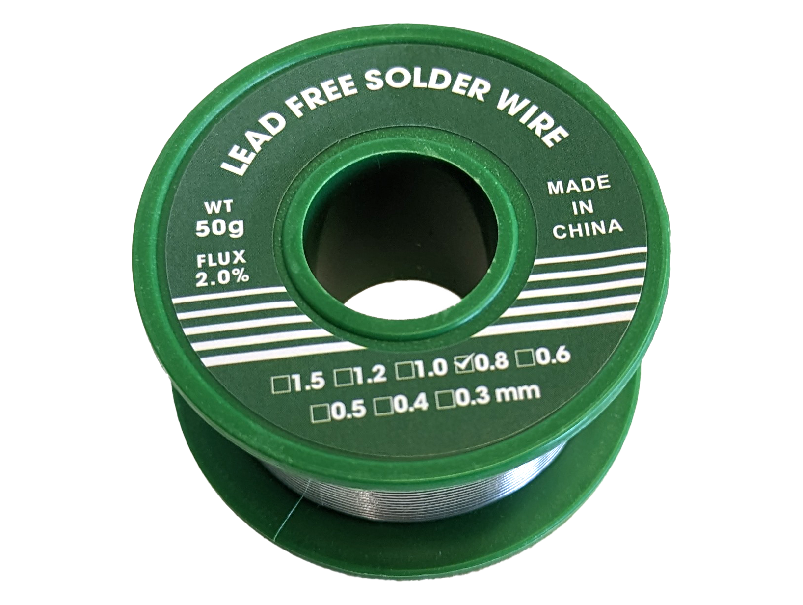

## Soldering Equipment

- solder
- [solder spool](how-to-use-a-solder-spool.md)
- soldering iron
- soldering iron tips ( point, chisel, knife )
- solder wick
- wire cutters
- solder tip cleaning sponge
- solder tip cleaning brass mesh
- fume extractor
- workpiece clamp or holder

## Soldering Technique

- **Clean Solder Iron Tip:** It is important to have a clean solder iron tip. The tip rapidly oxidizes since it is very hot. It also can bake on a burnt residue of unused flux that appears black and blocks heat transfer.
- **Tin the Solder Iron Tip:** Keeping a layer of solder on the solder iron tip helps with heat transfer and protects the tip from damage from oxidation. You should tin a tip before using it and re-tin the tip after each pause in soldering.
- **Tin Parts:** Tinning the wire or solder pad on a circuit board to be joined before making the final solder joint can help make better joints. To tin a wire or solder pad, apply heat with the soldering iron, then apply solder to the wire or pad. Remove the soldering iron.
- **Heat the Base Materials:** Don't heat the solder with the soldering iron, unless you are tinning the tip. When you are soldering, you should apply heat to the base materials that you want to join. When they become hot enough to melt the solder if solder is touched directly to them then the solder will flow with the flux and make a good joint. If you heat up solder with the iron and dump it on the joint you will create bad connections and cold solder joints.
- **Let Solder Cool:** Let the solder joint cool down gradually and without moving it. If a fan is blowing on the solder joint, it can make it cool down too fast and make a bad connection. Moving the joint while it is cooling can also make a bad connection.
- **Inspect the Joint:** The solder joint should look smooth, shiny, and even. Using lead free solder may make dull joints that are still good joints.
- **Avoid Acid Fluxes:** Don't use plumbing solder on electrical circuits or electronics as it could have acid fluxes that will damage your wires and components.

<figure>

[Tool Header Joints](https://learn.adafruit.com/assets/1978) by [Bill Earl](https://learn.adafruit.com/u/adafruit_support_bill) licensed under [(CC BY-SA 3.0)](https://creativecommons.org/licenses/by-sa/3.0/) [^1]

<figcaption>

</figcaption>
</figure>

## Soldering Safety

- [Little foam fume extractors do nothing](https://pubmed.ncbi.nlm.nih.gov/9838864/)
- [EHS Guideline - Soldering Safety - Carnegie Mellon University](https://www.cmu.edu/ehs/Laboratory-Safety/chemical-safety/documents/ehs-guideline---soldering-safety.pdf)
- [Pace Soldering Videos](https://www.youtu.be/vIT4ra6Mo0s)

Soldering poses a number of risks ranging from hazardous materials, production of particulate matter and fumes, and potential burns from the hot soldering iron. Simple common sense precautions can keep you safe while soldering. Safety glasses should be worn to prev ent hot solder from splashing into your eyes.

### Fumes and Smoke

Soldering releases fumes and particulate matter that can damage your lungs if inhaled. Never breathe in solder smoke or fumes and keep the smoke away from your face.

For occasional soldering a good fume extractor that filters the solder smoke will work well. You should use a solder fume extractor that has a HEPA filter to catch most of the particulate matter and a carbon filter to catch remaining fumes. If you plan to solder for longer periods of time and more often, then a solder fume extractor that vents to the outside will likely offer better respiratory protection than a filter type solder fume extractor.

### Lead Free Solder

Use lead-free solder unless your specific application won't allow it. Lead vaporizes at a higher temperature than soldering irons so it is not part of the solder smoke, but it is not a good thing to have around. Any amount of lead in the body is considered unsafe. Therefore avoiding contact is the best way to keep your body lead free. If you use lead solder, always wash your hands after you are done. You should also wash your hands after any soldering, even with lead-free solder.

## Soldering Resources

- [Case Western think[box] Soldering Guide](https://docs.google.com/document/d/1tkXUWJgCA8Q4fddSWkPbCKCXfLxbsZ7JyyeDv9Ac5PQ/view)
- [Arduino Guide to Soldering](https://docs.arduino.cc/learn/electronics/soldering-basics)
- [Circuit Technology Center Soldering Basics](https://www.circuitrework.com/guides/7-1-1.html) [(Web Archive)](https://web.archive.org/web/20230111095549/https://www.circuitrework.com/guides/7-1-1.html)
- [Wikipedia Soldering Article](https://en.wikipedia.org/wiki/Soldering)

## References

[^1]: https://learn.adafruit.com/assets/1978
