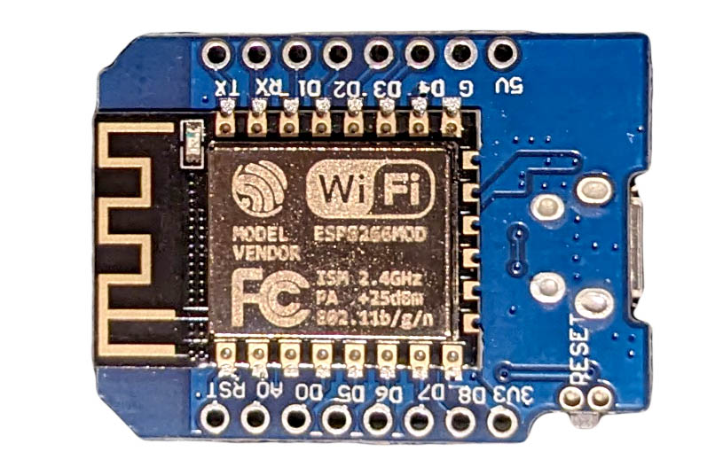

Espressif created a series of Wi-Fi and Bluetooth enabled boards. These are often used in "Internet of Things" devices. The modules are compatible with the Arduino IDE and many pre assembled development boards are available for custom projects. This allow for quick integration of Wi-Fi into an Arduino Project. The boards also have much more memory and processing power than a standard Arduino Uno at the cost of less GPIO pins.

## ESP-8266

The ESP-8266 was one of the early ESP chips and modules. It is still available and still useful but the ESP-32 will likely have more capabilities for future projects.

## Espressif Resources

[Espressif Website](https://www.espressif.com/en)

[Espressif GitHub](https://github.com/espressif/)

### ESP-32 Resources

[Espressif Arduino Core for ESP-32](https://github.com/espressif/arduino-esp32)

### ESP8266 Resources

[ESP8266 Arduino Core Documentation](https://arduino-esp8266.readthedocs.io/en/latest/index.html)
