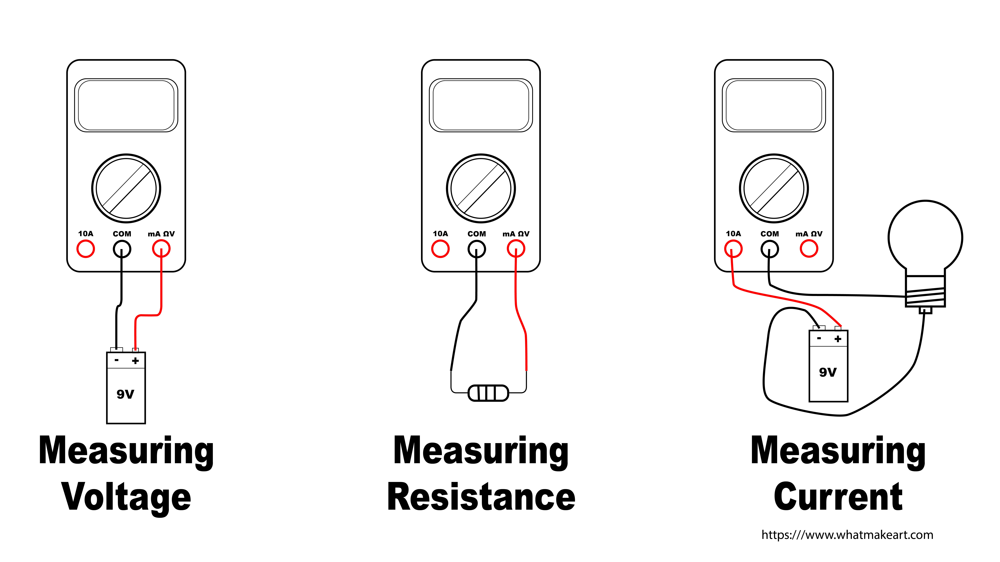

A multimeter can be used to measure voltage, resistance, current, and continuity. It is helpful in in electronics for diagnosing problems in projects as well as the specific attributes of an electronic component. Multimeters range from the very cheap to the very expensive but for the basic functions, any inexpensive multimeter will work fine.

It is recommended to use multimeters with digital displays rather than a gauge with a needle and to have auto measurement range sensing on the multimeter rather than having to select the measurement range manually.

## Parts of Multi Meter

Multimeters have two leads that are used for connecting to circuits and components to test. There is a screen that shows information and values from tests performed. It also has a control knob or switch to select what type of measurement is desired.

The leads or probes connect to a series of ports along the bottom. It is important to check that you are using the correct ports for different types of measurements so you get accurate readings and more importantly, you don't break the multimeter. Some multimeters only have two ports, others have 3, and some have 4.

The black lead / probe will always be in the COM or common port. The red lead will move to different ports. To measure voltage the red lead goes into the voltage port and to measure amps it goes into the 10A port unless you are measuring very small current.

## Measuring Voltage

Some multimeters automatically sense the voltage range but many require the use to select the range for the voltage reading. WHen you have no idea what the voltage will be it is best to start with the highest range and then move to lower ranges. If you have an idea of what the voltage will be, for example measuring a battery, then you can pick a range that is in line with your expected voltage reading.

ome multimeters measure AC an DC voltage with the same setting. That is usually marked with a straight line with a wavy line underneath.

### DC Voltage

To read DC voltage, turn the knob or selection switch to the ⎓ Direct Current Symbol. It is represented by a solid line with a dotted line below. Touch the black probe to the negative terminal of the battery or device you want to measure the voltage and touch the red probe to the positive side. The screen will display the voltage. If you hook it up backwards you will get a negative reading for the same amount of voltage.

### AC Voltage

To read AC voltage, turn the knob or selection switch to the ⏦ Alternating Current Symbol. It is represented by a sine wave with a line through it or by a simple sine wave 〜. It can also be written as VAC, or Voltage Alternating Current.

Double check that you have the multimeter set to AC voltage before attempting to measure AC voltage. Touch the red terminal to the hot side and the black terminal to the neutral side. Be extra careful to not touch the metal parts of the probes. Often it is best to use probes with alligator clips on the end so everything can be hooked up to take a measurement before the circuit is energized.

## Measuring Resistance

Turn the dial of the multimeter to the resistance setting. This is usually marked with the Ohm symbol Ω. The black probe should be in the COM port and the the red probe should be in the Voltage port. Often the Voltage port is labeled with VΩ to indicate the multifunctional nature of the port.

You can measure the resistance of most objects, including resistors. Unfortunately you won't be able to measure the resistance of a resistor in a circuit, it will need to be removed to get a reading.

## Measuring Continuity

A multimeter can detect if two locations on a conductive material connect. If you put both probes in contact with a metal pipe, it will sense that the metal is continuous and beep for positive continuity. This is not that useful since you can just look a the pipe.

What about detecting a break in a long coiled wire? If you strip both ends of the wire, touch one probe to one end and the other probe to the other end then the multimeter will beep with continuity detected if there are no breaks, or it will stay silent if there are breaks in the middle of the wire.

This is very useful for testing circuits and solder connections. It can be used to see if connections are continuous on a breadboard during prototyping. It can also check if your newly fabricated circuit soldered on a perfboard has continuous connections.

## Measuring Current

Measuring current with a multimeter is bit more involved and can be dangerous if care is not taken. Most multimeters have a 10A setting and a mA setting for measuring current. Unless you are absolutely sure you are measuring a low current device, it is always best to start with the 10A setting. Put the black probe in COM and the red probe in the 10A port. Turn the knob to 10A or the A setting.

Unlike the other measurements that use both probes to touch the positive and negative or the hot and neutral in parallel, to read current the probes must touch the circuit in series. What does that mean?

| **Multimeter Symbol** | **Meaning**                     |
| --------------------- | ------------------------------- |
| ⎓                     | Direct Current                  |
| 〜                    | Alternating Current             |
| V〜 or Ṽ              | Voltage AC                      |
| VAC                   | Voltage AC                      |
| Ω                     | Resistance                      |
| A〜 or à              | AC Current                      |
| A⎓                    | DC Current                      |
| A≂                    | AC / DC Current                 |
| ⇥                     | Diode                           |
| )))                   | Continuity                      |
| µ                     | micro                           |
| ㏀                    | kiloohm (1,000 ohms Ω)          |
| ㏁                    | megaohm (1,000,000 ohms Ω)      |
| µΩ                    | micro-ohm (0.000001 ohms Ω)     |
| F                     | Farad                           |
| mF                    | millifarad (0.001 Farads)       |
| µF                    | micro-farad (0.000001 Farads)   |
| A                     | ampere                          |
| ㎄                    | kiloampere (1,000 amperes)      |
| ㎃                    | milliampere (0.001 amperes)     |
| μA                    | microampere (0.000001 amperes ) |

