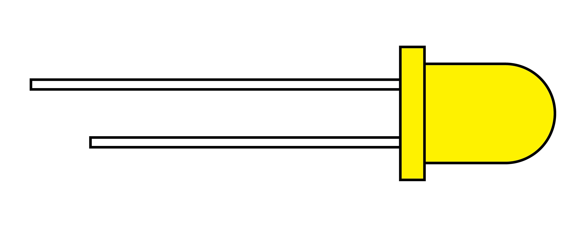

## Single LED Shape

Single LEDs or light emitting diodes have a long end the "anode" or positive + end and a short end the "cathode" or negative - end. Sometime the negative side of the LED is flattened to help identify it.

They typically run on 2 - 3 volts so when running LEDs from a 5V source such as an Arduino, then a resistor is needed to limit the current to not damage the LED. How do you know what resistor to use? Ohm's Law can be used to calculate the resistor needed for a particular LED with a certain voltage and current.

Since I = V/R we can do a bit of algebra by multiplying both sides by R and then dividing by I. We then get R = V/I Now how do you find out the current and voltage? The best way is to look at the datasheet of the LEDs you have, a datasheet for a very similar LED if you don't have one, or one of the many charts on the internet. Different color LEDs use different semiconductor materials and different voltages.

For example on the datasheet for Kingbright brand 5mm Super Bright Red LED Part Number: WP7113SRD it says that the voltage of the LED, usually referred to as the forward voltage, is 1.85v with a max of 2.5v tested at 20mA (milliamps) of DC current. It also mentions and absolute maximum current value of 30mA before the LED will break.[^1]

Now you just need to know the voltage of your power supply. The power supply could be battery powered or powered by a DC power supply. Non Li-Ion AA battery cells range from 1.2v to 1.6 volts. The common NiMH rechargeable AA operates at 1.2 volts. If 2 AA were run in series it would then supply 2.4v and 4 AAs would supply 4.8v.[^2] The next step is to subtract the LED forward voltage from the supply voltage.

2.4 - 1.85 = .55v

Now we have V and I. V is .55v and I is 20mA. But Ohm's law works with Amps so we need to divide 20mA by 1000 to get .0002 Amps. Then we divide .55v by .002A to get 27.5 Ohms. To use this 5mm red LED we need an ~ 27.5Ω resistor. Since resistors are not made perfect it is a good idea to select a size slightly larger than the theoretical calculation.

## Resistor Values and Color Codes

How do you know what the value of a resistor is after it is out of its package? Looking a a resistor there are painted color bands that wrap all the way around. These bands can be used to calculate the Ohm value of the resistor. The bands are usually closer to one side so you know which direction to read them. It can be complicated and error prone to read the code so an easy way is to plug the colors into a [LED resistor calculator](https://www.digikey.com/en/resources/conversion-calculators/conversion-calculator-led-series-resistor).

## LED Typical Voltages Vf

| LED Color | Voltage   |
| --------- | --------- |
| Red       | 1.8 - 2.1 |
| Orange    | 1.9 - 2.2 |
| Yellow    | 1.9 - 2.2 |
| Green     | 2 - 3.1   |
| Blue      | 3 - 3.7   |
| White     | 2 - 3.4   |

These values are from the electronics supplier Digikey.[^3] They also have a handy [LED resistor calculator](https://www.digikey.com/en/resources/conversion-calculators/conversion-calculator-led-series-resistor) as well as a [resistor color code calculator](https://www.digikey.com/en/resources/conversion-calculators/conversion-calculator-resistor-color-code).

## Try it Yourself

What would the resistor value be if you had a 5V power supply and a Green LED running at 20mA?

What would the resistor value be if you had a 9V battery power supply and a Blue LED running at 20mA?

## LEDs With Circuits

- [All About Circuits 555 Flashers](https://forum.allaboutcircuits.com/threads/leds-555s-flashers-and-light-chasers.19075/)

## LED Diffusion

- [Black LED Sheet](https://www.tapplastics.com/product/plastics/cut_to_size_plastic/black_led_sheet/)

[^1]: [Kingbright USA WP7133LSRD.pdf](https://www.kingbrightusa.com/images/catalog/SPEC/WP7113LSRD.pdf)
[^2]: [Wikipedia - AA Battery](https://en.wikipedia.org/wiki/AA_battery)
[^3]: [Digikey LED Resistor Calculator](https://www.digikey.com/en/resources/conversion-calculators/conversion-calculator-led-series-resistor)
