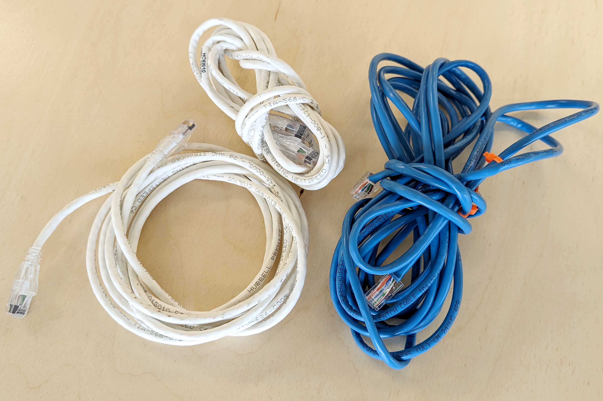
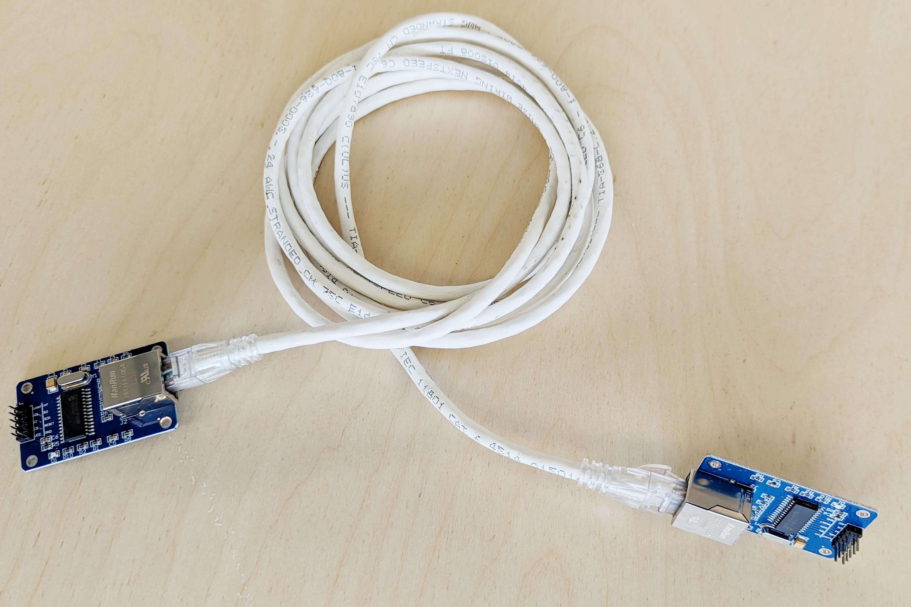

## Cat 5 Wire

Ethernet Cable comes with twisted pair wires that are designed for single transmission. They are easily found since many come bundles with consumer electronics devices

## Connection Module

To get a Cat 5 cable to connect to and Arduino, use a module.

## Capacitors for Noise

Use Cat 5 and one pair for power / GND and the other pair for signal and GND. A 100 nf ceramic capacitor from the [Arduino](../arduino/arduino-introduction.md) input pin to ground can help filter out RF interference

### Bypass Capacitors

- part 1 https://www.allaboutcircuits.com/technical-articles/clean-power-for-every-ic-part-1-understanding-bypass-capacitors/
- part 2 https://www.allaboutcircuits.com/technical-articles/clean-power-for-every-ic-part-2-choosing-and-using-your-bypass-capacitors/

[Decoupling Capacitor Tutorial](http://www.thebox.myzen.co.uk/Tutorial/De-coupling.html)

[Difference between bypass / decoupling capacitors](https://www.circuitbread.com/ee-faq/what-is-the-difference-between-coupling-decoupling-and-bypass-capacitors)

## RS422 or RS485

Use RS422 or RS485 and twisted pair need MAX485 TTL to RS-485 Interface Module

- https://ipc2u.com/articles/knowledge-base/the-main-differences-between-rs-232-rs-422-and-rs-485/
- https://www.omega.com/en-us/resources/rs422-rs485-rs232
- http://www.rs485.com/rs485spec.html

[Voltage Drop Calculator](https://www.calculator.net/voltage-drop-calculator.html)

Without using specific module - [debouncing](https://www.arduino.cc/en/Tutorial/BuiltInExamples/Debounce) may help with just plain twisted pair wires.
