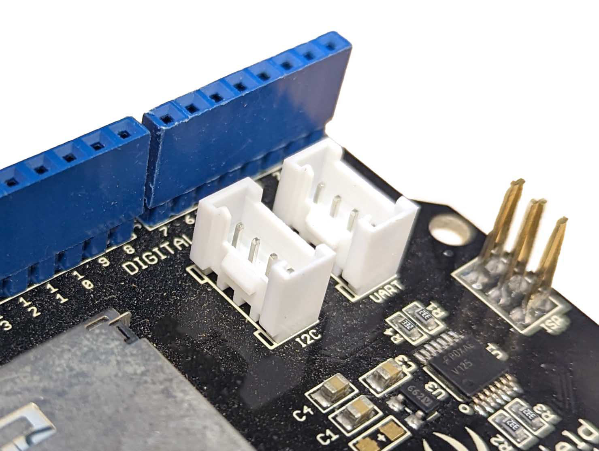
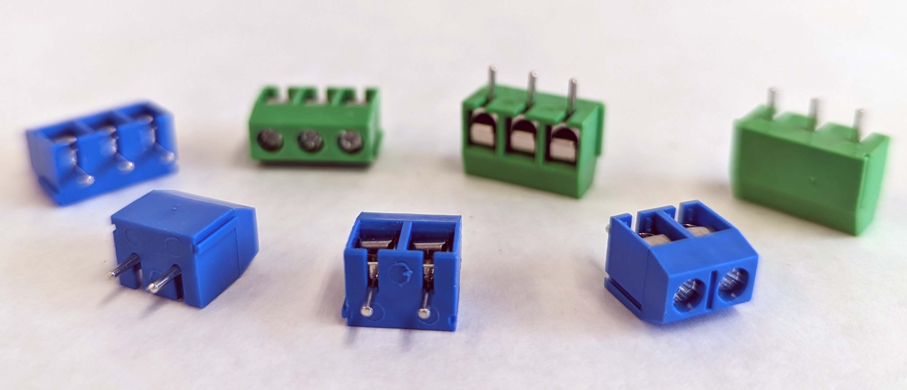

Each component and wire needs to be either soldering directly to the board or provided a way to connect to a board mount connector. If something needs to be removed to install the board, or if a component has different versions, then a board mount connecter can be a good option. Otherwise it is usually best to solder as much as possible directly to the board.

## Board Mount Connectors

Many connectors come in panel mount form, board mount form and cord form. When prototyping on a breadboard, inserting jumper pins into the breadboard or into the header pins of the Arduino are a type of panel mount connector. The cable or pin attaches to a point that is soldered to the board. Unfortunately, jumper wires and header pins are not the most durable, reliable, or permanent connection.

A more robust board mount connector, pictured above in white, is what is commonly referred to as a JST connector. JST is a company that makes thousands of connectors, but this style connector, made by JST, is found on many Arduino modules and computer accessories. It has a positive mechanical connection, and offers polarity alignment so that you can't hook up the pins the wrong way once you set it up.

### Screw Terminals

Screw terminals are a convenient way to make secure connections that are easily changed. They do not require special connectors. The downside of screw terminals is that on multiple pin connections, one must pay attention to where the wires go unlike a dedicated connector.

## Cord Mount Connectors

Cord mount connectors have wire leads coming off of a standard detachable connector. The wire leads are solder directly to the solder pads of the perfboard. This allows for a semi flexible connector that has some distance from the board. This can make assembly of a project in an electronics enclosure easier that with board mount connectors. The downside is the tendency for the wires to flex and move which can cause fatigue at the solder joint. This can be alleviated by a combination of heat shrink and strain relief.
