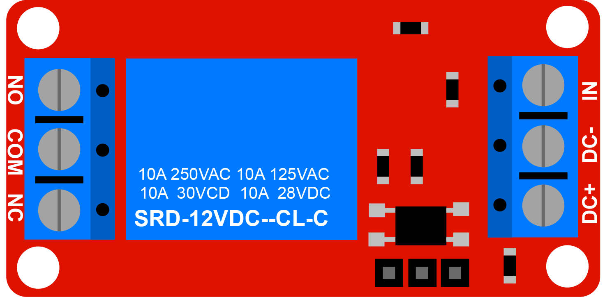
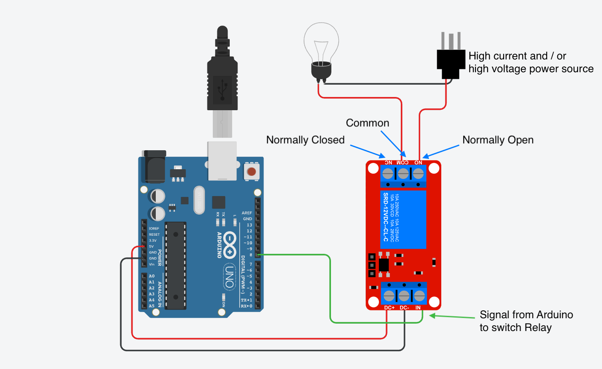
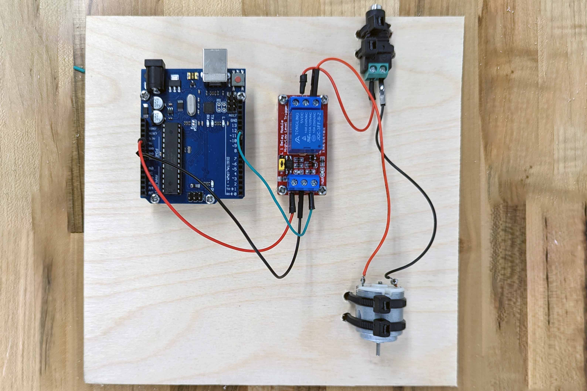

A mechanical relay flips a physical switch with a magnet when a signal is sent to it. This keeps the signal wire and the high voltage and / or high current source load separated. Sometimes an LED is used to trigger and optical sensor that then switches the load. This type of isolation, optoisolation, offers even more circuit protection.

Mechanical relays have a telltale "click" when switched. A good switch has a quick snapping action to prevent arcing. The fast acting switch in a mechanical relay hits the contacts hard enough to make a click. The sound made by turn signals in cars was once made by the clicking of a mechanical relay. Now sound for turn signals, if any, is created with a speaker since cars no longer use mechanical relays for turn signals.

## Mechanical Relay Module

For use with [Arduino](../arduino/arduino-introduction.md) microcontrollers, relay modules are available with a relay already soldered together with the necessary resistors and components. The modules usually have screw terminals for easy and secure connections. One side of the module will accept 5v in to power the module. This side will also accept a signal wire from the microcontroller. This signal tells the relay module when to switch the load.

On the load side of the relay module, there are 3 screw terminals labled, NC, COM, and NO. These stand for Normally Closed, Common, and Normally Open.

- Normally Closed - Wires connected to this terminal make a closed circuit with the wires connected to Common even when no power is applied to the relay
- Common - Wires connected to this terminal can connect to either the Normally Closed or Normally Open terminal depending if the relay is switched or not
- Normally Open - Wires connected to this terminal make a closed circuit with the wires connected to Common only when power is applied to the relay

## Relay Module Wiring

### Low Voltage Side

The relay module needs power to operate and to switch the load. Without power it is just a switch like the light switch in a wall. The low voltage side receives power from the Arduino or another 5v source. This side also has a pin labeled "IN" that accepts a signal wire from one of the GPIO pins of the Arduino. When the Arduino pin is set to "HIGH" then the relay module will switch the load.

### Load Side

On the load side the power source is connected to the Common pin. If using DC voltage, this is the + positive wire from the DC power source. If using AC voltage, this is the "hot" wire from the AC power source. AC does not have + positive and - negative but you can think of the "hot" wire as the positive and the "neutral" wire as the negative.

Then you decide if you want the circuit to be completed when the switch is off or when the switch is on. Usually you want the load to switch on when you apply voltage to the signal pin. That way, if the relay breaks or if there is no power from the microcontroller, the relay does not switch the power on. In that case, connect the "Normally Open" or "NO" terminal to the + positive or "hot" side of the load.

The - negative for DC or the "neutral" for AC is connected directly from the power source to the load.

Note that the high voltage / high current wires to not interact with the low voltage wiring of the Arduino at all. It is important to keep them completely separated.

### High Voltage Safety

If using a relay to switch any voltage 50v or higher, then the relay module and the high voltage wires must be completely enclosed in an approved electrical box. This protects the user from high voltage. Never use high voltage wiring that is not completely enclosed and insulated.

<figure>

<figcaption>

Arduino Relay Module Wiring Diagram for switching high voltage and / or high current loads

</figcaption>

## Relay Example with 5V DC and Single LED

Just because a relay can switch high voltage and high current doesn't mean it has to. This example shows a single relay being switch by the relay. It is completely isolated from the Arduino by the relay.

<figure>

<figcaption>

Relay Example with 5V DC and Single LED

</figcaption>

</figure>
