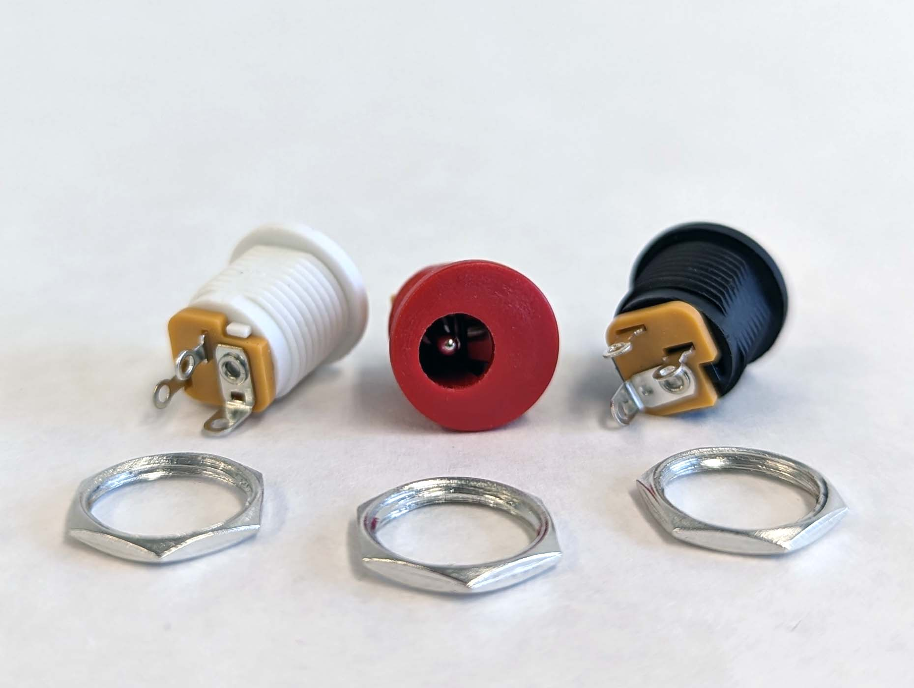

Panel mount connectors install through a hole made in the side of the wall of an electronics enclosure. The connectors typically have threads to attach a securing nut to hold it tight to the panel. Sometimes the connectors use a spring tension clip to keep that panel side in place.

Multiple connectors can be installed on the sides of an enclosure. Wires can be soldered to the connectors on the inside for a secure connection. Then the wires connect to the microcontroller, Arduino, or other electronics modules inside the enclosure. For removable or switchable connections, crimp terminals can be used on the wires with heat shrink tubing.

## DC Power Barrel Jack Connectors

](attachments/2023-panel-mount-dc-power-barrel-jacks.jpg)

DC power is essential for most electronics projects. Having a panel mount receptacle for DC power makes for a clean install and easy transport since you can simply unplug the power supply.

## Aviation Connectors

Aviation connectors allow for the secure connection of multi pin terminals and can handle reasonable current. They often feature cup terminals for soldering wire connections to them and have secure screw on fittings.

[Pace Cup Terminal Soldering Tutorial Video](https://youtu.be/_GLeCt_u3U8)
