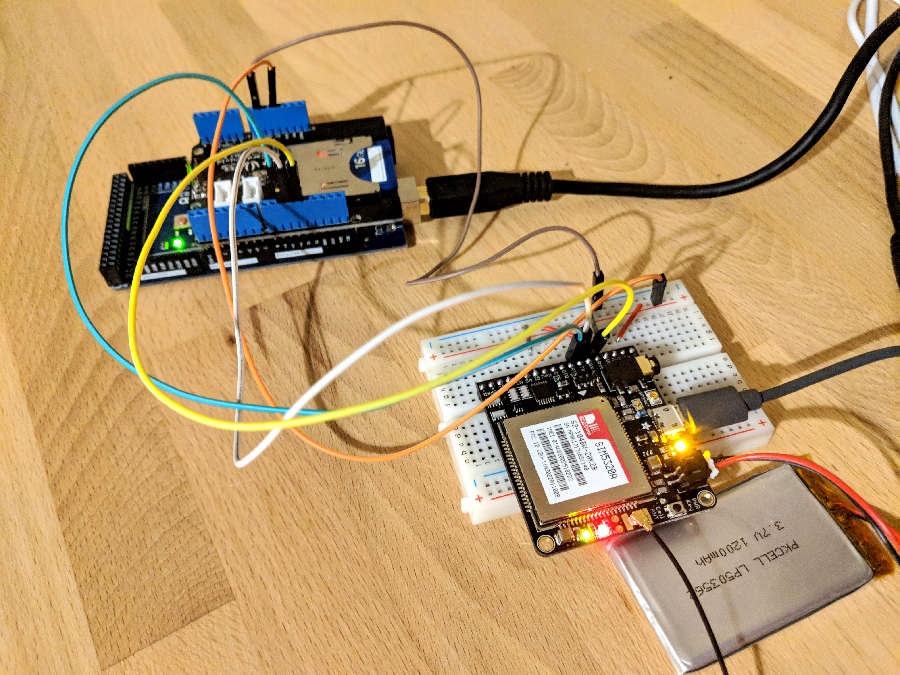
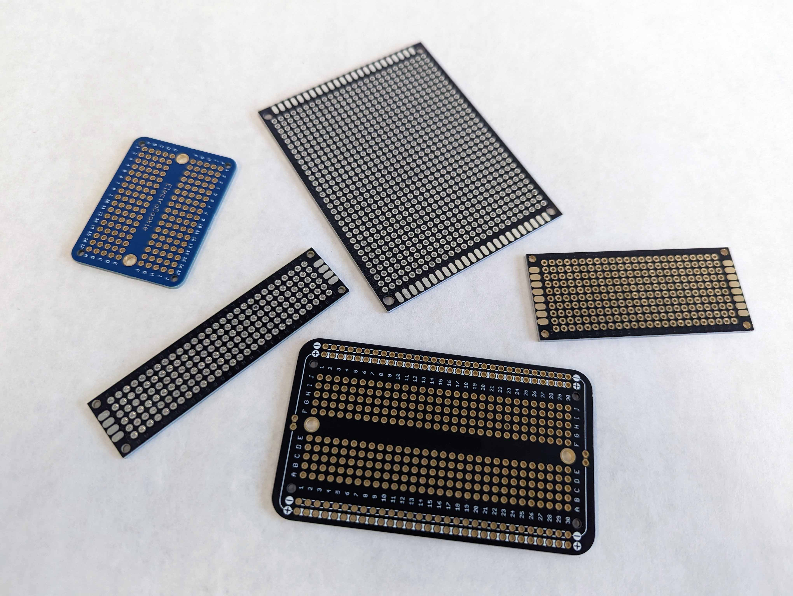

## Breadboard Prototypes

Breadboards are used at the beginning of a project to layout a circuit and test if it works. Breadboards are convenient because assembling one is fast and it is easy to make changes. This ease of change is also a liability. Jumper wire connections can easily fall out and sometimes have loose connections. Therefore breadboards are generally not the best choice for anything but a temporary setup. Once a circuit design, function, or layout has been proven on a breadboard it is time to transfer that work to a more permanent setup. Eventually that could mean a custom printed circuit board but that has the costs of design, fabrication, and waiting for the board. The next best thing is a soldered perfboard. Perfboard prototypes offer robust and durable circuits that can be used in long term projects.

## Perfboard Prototypes

This perfboard features a series of shift registers. These expand the input / output or IO of the Arduino to be able to control more pins. The components are laid out in an orderly fashion. Insulated wires make connections between the chips, ceramic capacitors (orange components), and the smaller green screw terminals. Larger blue screw terminals accept DC power.

### Perfboard

There are many different types of perfboard. Some perfboard has solder pads on one side only but most quality boards have double sided solder pads. Perfboard can either have all of its solder pads isolated from one another or it can have some of them tied together electrically. If the pads are isolated then an electrical connection must be made between components attached to different pads. This can be done with a solder trace, a continuous glob of solder between the pads, or with a wire connection. Solder traces are a good option for short connections about 1-3 solder pads long, but can become cumbersome on longer runs. For longer connections wire is the best. Silicone insulated wire is better that PVC insulated wire because the silicone can withstand the higher heat of the soldering iron and is more flexible.

#### Breadboard Style Perfboard

Some perfboards are laid out exactly like prototyping breadboards. These perfboards have two power rails on each side and a series of solder pads in the middle that are electrically connected. The advantage of these types of perfboards is that you can transfer your circuit design exactly from the breadboard to the perfboard. This can speed up your project. It can make for a a larger size circuit than if a more compact design was made. Breadboard style perfboards also tend to be more expensive than the individual solder pad style.

### Stripboard

Another type of prototyping board is strip board. These boards have a series of copper strips running along the solder pads. The copper strips electrically connect all of the solder pads in a row. This can make connections between solder pads easy in a single direction. Sometimes one does not want the entire row of solder pads connected. Using a scraper or a drill to remove the copper strip in between two solder pads can break the connection and allow for more complex and compact circuit layouts.

## Perfboard Layout Resources

[Hacked From Pieces Perfboard Process](https://hackedfrompieces.wordpress.com/2013/03/17/tutorial-professional-perfboard/) [(Web Archive)](https://web.archive.org/web/20190610005447/https://hackedfrompieces.wordpress.com/2013/03/17/tutorial-professional-perfboard/) - Shows interesting ways to transfer toner markings of designs onto perfboard to aid assembly and layout.

[Nuts and Volts Stripboard Prototyping](https://www.nutsvolts.com/magazine/article/june2013_Dratwa) [(Web Archive)](https://web.archive.org/web/20220611201804/https://www.nutsvolts.com/magazine/article/june2013_Dratwa)

[Circuit Board Prototyping Tips and Tricks](https://www.youtube.com/watch?v=J9Ig1Sxhe8Y) - Youtube Video with prototyping tips
