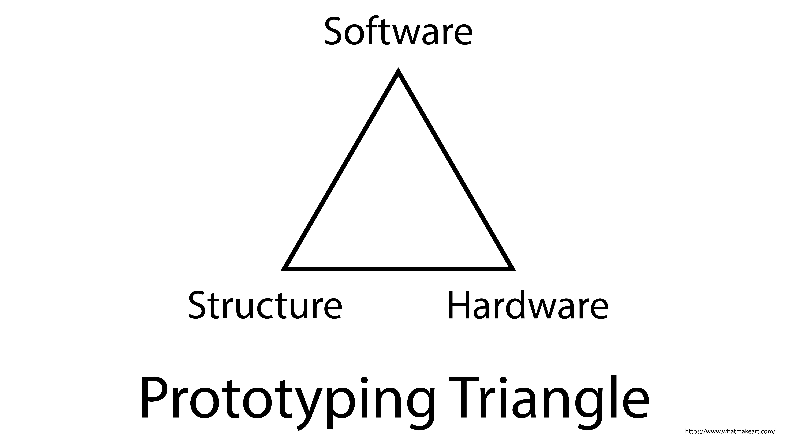

Making a new electronics project can be broken into three main categories:

- Software
- Hardware
- Structure

Then each of these categories can be broken down into individual components. We will use the toaster project example to show one way to break up a prototype project.

## Toaster Hardware

The hardware of the toaster includes the parts that do something. The insulation on the wiring keeps you from getting shocked, but that is more of a material property than a function. The same is true for the housing of the toaster. It keeps the heat inside but it doesn't have an active function.

- Lever to raise and lower toast
- Heating element
- Power Supply / cord
- Knob to select toast doneness
- Mechanism to raise and lower toast
- LED to indicate that Toaster is on

## Toaster Software

A toaster could be built completely with analog components and no software, but if you wanted to use a microcontroller like the Arduino to control your toaster, you might break the software up into components like this. We will talk more about making software components, or functions, in another section.

- Check if toast is inserted and lever is pressed down
- Check if toaster is set to light or dark
- Set timer based on the toast setting
- If timer is set, then turn on the toaster heater
- If heater is on, then turn on LED
- Check if the timer is finished
- If timer is finished, then turn off the toaster heater
- If heater is off, then turn of LED
- If the heating element and the timer are finished, then pop up the toast
- Standby mode waiting for a new piece of toast

## Toaster Structure

The structure of the toaster is what allows all of the separate hardware pieces to work together. If the heating element was just laying on the counter, next to a knob to select toast doneness, next to a lever, it would not be a good toaster. It would be very dangerous. The structure physically supports the hardware but may not have a specific function other than support.

- Exterior Housing
- Interior brackets and mounting points
- Screws
- Heat shielding
- Gap for lever to move
- Opening for toast

## Process

1. Break project into categories: Hardware, Software, Structure.
2. Break each category into individual components.
3. Add description to each component about what it does and how it fits into the project.
4. Write what the completion status of the component is. Finished, Almost Done, In progress, Barely Started, Not Started.
5. Write the next physical action step needed to make progress on the component.

## Example

| **Component**                         | **Description**                                                                 | **Status**  | **Next Step to Make Progress**                                |
| ------------------------------------- | ------------------------------------------------------------------------------- | ----------- | ------------------------------------------------------------- |
| **Hardware**                          |                                                                                 |             |                                                               |
| Lever to raise and lower toast        | This lever is needed to move the toast and the body needs to be built around it | Not Started | Design toast receiver                                         |
| Heating element                       | Heats the toast and is on both side of the toaster, controlled by a timer       | Not Started | Buy heating element to test settings                          |
| Power Supply / cord                   | Used to put power safely into the toaster                                       | Not Started | Buy long enough cord                                          |
| Knob to select toast doneness         | Could have 3-4 settings for light, medium, dark, burnt                          | In progress | Hook up to Timer to make different time durations             |
| Mechanism to raise and lower toast    | Needed to get the toast in and out of the toaster                               | Not Started | Research different mechanisms and take notes                  |
| LED to indicate that Toaster is on    | Safety feature to let people know that the toaster is on.                       | Completed   | Have code that switches LED on when desired                   |
| **Software**                          |                                                                                 |             |                                                               |
| `checkIfToastInserted(); `            | Check if toast is inserted and lever is pressed down                            | In Progress | Test distance settings with sensor                            |
| `checkToastSetting(); `               | Check if toaster is set to light or dark                                        | Not Started | Get Photo Sensor                                              |
| `setTimer();`                         | Set timer based on the toast setting                                            | In progress | Make different timers based on knob setting                   |
| `turnOnHeatingElement();`             | If timer is set, then turn on the toaster heater                                | Not Started | Get relay to turn on heater                                   |
| `turnOnLED();`                        | If heater is on, then turn on LED                                               | Completed   | N/A                                                           |
| `checkTimer();`                       | Check if the timer is finished                                                  | In progress | Convert `millis();` timer to toast timer                      |
| `turnOffHeatingElement(); `           | If timer is finished, then turn off the toaster heater                          | Not Started | Use relay to turn off heating element                         |
| `turnOffLED();`                       | If heater is off, then turn of LED                                              | Completed   | N/A                                                           |
| `popUpToast();`                       | If the heating element and the timer are finished, then pop up the toast        | Not Started | Translate LED blink to pop up                                 |
| `waitForNewToast();`                  | Standby mode waiting for a new piece of toast                                   | Not Started | Decide how long to wait before checking for new toast         |
| **Structure**                         |                                                                                 |             |                                                               |
| Exterior Housing                      | Protective layer that keeps heat and electricity inside the toaster             | Not Started | Make a sketch of the housing that fits around parts           |
| Interior brackets and mounting points | Used to hold the mechanisms and heating element in place                        | Not Started | Measure objects to design bracket at correct size             |
| Screws                                | Keep everything in place                                                        | Not Started | Look at existing toasters to see what type of screws are used |
| Heat shielding                        | Barrier between the electronics and the heating element                         | Not Started | Get piece of metal to test distance from heating element      |
| Gap for lever to move                 | Space for the lever to move                                                     | Not Started | Measure the lever                                             |
| Opening for toast                     | Allows the toast to be put in, should be wide                                   | Not Started | Measure different pieces of bread                             |

