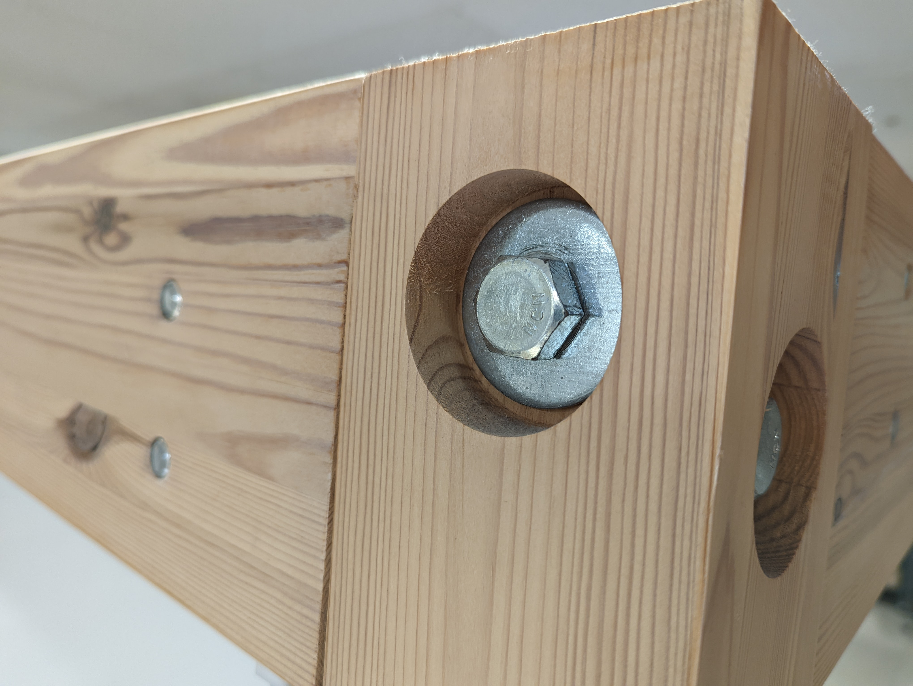

Often when using fasteners it is a good idea to countersink the fastener so it is either flush with the top of the material being joined or slightly below the material being joined. This can be done for aesthetic purposes as well as structural purposes. For example, some types of [Wood-Fasteners](../woodworking/wood-fasteners.md) are designed to be countersunk into the top material.

Example of hex bolt countersunk into wood with a washer.
