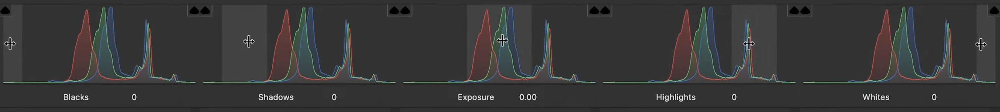

[Photoshop](../software/adobe-photoshop/photoshop.md) has a plugin called Camera Raw that can edit raw camera images as well as other digital images.

### Open Any Image in Camera Raw

<iframe class="youTubeIframe" src="https://www.youtube.com/embed/11jwSwUu2WI?rel=0" width="560" height="315" frameborder="0" allow="accelerometer; autoplay; clipboard-write; encrypted-media; gyroscope; picture-in-picture; web-share" referrerpolicy="strict-origin-when-cross-origin" allowfullscreen></iframe>

Adobe Camera Raw is where Photoshop speaks directly to your camera’s sensor data. Opening a raw file is like looking at the raw ingredients rather than the baked cake that is a processed jpeg. Raw cake ingredients are less convenient than a baked cake when you are hungry, but with the raw ingredients you can make any cake you want rather than being stuck with the grocery store sheet cake. That means you can season, remix, and rebalance a raw file without destroying the original image information.

You can launch Camera Raw from Adobe Bridge, Photoshop, or After Effects. In Bridge, Shift-click to select multiple raw photos, right-click, and choose Open in Camera Raw. You’ll get the Camera Raw window with a filmstrip of thumbnails and the main image preview. The filmstrip can sit along the bottom or the side. I like it vertical when I’m on a wide monitor so I keep more image area in the center.

## Camera Raw Simple Order of Operations

While there’s overlap among tools, this top-to-bottom flow is a good place to start.

1. Read the Histogram
2. White Balance
3. Basic tonality (Exposure, Highlights/Shadows, Whites/Blacks)
4. Texture/Clarity/Dehaze
5. Color adjustments (Color Mixer, Vibrance/Saturation)
6. Curves for fine tonal or color tweaks
7. Detail (sharpening/noise) as needed
8. Optics (profile and aberration fixes)
9. Geometry (if required)
10. Local Masks (brush, ranges, gradients, AI selects)
11. Effects (grain/vignette if you must)
12. Snapshots and final compare

### Start at the Top: Read the Histogram

At the top right you’ll see the histogram, but this one is special: it combines red, green, blue, and luminance. Hover your cursor and you’ll see labeled regions blacks, shadows, exposure (the midrange), highlights, and whites. These match the sliders in the Basic panel.

Here’s the neat part: you can either move the sliders in the Basic panel or drag directly on the histogram. If you click-drag in the “Shadows” region, you’re moving the Shadows slider; if you drag in the “Exposure” region, you’re nudging the overall midtones. Use whichever feels more intuitive.

### White Balance and Basic Corrections

Grab the eyedropper and click a neutral area in your image such as snow, gray card, concrete, a white shirt in shade. You can also switch among presets like As Shot, Auto, and Cloudy. If the auto choice pushes things too warm or cool, refine with the Temperature and Tint sliders.

Once white balance is set, move through the Basic Corrections

1. Exposure adjusts the overall brightness.
2. Contrast spreads or compresses tones across the whole range.
3. Highlights pulls back blown out bright detail such as in snow or clouds.
4. Shadows lifts the dark areas without crushing the super black areas.
5. Whites sets the brightest clipping point.
6. Blacks sets the darkest clipping point.

A practical sequence that works on most images:

- Pull Highlights down until bright areas hold detail.
- Raise Shadows until you see into the darks.
- Set Whites and Blacks to taste for a solid anchor.
- Revisit Exposure for the overall feel.

At any time, click and hold the little eye icon at the top of a panel to temporarily disable your edits and compare before/after. Your eyes adapt quickly; that peek is essential.

### Texture, Clarity, and Dehaze: Same Family, Different Frequencies

These three all add contrast, but at different scales think of them as high, mid, and low “frequency” contrast.

- Texture targets fine, high frequency detail. It crisps up hair, bark, fabric weave, the tiny cracks in peeling paint. It won’t halo edges as much.
- Clarity targets the mid tones and medium sized transitions. It adds punch to forms and edges without necessarily boosting the very fine grit.
- Dehaze is the low frequency sledgehammer. It clears atmospheric haze and big veils of fog or glare. It can make skies pop and backgrounds snap, but it will also crunch large areas if pushed too far.

A good rule: add a little Texture for perceived sharpness, a touch of Clarity for presence, and use Dehaze carefully, especially on scenes with sky and distant backgrounds.

### Vibrance vs. Saturation

Saturation raises the intensity of every color equally, which can make skin look too red. Vibrance is smarter it protects skin tones and very saturated colors, bumping up the more muted hues first. If there are people in the shot, favor Vibrance and add only a little Saturation if needed.

### Curves for Tonality and Color

The Curves panel can do everything the Basic sliders can and more, but with pinpoint accuracy. Use the Parametric or Point curve to add a classic gentle S curve: a slight lift in lights, slight dip in darks. You can also target individual RGB channels for color shifts:

- Red curve: up adds red, down adds cyan.
- Green curve: up adds green, down adds magenta.
- Blue curve: up adds blue, down adds yellow.

If you make a mess, hold Alt/Option over Reset in the panel to zero things out.

### Detail: Sharpening and Noise Reduction

Adobe Camera Raw’s Detail panel gives you sharpening and noise control. Texture/Clarity in the Basic panel will increase “perceived sharpness” will preserving frequency better, but Detail is great for:

- Luminance Noise Reduction to calm grain in high ISO shots or smooth backgrounds.
- Color Noise Reduction to kill color speckling and digital artifacts.

## Color Mixer: Targeted Hue, Saturation, and Luminance

This panel is your scalpel for color. Pick a color band reds, oranges, yellows, greens, aquas, blues, purples, magentas and adjust:

- Hue to shift the color itself (yellow toward green, blue toward purple, etc.).
- Saturation to intensify or mute only that band.
- Luminance to brighten or darken just that color.

It’s perfect for brightening blue siding without touching the rest of the house, deepening a yellow flower while leaving foliage alone, or nudging skies more teal or more royal blue. If you go too far, Alt/Option click Reset on the panel.

## Color Grading

Color Grading lets you tint shadows, midtones, and highlights independently and mix them with a Balance control. This is where you give a photo a cohesive vibe cool shadows with warm highlights, or a subtle split-tone to echo film looks. Small moves go a long way.

## Optics: Fix Your Lens for Free

Every lens has quirks. In Optics, enable the profile corrections for your lens to remove distortion and vignetting. Check Remove Chromatic Aberration to clean up those green/magenta edge fringes, especially common on wide lenses and high-contrast edges.

## Geometry: Straighten and Square the World

If your lines are leaning, Geometry is your friend. Try the one-click options:

- Auto for an overall fix,
- Level/Horizontal to target horizons,
- Vertical to correct keystoning.

You can also drop guided lines on edges (gutters, door frames) and ACR will warp the image to match. Be aware: Geometry transforms pixels it’s not just rotation so use it when you want true perspective correction. If you only need a slight horizon fix, use Crop’s Straighten tool instead.

#### Effects: Grain and Vignette

The Effects panel adds film-style grain and a post-crop vignette. I prefer building vignettes with a radial mask (more control, softer falloff), but if you need a quick symmetrical vignette, this is the switch.

#### Calibration: Match Multiple Cameras

If you had several cameras on a shoot and one’s color feels off, Calibration lets you nudge primary color behavior to harmonize sets. Dial it in once, then sync to the whole batch.

#### Crop and Straighten Without Warping

Use the Crop tool to set aspect ratios for print or social. You can rotate, flip, and use the Straighten tool to draw a line along a horizon or edge ACR will rotate to match. This is a simple rotate, not a perspective warp, so your pixels stay intact.

#### Spot Healing and Visualize Spots

The Spot Healing tool is perfect for dust, blemishes, and tiny distractions. Click to sample and replace; drag to paint a larger area. You can adjust size, feather, and opacity, and you can reposition the sampled area after the fact, which is wonderfully forgiving.

Turn on Visualize Spots for a high-contrast edge view that makes sensor dust and paper dents pop into view. Tap V to toggle overlays.

### Local Masks: Brush, Ranges, and Gradients

Masking is where ACR really sings. You can target exactly what needs attention and leave everything else alone.

- Brush: paint a mask by hand with adjustable size, feather, flow, and density. Great for irregular shapes but takes patience.
- Color Range: click or click-drag to sample a color or range of colors; ACR builds a mask from that hue. This is fantastic for skies, blossoms, painted surfaces any area defined by color. You can invert the mask to affect everything except that color.
- Luminance Range: select by brightness. Grab the bright snow without touching the mid-tone house. Feather the range for a clean transition.
- Linear Gradient: draw a straight gradient perfect for darkening a sky, fading a background, or building gentle depth.
- Radial Gradient: an ellipse you can size, rotate, and invert my favorite way to make custom vignettes or add a kiss of light around a subject.
- Select Subject / Select Sky: one-click AI selections that are shockingly good for product shots, portraits, and simple backgrounds.

You can also combine masks: add, subtract, or intersect. For example, create a Linear Gradient for the background, then subtract Select Subject so your subject stays untouched while the backdrop fades. It’s fast and feels like cheating in a good way.

### A Practical Product-Photo Workflow

Here’s a clean sequence for a flat-lit, sweep-background product photo:

1. In Basic, click Auto to get a starting point.
2. Confirm white balance with the eyedropper on the sweep.
3. Pull down Highlights if any shiny areas are clipping; lift Shadows to reveal form.
4. Add a touch of Texture for edge sparkle; a little Vibrance to make color honest.
5. Use Spot Healing to remove tape edges, paper seams, or dust. Turn on Visualize Spots to catch dents and sensor junk.
6. Create a Linear Gradient from the top to gently darken the background. Subtract Select Subject so only the sweep is affected.
7. Optionally, Select Subject and nudge Exposure/Temperature for a warmer, more inviting product while the background stays neutral.
8. Toggle panel eyes for before/after and make micro-adjustments.

Result: a clean, dimensional image that looks like your sweep rolled to infinity even if the set was a bit lacking.

### Snapshots and Non-Destructive Edits

Use Snapshots to save versions. Make a baseline snapshot, try a wilder grade, then flip between them instantly. When you click Done, your edits are saved non-destructively into the file’s metadata. If you’re working in DNG (Digital Negative), those edits can be stored right in the file, which keeps everything tidy and portable. You can always reopen the image in ACR and keep iterating.

Camera Raw lets you work directly with the richest version of your image. Start with honest white balance, shape your tones with the basic sliders, add presence with Texture/Clarity, and then get selective with masks to guide the viewer’s eye. Fix the lens, square the lines if needed, and use snapshots to explore looks without fear. Click Done and those non-destructive changes follow the file wherever it goes.

Use these tools to make your images sing whether it’s pulling detail back from bright snow, pumping the blue in a spring sky, warming up a desert canyon the camera misread, or turning a quick tabletop product shot into a portfolio-ready photograph.

### Video Transcript

In this Adobe Photoshop tutorial, I'm going to show you the basics of Adobe Camera Raw. Raw images are uncompressed image data from your camera's sensor. It has grayscale image data from all of the channels, and therefore you can then manipulate those channels and that information to pull out all kinds of things from your camera, rather than an already rather than an already pre-processed Jpeg that you may be used to using. You can also open JPEGs in Camera Raw, but the true power comes from raw photographs. Here I am in Adobe Bridge. You can get to Camera Raw from Adobe Bridge or Photoshop or After Effects. You can also use Lightroom. I'm going to shift click all these raw photographs, then right click Open in Camera Raw. This brings up the Camera Raw window. You'll see on the bottom a filmstrip. Or if you click this icon No film strip. You can show and hide the film strip. Or you can click and hold and you can make it vertical. Sometimes it's nice to have it vertical because a lot of times monitors are wider than they are long,but you can also have it on the horizontal just like this. You can click through different images to see which one you want to edit. Over on the right hand side of the camera raw window, you see a histogram. But this is a unique histogram because it has all the red, green and blue channels plus the luminance channel. All baked into one. This is pretty exciting. And when you hover over it, notice that there are certain areas that are highlighted. These areas are the blacks, the shadows, exposure highlights and whites. If I do exposure, it's more of a general adjustment. And you'll notice if you twirl out the basic corrections, you'll see exposure, contrast, highlights, shadows, whites and blacks. You can either adjust them here or you can grab right in the histogram. So if I grab shadows in the histogram, I can go back and forth. Look at the shadows slider down in the panel. So whatever way you feel is more intuitive for you to make adjustments, you can do that. So this is actually adjusting the exposure even though I'm just grabbing right on the histogram. So the first thing to do with the photograph is to do white balance. You can use the eyedropper and click a neutral part of your image. For example this snow would be pretty good. Notice that nothing changed because this was shot outside, and so the white balance should be pretty good. You can choose between different presets of white balance, auto white balance, or as shot. If I pick cloudy this will probably be just the same as I pick auto white balance. Auto white balance made it a little bit yellower than I think the actual scene is. So I'm going to go back to cloudy. I think this is a good representation of what was there. You can then further adjust this by changing the temperature and tint sliders right here. You can adjust exposure which is an overall correction to the entire range. Contrast either crushes everything together. So if I slide this to the left notice up in the histogram everything gets closer together to have less contrast or less difference between the parts. If I raise the contrast, notice the histogram becomes whiter. A better way to do this is with highlights and shadows. That way you can more precisely control what's happening. If you pull down the highlights, you'll pull back information that was in the snow, and then if you raise up the shadows, you'll brighten some information. There was in the shadows. You can then also adjust the very extremes the whites and the blacks. Probably in this image I want to bring down those whites in the snow. Maybe bring up the blacks just a little bit. Then it comes down to the next section of basic editing. We have texture, clarity and dehaze. All of these are about adding sharpness and contrast, but they work on different frequencies. You can think of texture as the high frequency clarity as the middle frequency, and dehaze as the low frequency. What do I mean by frequency? Well, how fast do the pixels change when they go from one pixel to the next? For example, right here by the black and white on the snow, that's high frequency. So when it goes from black to white it's a sharp curve on the graph from black to white. Whereas if I'm looking at the sighting, this is a very low frequency section of the image. Because it's kind of just a gradual grain. And then anything in the middle would be clarity. So watch what happens if I crank up texture. It affects anything that's high frequency. For example, we can see all the cracks on the paint. Now on the siding. If I lower that down. Notice that we can still see these lines fine over here on the left. But everything else kind of got blurry. Now. For example, clarity will do the middle parts. So if I crank up clarity, notice that the snow stays the same. But all these middle parts are much more dramatic. So the difference between the moisture on the dry paint and the wet paint was kind of a middle frequency. So that became more sharp if I lower clarity. Notice that the high frequency pieces. So this black and white parts of the snow, those are still there. Right. And even these lines over on the left because those are low frequency, they stay there because it's only doing the middle frequencies. Now Dehaze does the low frequencies. Look at the difference between the siding in the background and the snow in the foreground? If I crank up Dehaze, look how sharp this stuff gets over here and the snow gets all crinkly. But if I lower it once again, the snow is still very sharp. But now I hardly see anything over here in those low frequency areas. So these are really nice tools. When you're not using them in such an extreme to really fine tune your image. Next we have vibrance and saturation. Saturation increases the saturation of all the colors in your image. Vibrance, on the other hand, does that, but then it tries to keep anything it perceives as a skin tone neutral, so it doesn't up the saturation of skin tones. So this is really great. If there's any people in your image. So it will keep those skin tone reds basically neutral compared to what they were while cranking up the saturation in other sections. So the first thing to do on your image is do the basic correction. And a lot of times, just to get yourself started, you can click auto and it'll make some adjustments. And then you can come in here and you can tweak what you think would be best for your particular image. And then you can either add more texture or if you want to really show the crankiness of that ice, I think that's a nice thing to do. And then you can just lower that dehaze down on the bottom there. To what you want, and probably crank up the vibrance just a little bit. After you've done your basic corrections, you can twirl that up. And it's always a good idea to click and hold the eye and then let go just to see what you've done to change it, because your eyes get really adjusted to seeing the new changes, then in curves, then in curves, we can do many similar things. We can target just the red channel, which is great. So I could bring down the green right there, crank up the red in the shadows. So now you can see these dark areas are all red in the shadows. If I want to reset that I can hold alt or option and reset curves. I can also do this in the green channel. So green versus magenta. And then blue versus yellow cyan versus yellow. And I can do it to all of the channels. So curves is a really powerful way to just add a bit more dynamic range. You can add the classic S curve. We've already done that a bit up there. So I'm going to go ahead and reset the curves. Next we have detail. Detail also add sharpening so we can add more sharpening. But I like to use the sharpening tools up in basic because I have more control over the frequency of the sharpening. We can do noise reduction, which is really great for things that have a high ISO or noise in the background. And then you can also do color noise reduction, which helps with digital artifacts. I'm going to go ahead and hold alt and reset detail. Next we have the color mixer. This is a very powerful targeting tool. We can target different colors and then adjust only those colors. For example we have all these aquas in blues. And then we can change those to be different. So I can crank up the luminance of the aqua. So if I do this 100 up, you can see how much brighter the blue got, but other colors did not. If I do it to the yellow, you'll notice up at the top left hand corner of the image that all gets bright. Or if I crank down the yellow, it's adjusting the luminance. We also can do the hue in the saturation. So for example with the yellow, if I slide the yellow towards the green, notice the yellow gets green, but the blue stays the same. I can go back the other way to the orange and have a contrast the orange section there. I can do the same with the blues. I can make everything much more purple, right? And see how it only affects that hue. And then I can also bring the purples more blue, or add even more purple there, or see where the magenta is, are probably there's a bit of aquas in there. I can bring that down and really change what's going on there. We can also change the saturation so I can crank up the saturation of that yellow there. Or I could crank up or down the saturation of the blues. Now I almost have a gray house because there's no saturation on that siding anymore. So this is a really great way to target specific color bands in your image. Once again, hold alt or option to reset color mixer. Color grading is a final touch that you can adjust midtones and shadows. So for example, we can add the shadows and just add a cast to the different shadows in pieces, and we can blend that in more or less. This is used in color correction and film to add a specific look that you want. And you can do the same thing with your photographs. Many of these tools overlap each other and allow you to do things in different ways, so it's best for you to find the tools that work the best for you. They kind of intend for you to work from the top down, because the basic really covers just about everything, and then the rest of them are fine tuning. When we click on optics, we can fix any problems with the lens. Most lenses have some sort of problem, and Adobe Camera Raw has all of the things that you need to fix those problems automatically. So you can just use the profile correction they're usually built in and already there. You can also remove chromatic aberrations. This is more prevalent in large format and wide angle lenses. When there's a lot of glass on one side. Next we'll go down to geometry. This is really nice because you can use Adobe Camera Raw to straighten or fix your image. With the geometry tab, you can click auto and it'll automatically adjust the geometry. You can click horizontal. It will look for horizontal lines. You can click vertical. It'll try to adjust on vertical lines. So you see Adobe Camera Raw is adjusting on this gutter right here. If you click horizontal and vertical it will try to adjust everything. And so Adobe Camera Raw has now stretched my image out and it's not the best. So sometimes that's way too much. And then you can also manually adjust the geometry in Adobe Camera Raw by clicking on your image and dragging out lines. So I'm going to drag out along this gutter and then it's going to correct that image. This is different than the straightened tool. We'll get to that in a second because this is actually changing the pixels of the image rather than just rotating it. So be careful if you don't want to change the pixels of your image with the geometry tool. So I'm going to reset geometry. Then we have effects. We can add grain to this to make it more more filmic. And we can also add a vignette. We can add a white vignette or a black vignette. This is pretty harsh. So I think a better way to add a vignette is with a circular mask. Adobe Camera Raw also offers calibration. So for example, if you're using multiple cameras at a shoot and one of them had a different color cast, you could do this to calibrate the different images from different cameras to be exactly the right and then apply them to all the images. So that's really a helpful feature of Adobe Camera Raw. Next, let's look at the tool palette over here. And we can click on crop. So crop allows us of course to crop the images in Camera Raw. And we can use the as shot aspect ratio. Or we can use custom ones for example putting it on social media. You may want to make it square. Or if you're making a portrait or something for print you can do that. So that's really nice. You can also rotate and flip the image. And then you can change the angle manually. Or you can click here or you can click the straighten tool. And then I can click and draw a line right on that gutter. And now notice that this is different than what happened in the geometry tab here. I'm not changing any of the pixels, I'm just rotating the image so it can be more accurate. Way to fix straight lines and things, especially for horizons. So I'm going to go ahead and reset this. And you may notice that I can't hold alt or option on the crop tool. So I need to click this undo arrow right here. Let's continue going down. This is the spot healing brush. Very similar to what you would use in Photoshop or Lightroom. So I can click on this piece of snow right here. And then it's going to show me which part of the siding it's sampling. And I can move this around which is really great. So I can move this over here. And I put if I put it on there, it's going to get very confused and add a spot. So be careful where you put this and I can feather this out. So if I, if I have it super feathered out or very sharp, that's great. I can also change the size of that. And I can change the opacity. So this is the size of my brush. And so if I click this spot right there it's going to try to use this information to replace that. This is really good for touching up portraits or removing dust. If you are removing dust you can click on Visualize Spots. Then with this slider you can crank up the threshold of seeing the spots. This is really good for finding dust on a scanned image or other things. And then I can just come over here, lower the size of my brush, and then I can use the Spot Healing brush in Adobe Camera Raw to move these spots out of the way. And if you don't want to see these overlays, just check this checkmark. Or you can use the keyboard shortcut of V and you can toggle those on and off. And then I can toggle that off. And I can see what is happening. And I can look to double check that everything is looking right. And what's great is unlike the Healing Brush tool in Photoshop, I can still move these around to fine tune my edit, which is really great and really fast for editing little blemishes in Adobe Camera Raw. Let's move down here we have the masking tools so we can select the subject automatically or select the sky. We'll try this on a different image. And then we can also brush in a mask. So you can manually brush in I can brush in on the snow here. And I can change the feather and the density in the flow, just like I can in Photoshop. And I can also erase inside the mask. So that's really great. And so you can see these red spots here. And I can either show the overlay or not. So if I don't show the overlay and I lower the exposure of that section, you can see how it gets darker there. I can also change the highlights on any of those parts. I can also use this to change the color temperature of that area. So brushing can be very convenient because it can do complex shapes, but you generally have to spend time with the brush and the eraser to get a good mask and Adobe Camera Raw, and that can be problematic. So there are other ways that we can precisely select masks. So I'm going to undo this mask. And then I'm going to click on Color range. So color range is really exciting because I can click on a color range. So I can either click then shift click different colors. Or I can click and drag a section of colors. And now notice that this is only grabbing that sighting color. It's very precise. And then I can hide the overlay. I can mess with the exposure and it's only doing it on the sighting. Very powerful. I can bring up the highlights of the sighting. I can come down here and change the temperature of the sighting. There's all kinds of controls down here, so I can crank up the saturation or lower the saturation. I can add more texture to just the sighting and leave the snow alone, or lower and make the sighting whole blurry. Many things that are very powerful that you can do. I can reduce noise on the sighting or increase the sharpness. I can really change the hue like this. So this is nice and I can check this box to use fine adjustment. So it's going to move much slower. So color range masks are great especially for fixing when you have two different competing light sources. I'm going to undo this. Let's take a look at another type of mask. We have luminance range I can use luminance range to try to select just the bright snow. So I select here and it's doing a pretty good job. But I can then even more feather this over to only get those bright pieces of snow. And then I can hide the overall part, and then I can change the temperature of the snow. So now it's this really warm fuzzy snow. And then if I don't want this sighting, I can just keep cranking this over. So if I show the overlay, I can then keep cranking that over to not get the sighting. Really great. I'm going to undo that. We can also do a linear gradient. So if I click on Linear gradient click and drag. And you'll notice that from the red dot to the left or below, depending on how you use it, the effect is applied 100%. Then they have this nice icon that shows a gradient. So that means the Adobe Camera Raw mask is a gradient in between. And then after the white dot there is nothing applied. You can rotate these and do all kinds of stuff. So if you wanted to line up that gradient with the siding and then apply a hue adjustment and have a two tone house that slowly goes up to the top, you can do that. Very exciting and very great way to adjust things in Adobe Camera Raw. Let's undo that. We can also do a radial gradient, which is very similar and this is a much better way, I think, of doing a vignette. So I can do this, show the overlay, and then I can just change the exposure. And if I need to invert it, I can do it like that. And then I'm doing the exposure on the outside and then I can change the feather and everything else. So if I want to feather this out a lot more. So that's a super feather. And I think that is a much more exciting vignette than we had with the course vignette tools. So I can really bring that down and change it how I want to. So radial gradient, so great for creating different effects. You can also make small radiant masks to change the colors of people's eyes and different things like that. Let's undo that. Let's go ahead and try select subject. Let's go to another image. So here we have an image of a little laser cut phone stand. Let's see how select subject does on it. So Adobe Camera Raw can use algorithms to select the subject. Look at this. We have just that subject done in one click. Absolutely amazing. And then we can hide the overlay and we can totally change the tint. Look at that. Now I've got a purple one and everything looks great. So this is an excellent way to make adjustments on this. I want to show you that we can use the color range to correct the white balance of this photograph. This is a really cool slot canyon from out west and it should be all red. But the camera got so confused because there's daylight coming in and then all these reds bouncing off from the rocks, and it tried to compensate and made mistakes. So what we can do is grab the color range and we can select either using the blues or up here. And I'm going to drag a little bit. Then I'm going to click and shift click here and get that mask really tight up there. And then what I want to do is don't show the overlay. I can invert the mask. So now if I'm showing the overlay I'm selecting all of these pieces. And now I want to change the temperature and the color balance of that. So I want to add a bunch more magenta. And yellow. And then now it's really starting to look more like a desert canyon. If I wanted to use different colors down here I can do that as well. I can add just a bit more texture. I can crank up the saturation a little bit or lower the saturation to kind of match the sky, and then I'll add just a little bit less there. I think that looks better. And then you can compare. So I can go ahead and turn this on or off. For example, this eyeball here, it's all blue. And now I let go look at that perfectly balanced image that looks like all the rocks are the same. So using a color range mask and Adobe Camera Raw is super powerful. Let's click on this image. I can click a couple places and bam! Look at that. I have all the blue color of the sky, and then I can hide the overlay and I can go ahead and either brighten it up or take the temperature way blue and really crank up that sky so that I am seeing a great image. And then I can go ahead and add a new mask. So I create a new mask and I could do a color range, and then I can still collect those same colors and then I can invert that mask. And now I can hide the overlay and really bring up the temperature of these cherry blossoms, so I can make them even more pink. Look at that. Now this is getting a little cartoonish with such a blue sky, but I can go up to that original mask and adjust with that. But now let's hide that. Look at that. Now we have really pink cherry blossoms and it pops in is super exciting to see. Let's see how we can use Adobe Camera Raw to edit a more traditional photo shoot image. Here we have an image that's on a photo sweep and just taken with some flat lighting. So we'll go ahead and go back to the basics panel. And a good thing to do is just click auto just to get started. And you can see it does a pretty good job. We can twirl that out and then we can sample some areas to see how the white balance looks. This was shot with good white balance. So that looks great. Then we can go ahead and use the dehaze to lower the contrast out in the background just a little bit, just to remove some spots there. We can bring up the texture just a little bit to really just glisten on those edges. Right there. Bring up the vibrance just a little bit. So this is looking great. So now we've adjusted that image. And if you look at the before and the after, you have to remember that raw images from cameras are unprocessed so they don't look like JPEGs. The last thing to do would we could try to go ahead and use the spot healing brush to just remove that section. This would be done better in Photoshop potentially, but we can see if we can just go ahead and use the Spot Healing brush to go ahead and remove this little piece of paper that we don't want to see. So that did a good job. And then we can remove that section. Remove that section looking great. We can then go back over this section nice. And then we can remove this section. Looking good. There's a couple more spots. And then there were some dents in the paper. So I'm going to visualize spots now. And you can see that I love to get rid of this spot and love to get rid of that spot. And then I can crank this up to see if there's more spots. I think that's okay, but it helps me visualize right here. So now I can just go ahead and get rid of those. And then this last piece of paper right there, get rid of that. Click here click here, click there. Click there. And I'm going to go and click there. Now undo visual spots. Undo overlay. And now I don't have any paper here. And it looks like I had my backdrop going all the way down to the bottom. So just with a little bit of editing I can change all that. So hopefully you can use Adobe Camera Raw and its basic tools to go ahead and edit your images. I want to show you a few other things. For example, if you click here on snapshots, I can go ahead and save a snapshot of this. Now that I have a snapshot, I can make other changes and have two different versions of my image. For example, now I can grab a linear gradient and I can drag down from the top here. So I have a nice gradient. But the problem is it's also having a gradient on my subject. So what I can do is I can subtract from this mask and I can use select subject. It will now make another mask, select the subject and subtract it from my linear gradient mask. Look how powerful and fast that is. Then I can go ahead and lower the exposure of my linear gradient to add some depth to my image, and then I can click on the linear gradient and I can either drag it out more. So it's a little bit more subtle. This is cheating a bit, but I think it looks great and it makes the image pop out. So look at the difference between having that and that. Now we have a lot of three dimensional space in our image and we have a lot of color pop and it looks really good. We could go ahead and make a new mask, select the subject. And now that we have these darks, we can just brighten up the subject just a little bit so we can just warm that temperature. Just give it a little bit more yellow. Make that would just a little bit warmer to contrast with that gray. And now we have a really nice image that we can present of our work. Adobe Camera Raw is a great way to make adjustments to your images very quickly, whether it's adding more pop to some cherry blossoms or making a product photo look much better. And then once again, I can go to snapshots, make a new snapshot, and then I can jump back and forth between these snapshots. I go ahead and save those changes. When I click done, it will save all those into Adobe Camera Raw, and I'll have these changes displayed right in bridge. These are nondestructive changes. So this is really great. Notice that I'm using the digital negative format which allows me to save these changes directly within the file. So hopefully you can use Adobe Camera Raw to make your images look much better and really sing and show off your work.

