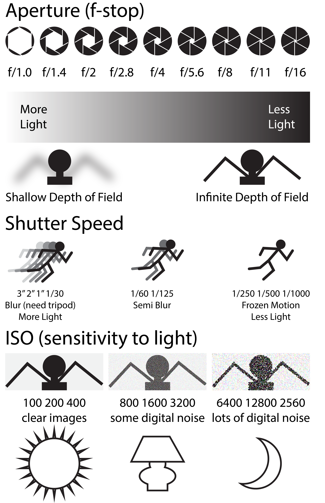

Photography is one of the main ways you will document the creative works that you make for presentation to others. Most people will not see your work in person, but we'll see documentation in your portfolio. The quality of your documentation of your artwork will often determine someone's response to it and whether or not they like it around. Is important to know how to use a camera to create high resolution while exposed images of your artwork.

## 3 Main Camera Settings

There are three main camera settings that photographers need to understand to be able to control a camera and take the photographs they want. Photographers need to know how to control shutter speed, aperture, and ISO.

Shutter speed is how long the camera lets light in. The longer the camera stays open, the more light will come in and affect the exposure. A fast shutter speed will also freeze motion, while a slow shutter speed will allow for motion blur and trailing artifacts of objects in motion.

Aperture is the hole in the camera that lets light in. This can be large or small. The larger the hole is the more light is let in and makes a shallower depth of field, or area in focus.

ISO refers to the sensitivity of the digital sensor in the camera. A higher ISO means the sensor will react to lower levels of light. If the ISO is too high, then digital noise can be created.

With these three settings, you can understand how to use most still cameras. Each camera manufacturer will have these settings and slightly different places, but the basic principles are the same.

## Documenting Artwork

[How to Document 2D Artwork](../art-faq/how-to-document-2d-artwork.md) [How to Document 3D Artwork](../art-faq/how-to-document-3d-artwork.md) [How to Edit Photos in Adobe Camera Raw](../photography/how-to-edit-photos-in-adobe-camera-raw.md)

## Two Light Portraits

### Clamshell

Top light on top facing person pointed at nose Bottom light pointed up with less power

### Flat lighting

First light to side and above subject

### Butterfly lighting

Above and in front of subject, butterfly shadow under nose

### Loop cheek lighting

45deg off to side above eye level Ring highlight on cheek
