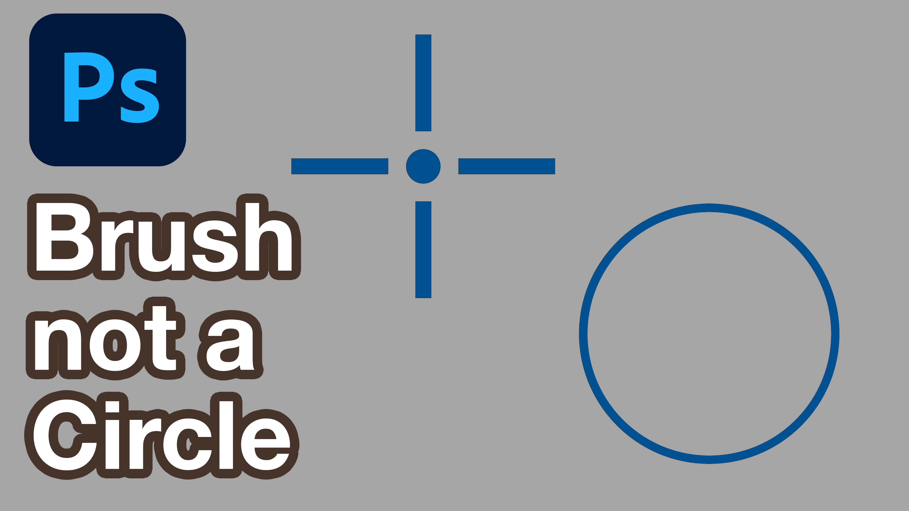

<iframe class="youTubeIframe" width="560" height="315" src="https://www.youtube.com/embed/fQz6vmnBbpM?rel=0" title="YouTube video player" frameborder="0" allow="accelerometer; autoplay; clipboard-write; encrypted-media; gyroscope; picture-in-picture; web-share" allowfullscreen></iframe>

When you're using a brush in Photoshop and all you see is a crosshair instead of the full brush outline, it can be frustrating, especially if you're trying to work with precision. This issue usually happens because the Caps Lock key is turned on. The Caps Lock key toggles between showing the full outline of your brush and just the crosshair, which is intended for more precise work.

## Quick Fix:

- **Press Caps Lock:** Simply pressing the Caps Lock key will switch between the crosshair and the normal brush outline. If you only see a crosshair, pressing Caps Lock should bring back the full brush outline. Press it again to return to the crosshair view.

### Customizing Brush Cursor Preferences:

If you want more control over how your brush cursor appears, you can adjust these settings directly in Photoshop:

1. Go to `Edit` (Windows) or `Photoshop` (Mac) > Preferences > Cursors
2. Choose your preferred brush tip: Here, you can select between different options:
   - Normal Brush Tip: Displays the brush size that corresponds to the brush's soft edges.
   - Full Size Brush Tip: Shows the entire brush tip size, including any feathered edges.
   - Show Crosshair in Brush Tip: This option adds a crosshair to the center of your brush, which can be helpful for precise placement.

By adjusting these settings, you can customize your brush appearance to suit your workflow. However, the most common reason for not seeing your full brush outline is the Caps Lock being on, so always check that first.

## Summary:

- Caps Lock toggles between crosshair and full brush outline.
- Preferences allows for further customization of brush cursor appearance.

With these tips, you should be able to switch back to your preferred brush view and continue working smoothly in Photoshop. Happy photoshopping!

## Transcript

Why can't I see the edges of my Photoshop brush? Why is my Photoshop brush a crosshair? This can be very annoying when you're trying to draw in Photoshop with a brush but you only see a crosshair instead of the full outline of your brush size. How can I fix this? The simple fix is to press caps lock and then this toggles your Photoshop brush between an outline and the crosshairs. By pressing caps lock then I have cross hairs, caps lock again now I can see my entire brush outline We can also go to file > preferences and if we go to cursors we can choose what our normal cursor will be. We can have the full size brush tip, the normal size brush tip, we can show the crosshair and the circle in the brush tip. So you can set this to exactly how you want but the simple fix when you can't see your Photoshop full size brush and you only see crosshairs is to make sure that you don't have caps lock on. Hopefully this Photoshop quick tip gets you back on the way to creating wonderful things in Photoshop and making neat stuff. Happy photoshopping!

