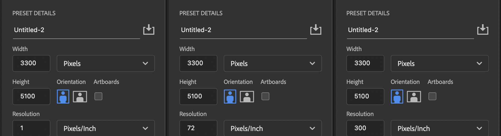

TL;DR DPI doesn't matter

Pixel dimensions or the number of pixels high and the number of pixels wide, is the only thing that matters about digital images.

<figure>

<figcaption>

Even Photoshop swaped out DPI for resolution in its New File dialog window. Each of these images are exactly the same even though one has a resolution of 1 pixel per inch, one has a resolution of 72 pixels per inch, and one has a resolution of 300 pixels per inch. They all have the same pixel dimensions and therefore the same potential ammount of digital image information.

</figcaption>
</figure>

DPI refers to Dots Per Inch and is used when printing on physical materials.

PPI refers to Pixels Per Inch and is use d to define the pixel density of an electronic display.

Resolution is a vague term that might refer to either DPI, PPI, or neither.
