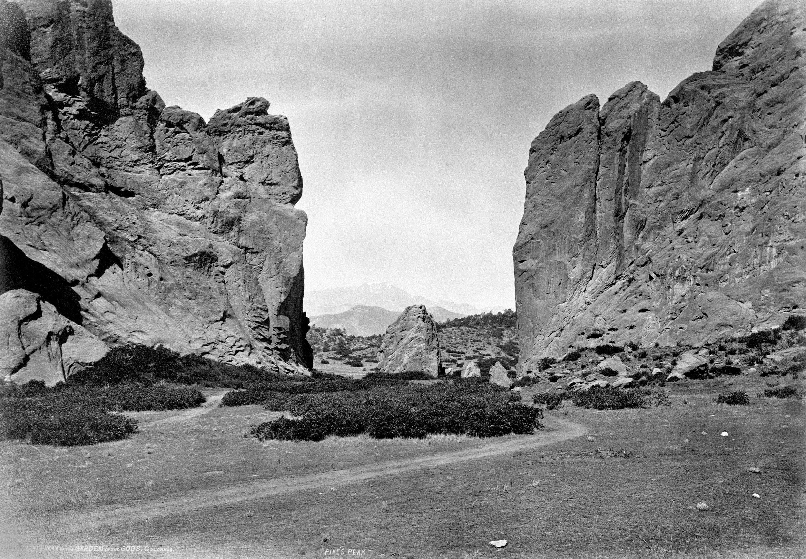
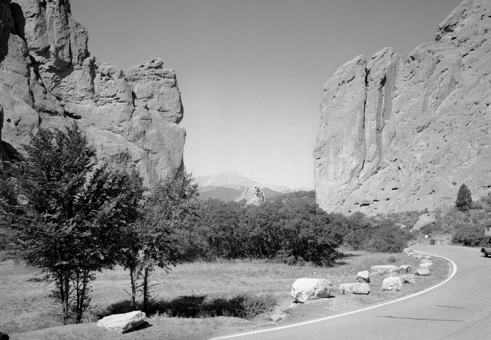
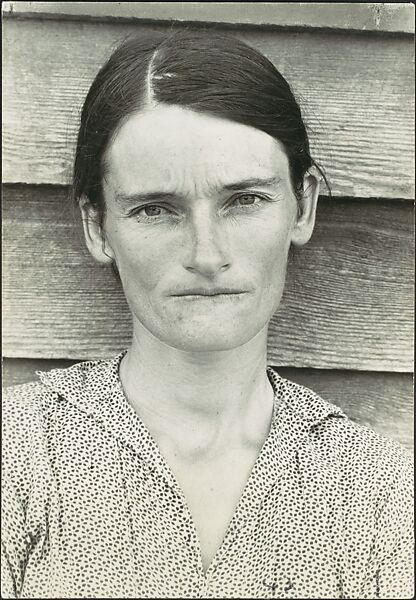
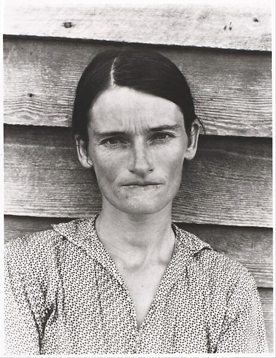
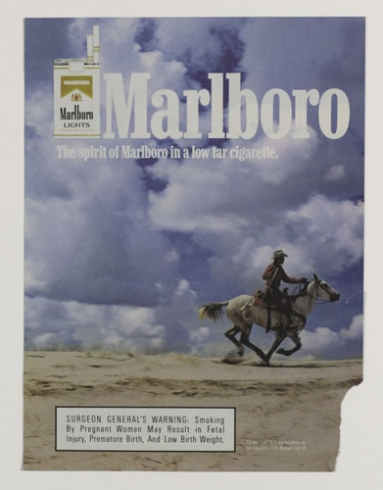
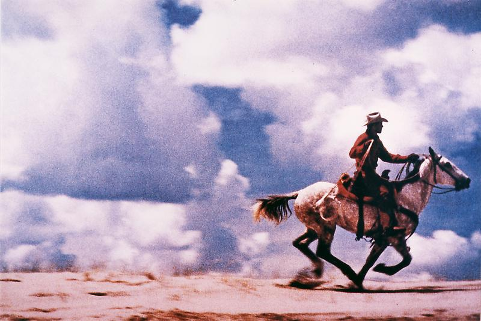

Rephotography can refer to the photographing of the same object or location at different times.

The term "rephotography" or "rephotographic" comes from _The Rephotographic Survey Project_ made in 1977 by Mark Klett, Ellen Manchester, and JoAnn Verburg. They photographed or "rephotographed" the same locations as previous photographs of locations of the American West from the nineteenth century. A conceptual part of the project was to attempt to accurately recreated the original photographs by setting the camera in the same location and matching the time of year and time of day of the original photograph.[^klett-rephotography]

Later in 1998 Klett revisited sites in the west to rephotograph them again for a _Third View_ project. He also made panoramic photographs that combined old photographs amid a series of present day photographs as a way of showing that the past, present and future are all linked, inseparable, yet different. This technique revealed that a photo of "Karnak Ridge" by Timothy H. O'Sullivan was taken at an angle to make the rocks and formation look taller and more imposing similar to VFX tricks in movies that show heroes "scaling" buildings while walking on level ground.[^fox-third-view]

<figure>

<figcaption>

William Henry Jackson, Gateway of the Garden of the Gods, Colorado, 1873

</figcaption>
</figure>

<figure>

<figcaption>

Mark Klett and JoAnn Verburg for the Rephotographic Survey Project, Gateway of the Garden of the Gods, Colorado Springs, CO, 1977 _courtesy of the artist_

</figcaption>
</figure>

In 1981, Sherrie Levine "rephotographed" an image of Allie Mae Burroughs[^jca-levine], a share cropper in Alabama, originally photographed by Walker Evans in 1936.[^evans-met] By [appropriating](../art-faq/appropriation.md) the images of Walker Evans and presenting them as her own, Levine deemphasized the concept of precious originality. Levine later reproduced famous paintings as paintings.

<figure>

<figcaption>

Walker Evans, _Alabama Tenant Farmer Wife_, 1936, Gelatin silver print, 20.9 x 14.4 cm (8 1/4 x 5 11/16 in.) © Walker Evans Archive, [The Metropolitan Museum of Art](https://www.metmuseum.org/art/collection/search/284685). _(This image is included on the basis of fair use.)_

</figcaption>
</figure>
<figure>

<figcaption>

Sherrie Levin, _After Walker Evans: 4_, 1981, Gelatin silver print, 12.8 x 9.8 cm (5 1/16 x 3 7/8 in.) [Metropolitan Museum of Art](https://www.metmuseum.org/art/collection/search/267214) and [Zwirner Gallery](https://www.davidzwirner.com/artists/sherrie-levine). _(This image is included on the basis of fair use.)_

</figcaption>
</figure>

Richard Prince's early photographic work used rephotography to rephotograph cropped versions of advertisements. Prince once wrote that "Rephotography is a technique for stealing (pirating) already existing images, ..."[^prince-without-license] Prince has matter of fact view of appropriation as theft and focuses on the possibilities and "satisfying" possibilities. He made conceptual statements about the bouncing of light from original photo to camera and then throughout the rephotography process. The physical labor of creating a photo from a photo seems to become a work of art akin to a performance. Prince also questions the nature of information and what it means to reproduce or transmit imagery by encoding picture data on computer readable tapes. He referred to sending these photos, tapes, "halfway around the world" as "photoshperes."[^prince-photospheres] Prince continued early investigations of authorship, originality, and authenticity into the social media age by appropriating images from Instagram and displaying them on gallery walls. His view of appropriation and rephotography is not universally held since some rights holders have won judgments against the artist in court.

The iconic image of the cowboy in front of the clouds was reportedly shot by Jim Brady.[^time-video]

<figure>

<figcaption>

Tear Sheet, Original Marlboro Ad _(This image is included on the basis of fair use.)_

</figcaption>
</figure>
<figure>

<figcaption>

Richard Prince, Untitled (Cowboy), Ektacolor photograph, (50 x 75 inches, 127 x 190.5 cm) Used with permission courtesy of Fulton Ryder. [richardprince.com](http://www.richardprince.com/photographs/cowboys/)

</figcaption>
</figure>

Is rephotography a form of [fair use](../copyright/fair-use.md)? Is cropping an image transformative? Does the physical act of taking a picture of a photograph create a new author? What if it was your photography that was rephotographed? Norm Clasen shot some of the original photographs used in Richard Prince's work. Clasen shot photos of cowboys for Marlboro from approximately 1978 to 1992. He rode and traveled with the cowboy subjects of his photos in order to capture what are now iconic images of American mythology and fantasy. In 2018 he exhibited some of his original cowboy photos in an exhibition called _Titled (Cowboy)_ as a reference to Prince's _Untitled (Cowboy)_. Clasen has referred to appropriation of others' photography as "artistic piracy."[^clasen-mb]

<iframe class="youTubeIframe" width="560" height="315" src="https://www.youtube.com/embed/bxySP5R-IWs?si=XYngT0vSjWUHZdXK" title="YouTube video player" frameborder="0" allow="accelerometer; autoplay; clipboard-write; encrypted-media; gyroscope; picture-in-picture; web-share" referrerpolicy="strict-origin-when-cross-origin" allowfullscreen></iframe>

## Contemporary Rephotography

Michael Mandiberg rephotographed rephotography by creating the website [aftersherrielevine.com](https://www.aftersherrielevine.com/) that includes high resolution copies of photographs, for download and printing by the public, from Sherrie Levine's _After Walker Evans_ series.

Rephotography has become ubiquitous with the increase of photography powered by small portable electronic devices such as cell phones and machine learning computer vision algorithms. Many photo applications will automatically scan a library of images for similar subjects and framing to create "then and now" parings showing a variety of subject matter from different times, similar to the original concept of rephotography.

## Resources / Further Reading

- [History Pin](https://www.historypin.org/en/) crowdsources matching historical and contemporary photos to locations using street view and GPS.
- [Time Travel Rephotography](https://github.com/Time-Travel-Rephotography/Time-Travel-Rephotography.github.io) uses a unique unified image processing method to enhance and colorize historical photographs.

## References

[^klett-rephotography]: Klett, Mark. [Rephotographic-Survey-Project 1977-1979](https://www.markklett.com/projects/rephotographic-survey-project) [(Archive Link)](https://web.archive.org/web/20241129152939/https://www.markklett.com/projects/rephotographic-survey-project)
[^fox-third-view]: Fox, William L. [Mark Klett RephotographyLook Again: Mark Klett's Rephotography of the American West - National Gallery of Art](https://www.nga.gov/stories/west-to-east/mark-klett-rephotography-american-west.html) [(Archive Link)](https://web.archive.org/web/20241006091839/https://www.nga.gov/stories/west-to-east/mark-klett-rephotography-american-west.html)
[^evans-met]: [Metropolitain Museum of Art Collection Search](https://www.metmuseum.org/art/collection/search/284685) _Alabama Tenant Farmer Wife_ Walker Evans, American 1936. [(Web Archive)](https://web.archive.org/web/20240716202322/https://www.metmuseum.org/art/collection/search/284685)
[^jca-levine]: [Constance Lewallen and Sherrie Levine](https://www.jca-online.com/slevine.html) Journal of Contemporary Art. 1993. [(Web Archive)](https://web.archive.org/web/20020802095936/http://www.jca-online.com/slevine.html)
[^prince-without-license]: Prince, Richard. [Practicing Without A License 1977](http://www.richardprince.com/writings/practicing-without-a-license-1977/) [(Web Archive)](https://web.archive.org/web/20111007135329/http://www.richardprince.com/writings/practicing-without-a-license-1977/)
[^prince-photospheres]: Prince, Richard. [Photospheres](http://www.richardprince.com/writings/photospheres/) [(Web Archive)](https://web.archive.org/web/20111007135708/http://www.richardprince.com/writings/photospheres/)
[^clasen-mb]: [Norm Clasen: Titled (Cowboy)](https://www.mbphoto.com/exhibitions/124/overview/) exhibition at [M+B Photo](https://www.mbphoto.com/) March 2 to April 21, 2018. [(Web Archive)](https://web.archive.org/web/20240623071217/https://www.mbphoto.com/exhibitions/124/overview/)
[^appel-prince-interview]: Appel, Brian. [Money, Paint and Jokes – An Interview with Richard Prince (2007)](http://americansuburbx.com/2013/03/interview-richard-prince-2007.html) AMERICAN SUBURB X / ASX. 2007 [(Web Archive)](https://web.archive.org/web/20130503172119/http://www.americansuburbx.com/2013/03/interview-richard-prince-2007.html)
[^time-video]: Time Video
