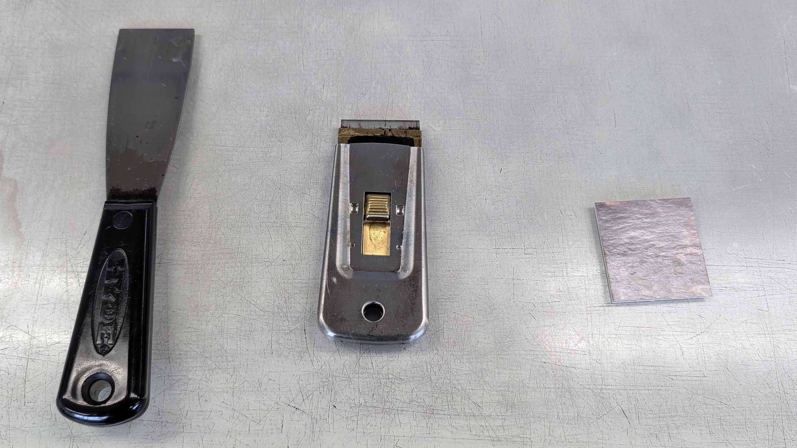
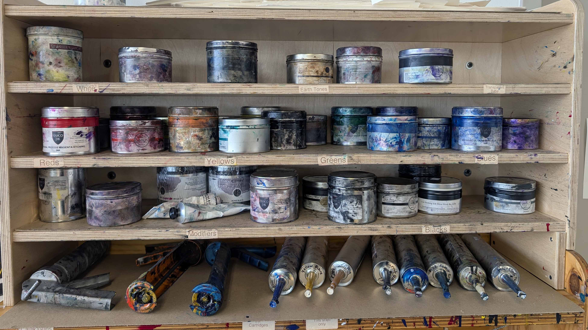

Make sure the plate is not warped, it should lay flat on the press bed. Remember that the pulled print will be the inverse of the laser etching. The ink sticks to the raised "relief" parts of the plate or the "non-laser-etched" parts.

## Sealing the Printing Plate

1. Seal the plate surface with a light coat of brushed on shellac. Make sure to turn the ventilation on before opening the shellac.
2. Brush the shellac on the top surface of the plate, where the ink will go, coat the entire top surface. Sides and the back do not need to be coated.
3. Use a hammer to close the lid so the shellac does not dry out.
4. Clean the brush immediately in the alcohol solution.
5. Allow the plate and shellac to dry before inking. Ideally, leave the wet plate in front of the ventilation to extract VOCs while it is drying. It takes ~15 minutes for the shellac to dry on the plate.

## Preparing Printing Paper

1. Full size sheets of paper are 27.5" X 35" _(Adjust accordingly if using a different starting paper size)_
2. Use the tear-bar to tear the paper into 4 even pieces.

## Set the Pressure on the Press

1. Use a completely dry plate that does not have ink on it.
2. Place the plate on the print bed.
3. Set a piece of proofing paper on the plate.
4. Place a couple sheets of newsprint on top of the paper.
5. Test out the pressure of the press roller and adjust as needed.
6. Both sides of the press must be set exactly the same for even pressure.
7. Make note of your pressure settings and write which press was used with what pressure settings on the back of your plate
8. If there is a lower section or "dead-spot" on the plate, placing more newsprint in that area can help pull a more even print.
9. Six over five is good starting point for the first press. Note the press counts from 0 at the bottom. 2 over 1/2 F is a starting point for the second press
10. Note: Press #1 is always engaged with the wheel and press #2 is not automatically engaged and may need to be "assisted" when you start to turn the wheel. Be aware of what is going toward the press and avoid allowing anything but the print pass through the press. Be aware of where your hands and clothing are. Be safe.

## Preparing Printing Ink

1. Avoid getting ink on your hands by wearing disposable gloves.
2. Avoid getting ink on your clothing by wearing a shop apron.
3. Ink is in cans.
4. Use one of the small cardboard cards to "skim" a bit of ink out of the can. Do not gouge the ink. Think about just taking the thin top layer of ink. Gouging the ink causes it to dry out and become unusable.
5. Smear the ink from the card onto the glass plate.
6. Replace the lid to the ink.
7. Use a new card to skim out some ink modifier. This makes the ink more liquid and easier to use.
8. Use a ratio of 75% ink to 25% modifier. _(A little ink goes a long way. Don't be wasteful.)_
9. Mix the ink and modifier together using a flexible putty knife. Do not use a rigid litho spatula.
10. As you mix the ink and modifier, note how it feels to get a sense of the correct consistency.
11. Once the ink is mixed, spread out a ribbon of ink.
12. Note: If preparing color ink for printing, it is a good idea to clean the glass plate with dawn water and vinegar before putting your ink down to avoid color contamination from the previous printing process. The glass should have been cleaned from the previous person, but it is good practice to make sure.

<figure>

<figcaption>

Printmaking Ink Tools, (Hyde Ink Knife, Rasor Scraper, Matboard Scrap)

</figcaption>
</figure>

<figure>

<figcaption>

Printmaking Inks in Tubs

</figcaption>
</figure>

## Inking up a Brayer

1. Select an appropriate sized brayer.
2. Never set a brayer down on the roller. Always set the brayer down with the roller facing up so you do not create flat spots on the roller.
3. Roll the brayer to spread out the ribbon of ink. Pick the brayer up and then place it back in the ink ribbon.
4. Continue until the brayer is evenly coated with ink. Avoid any dry spots or over inked spots.
5. It should sound like bacon or and "ink-kiss". Note the sound as you are rolling.
6. The ink should not be sparse and should not be globby. If spread evenly the ink creates tiny dots of ink like an ink jet printer.
7. Thin is good but if you do not hear the bacon sound then you do not have enough ink.

## Inking the Printing Plate

1. Apply the ink smoothly and evenly.
2. If you do not hear the ink on the board then you do not have enough ink.
3. Too much ink will squish all around and mess up your print.

## Printing

1. Note the pressure settings and make sure they match the confirmed settings from earlier noted on the back of the plate.
2. Set the inked plate on the print bed.
3. Place your printing paper on the plate based on your desired spacing and registration.
4. Use the grid on the press bed to align the plate and the paper to achieve desired border.
5. Place pieces of newsprint on top of the printing paper.
6. Pull the print by rolling it through the press.
7. Place the pulled print on the drying rack. Be mindful of others' work already on the drying rack. Be careful to avoid damaging it or disturbing it.
8. Re-ink the plate and repeat as desired.

## Studio Clean Up

1. Clean up all areas of the studio. It is a shared shop.
2. Wrap up still good ink in plastic wrap for later use.
3. Vegetable oil is used for cleaning up ink.
4. Use "heavy used" rags first. Do not use "new clean rags", "gentle used" rags, or paper towels.
5. After getting all the ink wiper up with vegetable oil, "dawn water" is used for final cleanup.
6. Make sure all ink is cleaned from the brayer, printing plate, putty knives, glass plate, and any other areas or tools in the shop.
7. Cover the printing press with its cover to avoid getting dust on the press.

## Hand Clean Up

1. Use the "waterless" soap to clean your hands.
2. Do not wet your hands. The soap will not work if your hands are already wet.
3. Apply the waterless soap first and rub it around your hands to remove and capture all ink.
4. Then rinse clean with water.

<figure>
<figcaption>
</figcaption>
</figure>

<figure>
<figcaption>
</figcaption>
</figure>

