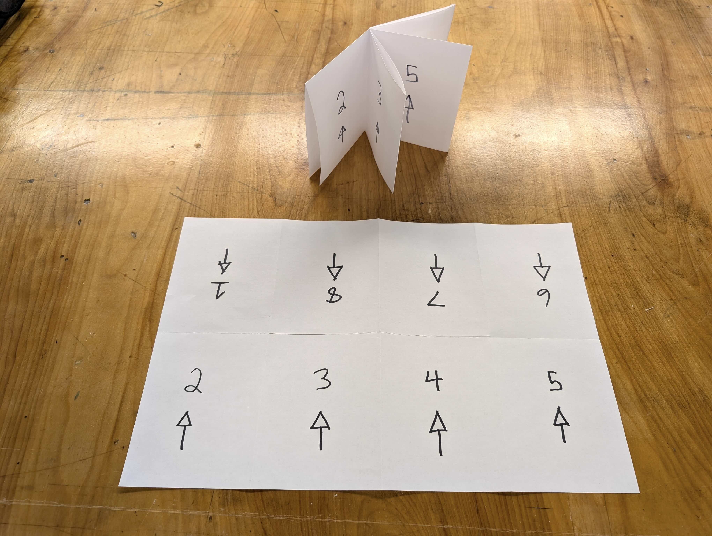

1. Fold the paper in half lengthwise. Burnish the fold flat.
2. Unfold and flatten.
3. Fold the paper in half widthwise. Burnish the fold flat.
4. Unfold and flatten.
5. Fold both short edged into the center, meeting at the fold. Burnish both folds flat.
6. Unfold and flatten.
7. Cut along the fold of the middle two sections lengthwise.
8. Fold up the zine like a book.
