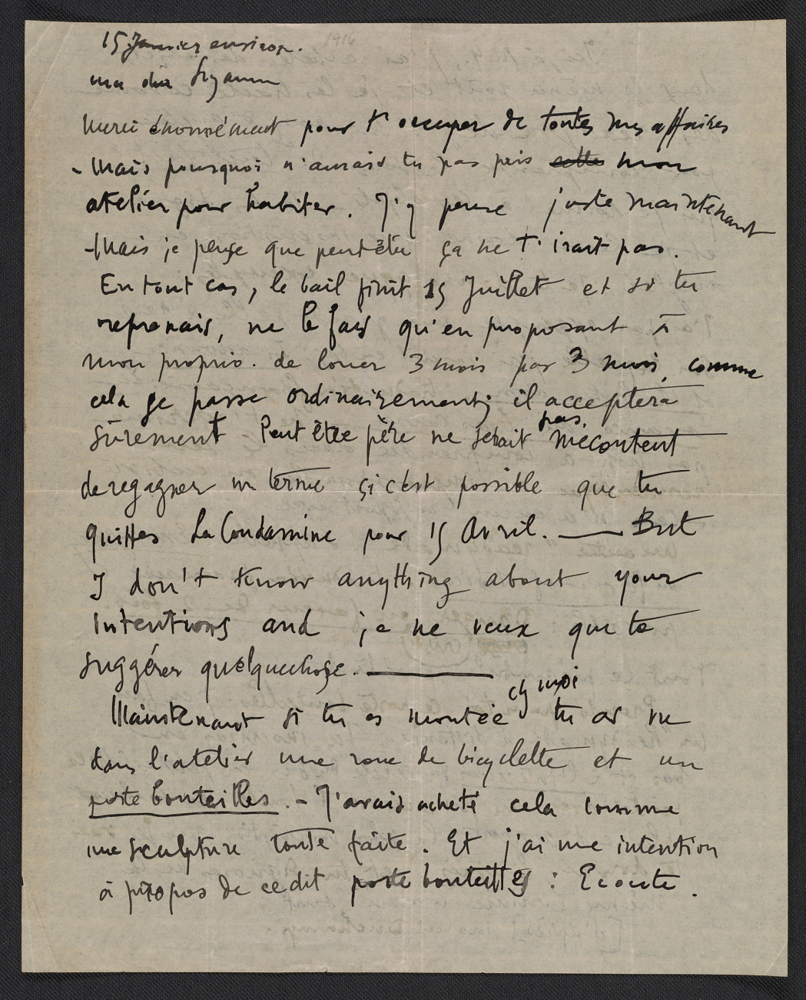
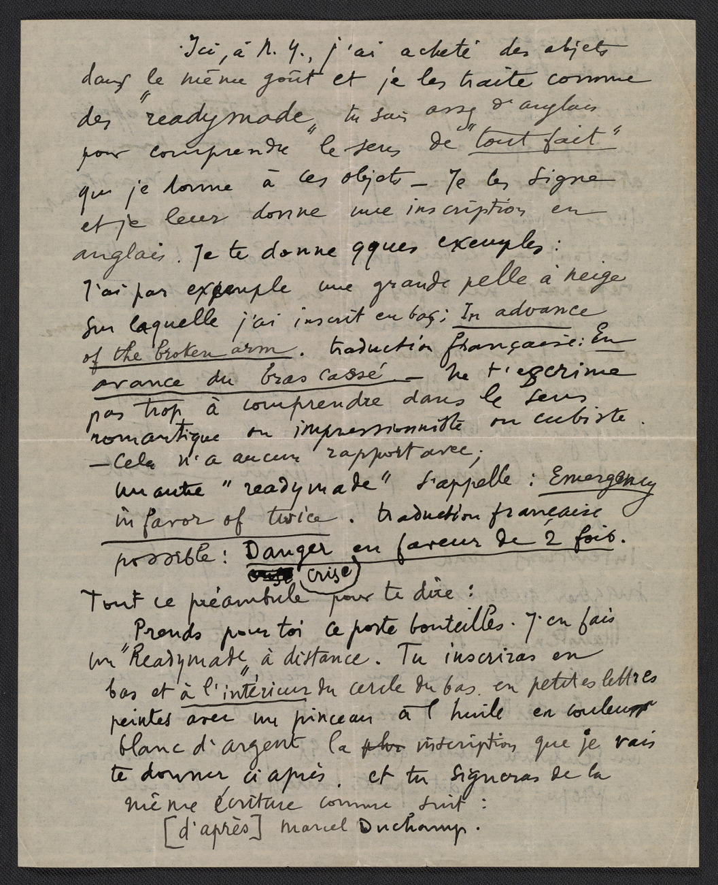

In art, found objects are materials used mostly as is or as they were found. This is in contrast to using raw materials manipulated into a new form such. If one "find" a coffee cup in the trash or at a store and then uses it as is as an art making material then it is a found object. If one uses ceramic clay to make a coffee cup, then it would not be considered a found object since it was make from raw materials.

## Found Object Origins and the "Readymade"

Marcel Duchamp brought focus to using found objects in art with the concept of the "Readymade" as demonstrated with his sculpture, _Fountain_, a standard ceramic urinal modified by the addition of the artist's signature and presented as art. Duchamp wrote the word "Readymade" in English in a letter written in French he sent to his sister Suzanne Duchamp.[^duchamp-letter] Art historians credit this letter as the first use of the word in the context of found objects as art but also point out that the term has existed in various spellings since 1440 and often referred to ready made clothing.[^readymade-history]

<figure>

<figcaption>

Marcel Duchamp letter to Suzanne Duchamp, January 15, 1916, page 1, from the Archives of American Art at the Smithsonian.[^duchamp-letter]

</figcaption>

</figure>

<figure>

<figcaption>

"Readymade" clearly visible in the handwriting of Marcel Duchamp on the second page of a letter to Suzanne Duchamp, January 15, 1916, from the Archives of American Art at the Smithsonian.[^duchamp-letter]

</figcaption>

</figure>

<figure>

<figcaption>

Marcel Duchamp, _Fountain_, 1917, photograph by [Alfred Stieglitz](https://en.wikipedia.org/wiki/Alfred_Stieglitz) at the 291 (Art Gallery) following the 1917 Society of Independent Artists exhibit, with entry tag visible. The backdrop is _The Warriors_ by [Marsden Hartley](https://en.wikipedia.org/wiki/Marsden_Hartley).[^duchamp-fountain]

</figcaption>

</figure>

### Readymades Not Really "Found"

While it appears that the original readymades by Duchamp were found, since the Conceptual Art Manifesto puts an emphasis on the artist choosing the objects, later reproductions of the readymades were hand crafted for reproduction.

## References

[^duchamp-fountain]: [Wikimedia Commons](https://commons.wikimedia.org/wiki/File:Marcel_Duchamp,_1917,_Fountain,_photograph_by_Alfred_Stieglitz.jpg) Photograph and artwork is in the public domain.
[^readymade-history]: Davila, Thierry. [Readymade, ready-made, ready made](https://www.sciencespo.fr/artsetsocietes/en/archives/4753) Arts & Sociétés. # 115 | Duchamp, words, and things. [(Archive Link)](https://web.archive.org/web/20240221082335/https://www.sciencespo.fr/artsetsocietes/en/archives/4753)
[^duchamp-letter]: [Marcel Duchamp letter to Suzanne Duchamp, 1916 Jan. 15](https://www.aaa.si.edu/collections/items/detail/marcel-duchamp-letter-to-suzanne-duchamp-15127) Jean Crotti papers, 1913-1973, bulk 1913-1961. Archives of American Art, Smithsonian Institution. [(Archive Link)](https://web.archive.org/web/20240724111119/https://www.aaa.si.edu/collections/items/detail/marcel-duchamp-letter-to-suzanne-duchamp-15127)
