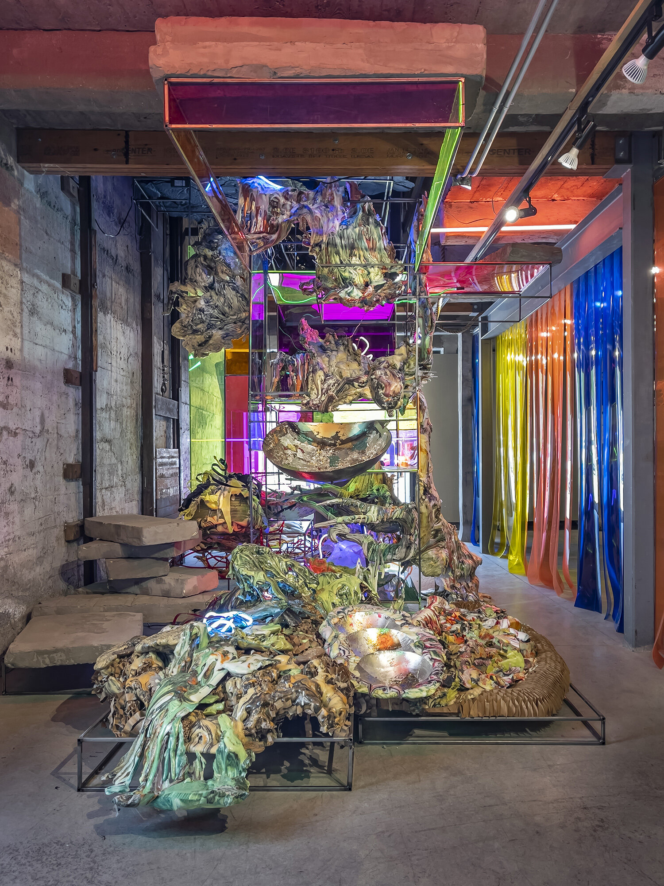

## What is Installation Art?

Installation art often takes a three-dimensional form. The work is more intentionally "installed" than an object on a pedestal or a painting on a wall. While often large in scale, installation art can be very small. The space around any objects in the works is considered part of the artwork. The experience of the view observing or moving through space can be part of the work. [Site-specific](../sculpture/site-specific.md) installation art takes the consideration of the environment further by making art that can only be displayed or made complete at a specific location or under specific conditions. If the site specific work is removed from that context, then it would cease to be that work of art.

## Types of Installation Art

### Large Thing in a Space

- Ai Weiwei - _Law of the Journey_ - large inflatable raft [Link](https://artpil.com/news/law-of-the-journey-ai-weiwei/)
- Abbas Akhavan - _Curtain Call_ Pillars and green screen [Link](https://chisenhale.org.uk/audio-video/abbas-akhavan/)
- William Pope.L _Trinket_ Large flag and fan [Link](https://www.moca.org/exhibition/william-popel-trinket)
- Jennifer Wen Ma _Hanging Garden in Ink_ pile of plants [Link](https://fpa319w.wordpress.com/2014/12/02/critical-review-unscrolled-2/)

### Lots of Small Things in a Space

- Do Ho Suh - small figures under glass
- Rachel Whiteread - _Embankment_ at Tate Modern in London
- Allan Kaprow - _Yard_ lots of tires in a room
- Ibrahim Mahana - _Lazarus_ - many sewing machines in a room [Installed at Whitecube](https://www.whitecube.com/gallery-exhibitions/lazarus)
- Tara Donovan - Cups, Pencils, other [Pace Gallery Link](https://www.pacegallery.com/artists/tara-donovan/)

### Removal of Context

- Yoyoi Kusama - mirror rooms
- James Turrel - light installations
- Rachel Whiteread - concrete building castings

### Interactive Installations

- [Meow Wolf](https://meowwolf.com/)
- Eva Fabregas - Living and breathing installation at Hamburger Bahnhof Museum of Contemporary Art [Exhibition Link](https://www.smb.museum/en/museums-institutions/hamburger-bahnhof/exhibitions/detail/eva-fabregas/)

### Hanging Structures from Architecture

- Chiharu Shota - Thread Installations - [Artist Website](https://www.chiharu-shiota.com/)
- Ernesto Neto - Net hangings - [Tanya Bonakdar Gallery Link](https://www.tanyabonakdargallery.com/artists/49-ernesto-neto/)
- Jacob Hashimoto _Gas Giant_ [Link](https://www.latimes.com/entertainment/arts/culture/la-et-cm-art-review-jacob-hashimoto-moca-pacific-design-center-20140311-story.html)
- Jean Claude and Cristo - wrappings

### Earthworks

### Site Specific

## Installation Artists

- [Judy Pfaff](https://www.judypfaffstudio.com/)
- Rachel Whiteread
- John Ahearn
- Mark Dion
- Andrea Fraser
- Donald Judd
- Renee Green
- Suzanne Lacy
- Inigo Manglano-Ovalle
- Richard Serra
- Mierle Laderman Ukeles
- Fred Wilson
- James Turrel
- Andy Goldsworthy
- Martin Creed
- Allan Kaprow
- Yoyoi Kusama
- Tara Donovan

## Images of Installations

<figure>

<figcaption>

AR.CHAE.OL.O.GY by [Judy Pfaff](https://www.judypfaffstudio.com/) from 2021. Photo by [Peter Aaron/OTTO](https://www.peteraaron.net/) © Judy Pfaff; Courtesy of the artist.

</figcaption>

</figure>

## Installation Art Texts

- Installation Art in Close Up by William Malpas
- LAND ART: A Complete Guide To Landscape, Environmental, Earthworks, Nature, Sculpture and Installation Art by William Malpas
- Screens: Viewing Media Installation Art by Kate Mondloch
- New World Order: Contemporary Installation Art and Photography from China by Sue-An van der Zijpp, Carol Yinghua Lu, Groninger Museum
- Landscape Installation Art II
- Space, Site, Intervention: Situating Installation Art by Erika Suderburg
- Understanding Installation Art: From Duchamp to Holzer by Mark Lawrence Rosenthal
- Expanded Field: Architectural Installation Beyond Art : Berman + Burnham by Ila Leslie Berman, Douglas Burnham
- OVERS!ZE: The Mega Art & Installations
- Land Art in the U. S. A.: A Complete Guide to Landscape, Environmental, Earthworks, Nature, Sculpture and Installation Art in the United States of America by William Malpas
- Installation Art in the New Millennium : The Empire of the Senses by Michael Petry
- Art Installations by Alix Wood
- Installation Art: Between Image and Stage by Anne Ring Petersen
- Installation Art by Andrew Benjamin
- Installation Art: Space as Medium in Contemporary Art Sandu Cultural Media
- Aesthetics of Installation Art by Juliane Rebentisch
- Installation Art and the Museum : Presentation and Conservation of Changing Artworks by Vivian van Saaze
- Unexpected Art: Serendipitous Installations, Site-Specific Works, and Surprising Interventions
- Installation Art: a Critical History by Claire Bishop
- Installation art as experience of self, in space and time (Curating and Interpreting Culture) by Christine Vial Kayser
