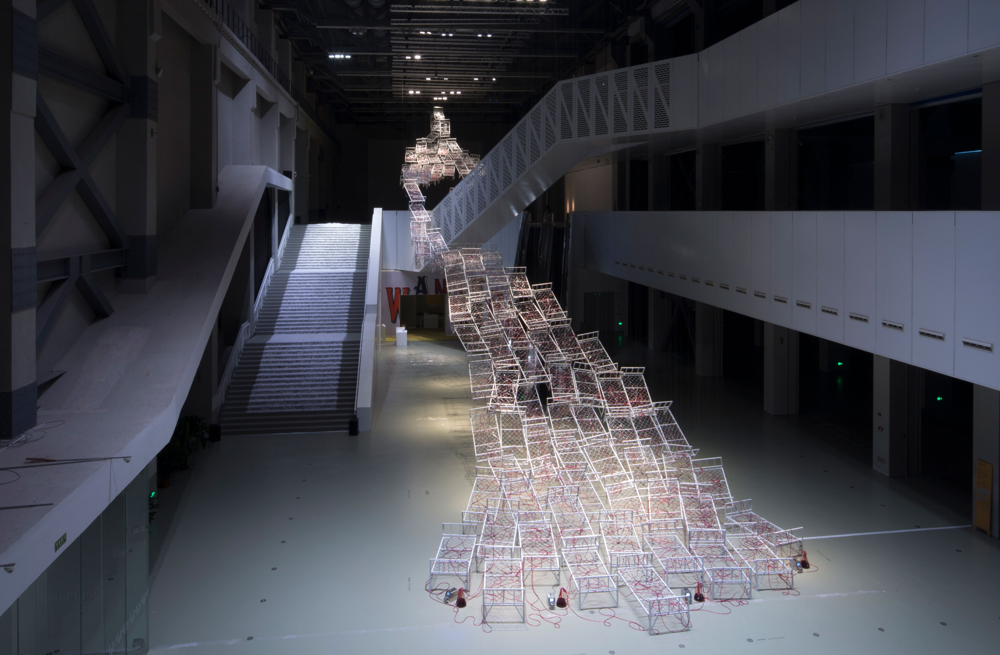
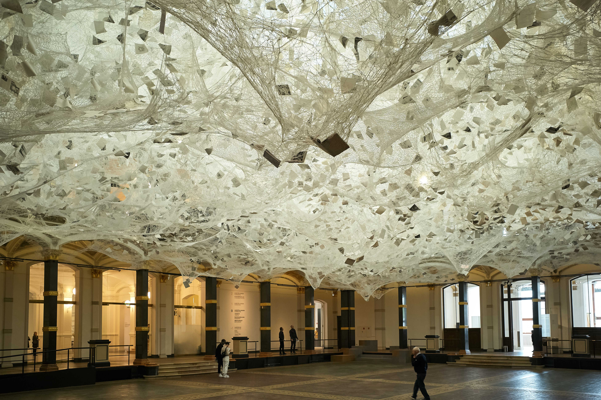
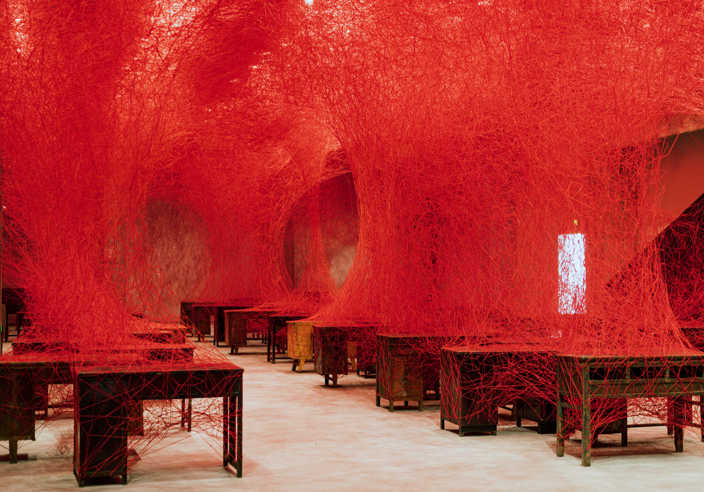

## What is Installation Art?

Installation art often takes a three-dimensional form. The work is more intentionally "installed" than an object on a pedestal or a painting on a wall. While often large in scale, installation art can be very small. The space around any objects in the works is considered part of the artwork. The experience of the view observing or moving through space can be part of the work. [Site-specific](../sculpture/site-specific.md) installation art takes the consideration of the environment further by making art that can only be displayed or made complete at a specific location or under specific conditions. If the site specific work is removed from that context, then it would cease to be that work of art.

## Types of Installation Art

Installation art can cover a wide range of process and techniques. While some works are inherently "uncategorizable" most installation art works fall into common categories or types.

### Large Thing in a Space

By placing a large object in a space, it instantly becomes an installation and a focal point. Museums use this technique to show off dinosaur skeletons and rocket ships. The same sense of scale and spectacle can be used to make an art installation with a large object or sometimes objects in a space. This is especially powerful if the object is not expected or related to the shape of the space in interesting ways.

- Ai Weiwei - _Law of the Journey_ - large inflatable raft [Link](https://artpil.com/news/law-of-the-journey-ai-weiwei/)
- Abbas Akhavan - _Curtain Call_ Pillars and green screen [Link](https://chisenhale.org.uk/audio-video/abbas-akhavan/)
- William Pope.L _Trinket_ Large flag and fan [Link](https://www.moca.org/exhibition/william-popel-trinket)
- Jennifer Wen Ma _Hanging Garden in Ink_ pile of plants [Link](https://fpa319w.wordpress.com/2014/12/02/critical-review-unscrolled-2/)

### Lots of Small Things in a Space

Assembling a large number of objects into a single location ofter makes for captivating installation art. While a single tire or styrfoam cup may not be interesting on its own, placing many together creates similar feeling a a drop of water compared to the entire ocean. One drop may not inspire but standing on the shore of the ocean is captivating.

- Do Ho Suh - small figures under glass
- Rachel Whiteread - _Embankment_ at Tate Modern in London
- Allan Kaprow - _Yard_ lots of tires in a room
- Ibrahim Mahana - _Lazarus_ - many sewing machines in a room [Installed at Whitecube](https://www.whitecube.com/gallery-exhibitions/lazarus)
- Tara Donovan - Cups, Pencils, other [Pace Gallery Link](https://www.pacegallery.com/artists/tara-donovan/)

### Removal of Context

Humans are pattern seeking creatures and have a general sense on how their environment should look whether in a grassland or a square room with gypsum board walls. Most grass grows from the ground, not the sky, and most walls are plumb with the earth and at right angles to each other. After seeing a particular environment enough times, our brains start to ignore the details and just assume that one room or plain is like all the previous ones seen before.

Installation art can capitalize on this weakness of human perception. Removing familiar context and cues from our perceived environment forces our brains to reengage with a space and to truly observe our surroundings again.

- Yoyoi Kusama - mirror rooms
- James Turrel - light installations
- Rachel Whiteread - concrete building castings

### Interactive Installations

- [Meow Wolf](https://meowwolf.com/)
- Eva Fabregas - Living and breathing installation at Hamburger Bahnhof Museum of Contemporary Art [Exhibition Link](https://www.smb.museum/en/museums-institutions/hamburger-bahnhof/exhibitions/detail/eva-fabregas/)

### Hanging Structures from Architecture

- Chiharu Shota - Thread Installations - [Artist Website](https://www.chiharu-shiota.com/)
- Ernesto Neto - Net hangings - [Tanya Bonakdar Gallery Link](https://www.tanyabonakdargallery.com/artists/49-ernesto-neto/)
- Jacob Hashimoto _Gas Giant_ [Link](https://www.latimes.com/entertainment/arts/culture/la-et-cm-art-review-jacob-hashimoto-moca-pacific-design-center-20140311-story.html)
- Jean-Claude and Cristo - wrappings

### Earthworks

Earthworks, sometimes called Land Art, use natural materials and the landscape to create sculptures and installation art. These works are often monumental in scale but can be as small as a collection of leaves. The use of juxtaposition of the work from the surrounding environment can highlight an earthwork. Some earthworks are site specific while others could have the same impact in multiple locations.

- Robert Smithson - Spiral Jetty
- Nancy Holt - Sun Tunnels
- Alter de Maria - Lightning Field
- Agnes Denes - Wheatfield - A Confrontation

### Site Specific

If an installation is intended to only work in a certain location it is considered site specific. This usually means that the work takes into account the particular form of the landscape or architecture of its exhibition location. Site specific works can take advantage of unusual features of a space that discrete object sculpture or installation may not be able to as well.

- Michael Heizer - City
- Cristo and Jeanne-Claude - Surrounded Islands

## Installation Artists

- [Judy Pfaff](https://www.judypfaffstudio.com/)
- Rachel Whiteread
- John Ahearn
- Mark Dion
- Andrea Fraser
- Donald Judd
- Renee Green
- Suzanne Lacy
- Inigo Manglano-Ovalle
- Richard Serra
- Mierle Laderman Ukeles
- Fred Wilson
- James Turrel
- Andy Goldsworthy
- Martin Creed
- Allan Kaprow
- Yoyoi Kusama
- Tara Donovan

## Images of Installations

<figure>

<figcaption>

AR.CHAE.OL.O.GY by [Judy Pfaff](https://www.judypfaffstudio.com/) from 2021. Photo by [Peter Aaron/OTTO](https://www.peteraaron.net/) © Judy Pfaff; Courtesy of the artist.

</figcaption>
</figure>

<figure>

<figcaption>

- Chiharu Shiota
- _Flow of Life_, 2017
- Installation: metal beds, red liquid, tubes, pump
- Power Station of Art, Shanghai, China
- Photo by Jiang Wenyi; courtesy of Power Station of Art.
- © VG Bild-Kunst, Bonn, 2023 and the artist

</figcaption>
</figure>

<figure>

<figcaption>

- Chiharu Shiota
- _Beyond Memory_, 2019
- Installation: wool, paper
- Gropius Bau, Berlin, Germany
- Photo by Sunhi Mang
- © VG Bild-Kunst, Bonn, 2023 and the artist

</figcaption>
</figure>

<figure>

<figcaption>

- Chiharu Shiota
- Conversations Between Others, 2023
- Installation: wool, desk, chair
- Yuelai Art Museum, Chongqing, China
- Photos by Zhao Mingxu
- Courtesy the artist and YUELAI Art Museum
- © VG Bild-Kunst, Bonn, 2023 and the artist

</figcaption>
</figure>

## Installation Art Texts

- _Installation Art in Close Up_ by William Malpas
- _LAND ART: A Complete Guide To Landscape, Environmental, Earthworks, Nature, Sculpture and Installation Art_ by William Malpas
- _Screens: Viewing Media Installation Art_ by Kate Mondloch
- _New World Order: Contemporary Installation Art and Photography from China_ by Sue-An van der Zijpp, Carol Yinghua Lu, Groninger Museum
- _Landscape Installation Art II_
- _Space, Site, Intervention: Situating Installation Art_ by Erika Suderburg
- _Understanding Installation Art: From Duchamp to Holzer_ by Mark Lawrence Rosenthal
- _Expanded Field: Architectural Installation Beyond Art_ by Ila Leslie Berman, Douglas Burnham
- _OVERS!ZE: The Mega Art & Installations_
- _Land Art in the U. S. A.: A Complete Guide to Landscape, Environmental, Earthworks, Nature, Sculpture and Installation Art in the United States of America_ by William Malpas
- _Installation Art in the New Millennium : The Empire of the Senses_ by Michael Petry
- _Art Installations_ by Alix Wood
- _Installation Art: Between Image and Stage_ by Anne Ring Petersen
- _Installation Art_ by Andrew Benjamin
- _Installation Art: Space as Medium in Contemporary Art_ Sandu Cultural Media
- _Aesthetics of Installation Art_ by Juliane Rebentisch
- _Installation Art and the Museum : Presentation and Conservation of Changing Artworks_ by Vivian van Saaze
- _Unexpected Art: Serendipitous Installations, Site-Specific Works, and Surprising Interventions_
- _Installation Art: a Critical History_ by Claire Bishop
- _Installation art as experience of self, in space and time (Curating and Interpreting Culture)_ by Christine Vial Kayser
